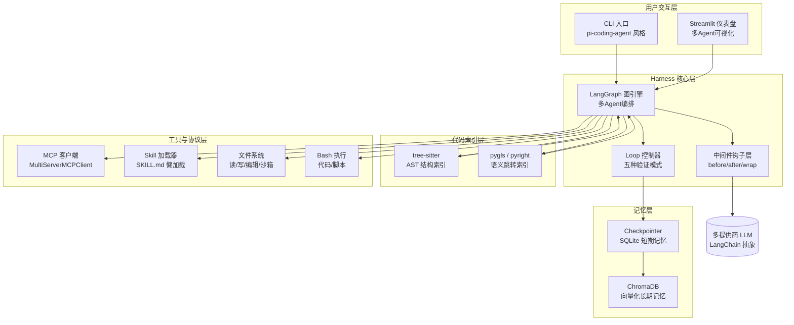
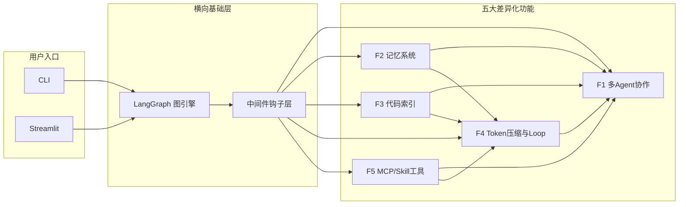
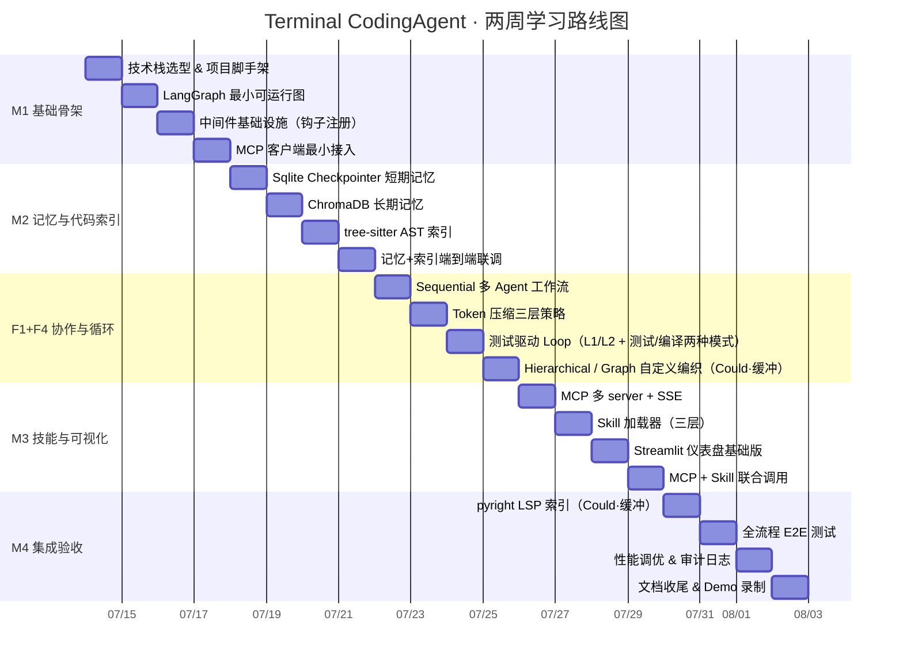

# Terminal CodingAgent — 产品需求文档（PRD）

> **文档版本**：v1.0  
> **编制日期**：2026-07-13  
> **文档编号**：TCA-PRD-001  
> **阶段**：需求分析  

---

## 0. 文档说明

### 0.1 本文档在整套文档中的位置

| 文档编号 | 文档名称 | 与本文档的关系 |
|---|---|---|
| `docs/README.md` | 项目总览 | 前置入口，了解项目由来 |
| `docs/01_产品需求文档.md` | **本文档（PRD）** | 定义"做什么" |
| `docs/02_系统架构文档.md` | 技术架构文档 | 本文档的后继，定义"怎么做" |
| `docs/03_项目开发文档.md` | 开发指南 | 落地实现 |
| `docs/04_核心模块设计.md` | 核心模块设计 | 5 大差异化模块接口与示例 |
| `docs/05_测试与运维手册.md` | 测试与运维手册 | 质量门禁、CI/CD、部署 |

**阅读路径**：先读 README 了解项目全貌 → 读本文档明确功能边界 → 读架构文档理解技术实现。

### 0.2 适用范围

| 角色 | 关注章节 | 使用方式 |
|---|---|---|
| **实现者** | 第 5 章功能需求、第 7 章验收标准 | 按里程碑逐步实现并对照验收标准 |
| **技术评审者** | 第 3 章产品定位、第 6 章优先级、第 9 章风险 | 评估可行性与优先级 |
| **后续维护者** | 第 10 章术语表、代码示例 | 快速理解设计意图 |

**前置知识**：Python 3.11+ 基础；专业术语首次出现时均附解释。

---

## 1. 项目背景与动机

### 1.1 原始 pi 项目是什么

`pi` 是一个**自扩展的 coding agent CLI**，用 TypeScript/Node.js 编写，采用 monorepo 结构：

| 模块 | 职责 |
|---|---|
| `pi-ai` | 统一多提供商 LLM API（OpenAI/Anthropic/DeepSeek 等） |
| `pi-agent-core` | Agent 运行时，驱动 Think-Act-Observe 循环 |
| `pi-tui` | 终端 UI（Ink/React） |
| `pi-coding-agent` | 主 CLI，提供 read/bash/edit/write 等工具与会话管理 |
| `pi-orchestrator` | 实验性多 Agent 编排器 |

**pi 的核心哲学**：给 Agent 一台能跑命令的机器，让模型自己"造工具"——而不只是预设函数列表。

### 1.2 差异化方向

pi 已是一个功能完备的 coding agent，但在以下五个方面存在空白或停留在"实验性"阶段。下表将"痛点 → 增强方向 → 参考资料"对应起来：

| # | pi 的痛点/空白 | 增强方向 | 对应参考 |
|---|---|---|---|
| 1 | `pi-orchestrator` 仅标注"实验性"，无可视化 | **多 Agent 协作与可视化** | 大模型18（MAS / LangGraph / CrewAI） |
| 2 | 会话仅以 JSONL 落盘，无跨会话记忆 | **跨会话项目长期记忆与知识积累** | 大模型22（短期/长期记忆、Checkpointer） |
| 3 | 代码上下文完全靠模型"读文件"，无结构化索引 | **LSP + AST 双引擎代码索引与上下文注入** | 大模型23（Harness Engineering 六层架构） |
| 4 | 对话膨胀后无任何压缩策略 | **结构化分层 Token 压缩与会话状态持久化** | 大模型24（Loop Engineering 外循环设计） |
| 5 | 工具系统是自定义的，不支持 MCP/Skills 生态 | **MCP 和 Skill 的接入** | 大模型20/21（MCP 协议 / Skills 延迟加载） |

**中间件钩子机制**（大模型19）作为横切能力融入架构，让上述五项的"观测、拦截、转换"逻辑可插拔，自身不作为独立差异化功能计数。

### 1.3 解决什么核心痛点

一句话概括：**把 pi 从一个单体会话工具，升级为"可协作、有记忆、懂代码、能自愈、接生态"的 Agent Harness（驾驭工程平台）。**

```
原始 pi：  用户 → pi CLI → 单 Agent 思考/执行 → 输出
增强后：   用户 → Pi Harness → 多 Agent 协作图 → 记忆检索 → 代码索引注入 →
          带验证的循环压缩 → MCP/Skills 工具池 → 输出 + 自动沉淀
```

---

## 2. 产品定位

### 2.1 一句话定位

> **Terminal CodingAgent = Python 原生 Agent Harness**——在 pi 的极简哲学之上，用 Python 技术栈实现五项差异化能力：多 Agent 协作与可视化、跨会话长期记忆、LSP+AST 双引擎代码索引、结构化分层 Token 压缩、MCP+Skill 接入。

### 2.2 核心价值主张

| 价值维度 | 主张 |
|---|---|
| **Harness 思想落地** | 严格遵循 Agent = Model + Harness 公式，把约束、记忆、验证显式化 |
| **组件可替换** | 每个组件可独立替换或禁用，便于在不同配置下做对比验证 |
| **Python 原生栈** | 拥抱 LangGraph/LangChain/ChromaDB 生态，对齐主流 Agent 工具链 |
| **渐进式披露** | 工具/Skill 按需加载，避免 Token 浪费 |
| **闭环自愈** | 写入→验证→修正的 Loop 模式让 Agent 真正"可靠工作" |

### 2.3 与同类产品差异

| 对比维度 | **Terminal CodingAgent** | **Claude Code** | **Cursor** | **Cline** |
|---|---|---|---|---|
| 技术栈 | Python 3.11+ / LangGraph | TypeScript / 闭源 | TypeScript / 闭源 | TypeScript / VS Code 插件 |
| 多 Agent | LangGraph 图编排 + Streamlit 可视化 | 子 Agent（有限） | 无可视化多 Agent | 单 Agent |
| 记忆体系 | Checkpointer(短) + ChromaDB(长) 双层 | CLAUDE.md + 动态记忆 | 无跨会话 | 无跨会话 |
| 代码索引 | tree-sitter AST + pygls/pyright LSP 双引擎 | 内置（黑盒） | 基于 embedding | 基于 grep |
| 工具协议 | MCP 官方 SDK + 自研 Skill 加载器 | MCP 原生 | 无 | MCP |
| 循环验证 | 五种 Loop 模式（测试/编译/Review/调试/迭代） | 无显式 Loop | 无 | 无 |
| 开放性 | **完全开源，面向学习** | 闭源商业产品 | 闭源 | 开源 |

> 注：表中"双引擎 / 图编排 / 五种 Loop"列的是完整能力全景；**MoSCoW 分级时将其拆为基础层（AST、Sequential、L1-L2 Loop、stdio MCP）标为 Must/Should，扩展层（pyright LSP、Graph/Hierarchical 编排、L3 / 全部 5 Loop）标为 Could**。Roadmap M4 为各扩展任务预留 1 天缓冲，按"有余力则做"处理，不阻塞 Must/Should 交付。

**差异化一句话**：同类产品把上述能力"藏"在产品中让用户无感使用；Pi Harness 把所有 Harness 组件**暴露为可配置、可替换的学习模块**。

---

## 3. 使用场景

### 场景 A：独立开发者维护开源项目

| 维度 | 描述 |
|---|---|
| **角色** | 3 年 Python 经验，维护一个开源 Web 项目 |
| **场景** | 接到 Issue 后希望 Agent 自动开 Worktree 修复、跑测试、写报告，自己只需 Review |
| **痛点** | Claude Code 太贵且黑盒；Cursor 的多文件编辑不可控；现有开源 Agent 缺乏跨会话记忆，每次都要重新交代项目背景 |
| **期望** | 能在自己的 VPS 上起一个可调试的 Agent，看到它怎么想、怎么改、为什么错 |

### 场景 B：Agent 工具研究者

| 维度 | 描述 |
|---|---|
| **角色** | NLP 实验室研究人员，研究方向是 Agent 记忆与评测 |
| **场景** | 需要一套能够轻松替换记忆模块（InMemory ↔ SQLite ↔ ChromaDB）的脚手架来跑对比实验 |
| **痛点** | AutoGen/CrewAI 的 Harness 耦合度高，换一种 Checkpointer 要动大量代码 |
| **期望** | Harness 各层可插拔，能单独关闭/开启某一类记忆或某一类验证 |

### 场景 C：Agent 工程实践者

| 维度 | 描述 |
|---|---|
| **角色** | 有 LangChain 基础的工程师，需要将 Agent 能力接入自有产品 |
| **场景** | 通过一个可运行的项目理解 Agent 怎样记忆、怎样协作、怎样压缩上下文 |
| **痛点** | Demo 级代码跑完就忘；文档碎片化 |
| **期望** | 一套"可运行、可单步调试"的 Harness，每个 PRD 功能对应一个可独立运行的验证样例 |

---

## 4. 系统全局概念图

下面这张图展示了 Terminal CodingAgent 的核心部件及其数据流关系（对应第 5 章的 5 个差异化功能）：



**数据流简述**：
1. 用户通过 CLI 或 Web 发起请求；
2. LangGraph 图引擎驱动节点执行，**中间件**在每个节点前后拦截；
3. 节点内可调用 MCP 工具、Skill、文件/Bash；
4. 节点执行前后进行 **AST/LSP** 代码索引检索注入上下文；
5. 每轮执行后 **Loop 控制器**根据验证信号决定继续/停止；
6. 短期状态由 **Checkpointer** 接管，长期知识沉淀到 **ChromaDB**。

---

## 5. 功能需求（核心）

本章详细定义 5 个差异化功能，每个功能按"概述 → 用户故事 → 功能需求列表 → 非功能需求"展开。中途穿插中间件（大模型19）的融入说明。

---

### 功能 F1：多 Agent 协作与可视化

#### F1.1 功能概述

基于 LangGraph 的 `StateGraph` 实现多 Agent 协作：用户在工作流 YAML 或 Python DSL 中声明多个 Agent（每个 Agent 拥有自己的 prompt、工具子集、模型偏好），系统将其编译为 LangGraph 图并执行。在 Streamlit 仪表盘中实时展示每个节点的输入/输出、Token 消耗和流转路径。对应大模型18 中的 CrewAI/LangGraph/AutoGen 模式，但统一到 LangGraph 单一框架下。

#### F1.2 用户故事

| 编号 | As a… | I want to… | so that… |
|---|---|---|---|
| F1-US1 | 独立开发者 | 用 YAML 文件声明一个"研究员+写手+审查员"三 Agent 工作流 | 我能让它们自动协作完成一份技术报告 |
| F1-US2 | AI 研究者 | 在浏览器里看到每个 Agent 节点之间的消息流和 Token 成本 | 我能量化评估不同拓扑（顺序/层级/群聊）的开销 |
| F1-US3 | 学生开发者 | 把同一个任务分别用 3 种 Process（Sequential / Hierarchical / Graph）跑一遍 | 直观理解不同编排模式的差异 |

#### F1.3 功能需求列表

| 编号 | 需求描述 | 验收测试方向 |
|---|---|---|
| F1-FR1 | 支持通过 YAML 或 Python DSL 定义 Agent 角色（name / role / tools / model） | 解析并生成 Agents 列表 |
| F1-FR2 | 支持三种内置 Process 模板：Sequential（顺序）、Hierarchical（层级）、Graph（自定义图） | 编译后节点/边数量正确 |
| F1-FR3 | 支持自定义图：通过 `add_node` / `add_edge` / `add_conditional_edge` 编程式定义 | 可表达条件分支和循环 |
| F1-FR4 | 支持 `Human-in-the-loop` 断点：节点执行前暂停等待人工确认 | 暂停/恢复语义正确 |
| F1-FR5 | Streamlit 仪表盘实时展示：Agent 拓扑图、各节点输入输出、Token 用量、执行耗时 | WebSocket 或轮询刷新 |
| F1-FR6 | 支持"子 Agent 隔离"——每个 Agent 可配置独立工作目录（Worktree 抽象） | 文件修改互不污染 |
| F1-FR7 | 输出最终结果 + 完整执行日志（JSONL 兼容原始 pi 格式） | 可回放 |

#### F1.4 非功能需求

| 维度 | 要求 |
|---|---|
| **性能** | 流式输出延迟 ≤ 2s（不含 LLM 推理时间） |
| **可扩展性** | 单图支持 ≥ 10 个 Agent 节点，图编译时间 ≤ 500ms |
| **可用性** | 单个 Agent 失败不影响整体，允许配置"失败重试/跳过/终止"策略 |
| **安全** | 高危 Agent 操作（push/PR）必须经中间件钩子拦截并人工确认 |

---

### 功能 F2：跨会话项目长期记忆与知识积累

#### F2.1 功能概述

对照大模型22 的"短期 Checkpointer + 长期 Store"双层模型，本项目将短期记忆从 `InMemorySaver` 升级为 `SqliteSaver`（持久化），长期记忆从 `InMemoryStore` 升级为 **ChromaDB 向量库**，并支持语义记忆、情景记忆、程序性记忆三大分类。Agent 在每次会话启动时按"命名空间 + 相关性"检索长期记忆注入上下文；会话中通过中间件判断是否需要"记忆写入"，会话结束后自动索引。

#### F2.2 用户故事

| 编号 | As a… | I want to… | so that… |
|---|---|---|---|
| F2-US1 | 独立开发者 | 让 Agent 在第一次会话中记录下项目约定（Node 20 + Fastify） | 下次开会话时 Agent 自动遵守约定，不需要重复交代 |
| F2-US2 | AI 研究者 | 看到每次会话开始时"召回"了哪些长期记忆，以及召回耗时 | 评估不同 embedding/top-k 策略的影响 |
| F2-US3 | 学生 | 告诉 Agent"上次那个 bug 我是用方法 A 修的" | 下次遇到类似问题时 Agent 能提示"您上次用过方法 A" |

#### F2.3 功能需求列表

| 编号 | 需求描述 | 验收测试方向 |
|---|---|---|
| F2-FR1 | 短期记忆使用 `SqliteSaver`，按 `thread_id` 隔离，支持会话恢复 | 重启服务后历史不丢 |
| F2-FR2 | 长期记忆使用 ChromaDB，按 `(project_id, memory_type)` 命名空间隔离 | 项目 A 数据与项目 B 完全隔离 |
| F2-FR3 | 支持三类长期记忆：语义（事实）、情景（案例）、程序性（规则），存储时打标签 | 支持按类型过滤检索 |
| F2-FR4 | 提供 `MemorySearchTool`，让 Agent 能主动搜索自己的长期记忆 | 可在 prompt 中引用工具 |
| F2-FR5 | 提供 `MemoryWriteTool`，让 Agent 在发现重要信息时写入长期记忆 | 写入后立即可检索 |
| F2-FR6 | 会话启动时 **自动检索** top-k 相关记忆注入 system prompt | 可打印"本次注入记忆列表" |
| F2-FR7 | 支持记忆的版本管理与 eviction（按时间/重要性 LRU 淘汰） | 可配置容量上限 |
| F2-FR8 | 中间件钩子：`before_model` 阶段自动写入"最近行为"到情景记忆 | 开关可配置 |

#### F2.4 非功能需求

| 维度 | 要求 |
|---|---|
| **性能** | 长期记忆检索（含 embedding） ≤ 300ms / 次 |
| **准确性** | 测试集上召回率（hit@5） ≥ 80% |
| **安全** | 每条记忆来源可追溯（session_id + timestamp），支持按用户/项目 GDPR 删除 |
| **存储** | 单项目 ≤ 10k 条长期记忆占用磁盘 ≤ 500MB |

---

### 功能 F3：LSP + AST 双引擎代码索引与上下文注入

#### F3.1 功能概述

对照大模型23 的 Harness 六层架构中 L1（信息边界层）和 L2（工具系统层），本项目引入"代码结构知识"作为独立输入通道：用 **tree-sitter** 做 AST 级函数/类/依赖索引，用 **pygls + pyright** 做 LSP 级的 goto-definition / hover / references 语义索引。当 Agent 处理某个文件时，系统自动检索"相关符号的签名、调用链、类型信息"注入上下文，而不是把整个文件盲塞进去。

#### F3.2 用户故事

| 编号 | As a… | I want to… | so that… |
|---|---|---|---|
| F3-US1 | 独立开发者 | 让 Agent 得知"该文件上游依赖哪些模块、下游被谁引用" | Agent 改接口时能自动排查影响面 |
| F3-US2 | 学生 | 在仪表盘上看到当前文件的 AST 树和符号表 | 理解"为什么 Agent 只拿到了函数签名而不是全文" |
| F3-US3 | 研究者 | 关闭 LSP 只用 AST / 关闭 AST 只用 LSP 做对比实验 | 独立评估两种索引对任务完成率的影响 |

#### F3.3 功能需求列表

| 编号 | 需求描述 | 验收测试方向 |
|---|---|---|
| F3-FR1 | tree-sitter 解析 Python/TypeScript/Java/Go 等主流语言生成 AST，提取函数/类/方法签名 | 解析 1k 行文件 ≤ 200ms |
| F3-FR2 | 建立符号索引表（`SymbolIndex`），支持按符号名快速定位定义的文件位置 | 支持 regex + 精确匹配 |
| F3-FR3 | pyright/pygls 启动 LSP 子进程，注册 `textDocument/definition`、`references`、`hover` | 跳转准确率 ≥ 90% |
| F3-FR4 | 提供 `InjectCodeContextTool`：输入"文件名+当前编辑区"，返回相关签名与调用链 | 返回结构为 `{symbol, signature, calls, called_by}` |
| F3-FR5 | 支持"按需注入"：仅在 Agent 显式查询时触发，避免每轮都注入 | 可配置注入策略 |
| F3-FR6 | 文件系统监听（watchdog）：文件变更后增量更新索引 | 增量更新延迟 ≤ 1s |
| F3-FR7 | Streamlit 中可视化当前项目的模块依赖图 | Mermaid / Graphviz 渲染 |

#### F3.4 非功能需求

| 维度 | 要求 |
|---|---|
| **性能** | AST 索引 1k 文件 ≤ 5s；LSP 查询 ≤ 500ms |
| **资源** | LSP 子进程内存 ≤ 512MB；索引库大小 ≤ 源码大小的 30% |
| **可用性** | LSP 崩溃后自动重启，索引不丢失（SQLite 缓冲） |
| **安全** | 索引服务只读，不修改用户源码 |

---

### 功能 F4：结构化分层 Token 压缩与会话状态持久化

#### F4.1 功能概述

对照大模型24 的 Loop Engineering 六要素，本项目建立"内+外"双层循环：
- **内循环**：模型自身的 Think-Act-Observe（LangGraph 内置）。
- **外循环**：由我们设计的 Loop 控制器根据验证信号（测试结果/编译器输出/人工反馈）决定"继续/修改/停止"。

同时实现 **三层 Token 压缩**（对大模型23"压缩三手段"的工程化）：
1. **L1 截断**：硬性丢弃超过预算的旧消息。
2. **L2 摘要**：用小结模型压缩历史为摘要。
3. **L3 工具输出卸载**：工具返回结果只保留头尾，完整内容落盘按需读取。

会话状态通过 LangGraph Checkpointer 持久化，支持任意时刻 resume。

#### F4.2 用户故事

| 编号 | As a… | I want to… | so that… |
|---|---|---|---|
| F4-US1 | 独立开发者 | 设定"目标：所有测试通过"，让 Agent 自动跑 → 修 → 再跑直到达标 | 不需要我每一步盯着 |
| F4-US2 | 学生 | 观察 Token 使用曲线图，看压缩策略生效前后的对比 | 直观理解"上下文衰减" |
| F4-US3 | 研究者 | 切换 L1/L2/L3 压缩策略分别跑一套 benchmark | 量化不同压缩策略的效果 |

#### F4.3 功能需求列表

| 编号 | 需求描述 | 验收测试方向 |
|---|---|---|
| F4-FR1 | 提供 Loop 控制器抽象：输入目标条件 + 验证器，输出是否继续/停止 | 支持测试/编译/Review/调试/迭代五种验证器 |
| F4-FR2 | 支持"最大循环次数"和"最大 Token 预算"双重熔断 | 超过阈值强制停止 |
| F4-FR3 | L1 截断：按 Token 预算裁剪旧消息，保留 System + 最近 N 轮 | `trim_messages` 正确性 |
| F4-FR4 | L2 摘要：调用小结模型生成摘要替换原历史 | 摘要占原 Token ≤ 20% |
| F4-FR5 | L3 工具卸载：工具返回只保留头 100 + 尾 100 token，完整内容写文件 | 文件大小与上下文节省可对比 |
| F4-FR6 | Checkpointer（SQLite）支持断点恢复：服务崩溃后 resume 到最后一轮 | 恢复后行为与断点前一致 |
| F4-FR7 | Streamlit 实时展示 Token 用量曲线、压缩触发事件 | 折线图刷新 |
| F4-FR8 | 中间件钩子：`wrap_model_call` 阶段注入 Token 计数与压缩判断逻辑 | 钩子开关可配置 |

#### F4.4 非功能需求

| 维度 | 要求 |
|---|---|
| **性能** | 单次压缩（摘要）耗时 ≤ 3s；上下文整体 Token 节省 ≥ 40%（长对话场景） |
| **正确性** | 断点恢复后与"无崩溃"跑分的行为差异 = 0 |
| **可用性** | Loop 执行中 ≤ 5% 的概率出现死循环（需熔断兜底） |
| **可观测** | 每次压缩都写审计日志（原因 / 前后 Token 数） |

---

### 功能 F5：MCP 和 Skill 的接入

#### F5.1 功能概述

对照大模型20/21，本项目同时接入两种能力扩展协议：
- **MCP（Model Context Protocol）**：通过官方 Python SDK + `langchain_mcp_adapters`（`MultiServerMCPClient`）接入。用户通过 YAML 声明式配置 MCP 服务器（command/args/transport），系统自动拉起并注册工具池。
- **Anthropic Skills 风格**：自研 Markdown Skill 加载器。每个 Skill 是一个包含 `SKILL.md`（frontmatter + 执行说明）+ 可选 `scripts/` `references/` 的文件夹。系统仅在匹配触发条件时才加载正文，scripts/references 真正实现"延迟加载"。

#### F5.2 用户故事

| 编号 | As a… | I want to… | so that… |
|---|---|---|---|
| F5-US1 | 独立开发者 | 在 `mcp_servers.yaml` 里写上一行 `npx @modelcontextprotocol/server-github` | 我的 Agent 立刻获得操作 GitHub 的能力 |
| F5-US2 | 学生 | 创建一个"代码审查报告生成 Skill"，包含触发条件、执行流程、输出模板 | Agent 遇到"帮我审查这段代码"自动加载 Skill |
| F5-US3 | 研究者 | 对比"MCP 直连工具"和"MCP+Skill 包装"两种方式的 Token 消耗 | 验证"延迟加载能省 Token"的假设 |

#### F5.3 功能需求列表

| 编号 | 需求描述 | 验收测试方向 |
|---|---|---|
| F5-FR1 | MCP 客户端支持 stdio 和 sse 两种 transport；通过 YAML 声明式配置多个 server | 可同时连 ≥ 3 个 MCP 服务器 |
| F5-FR2 | MCP 客户端启动后自动 `tools/list` 发现，转换为 LangChain Tool 注册到图 | 工具列表正确 |
| F5-FR3 | Skill 加载器扫描 `skills/` 目录，解析 `SKILL.md` 的 frontmatter（name / description / triggers） | 目录扫描正确 |
| F5-FR4 | Skill 延迟加载：初始只注入"名称+描述"列表；触发条件命中后才读取正文到上下文 | 未触发时正文不占 Token |
| F5-FR5 | Skill 支持三层加载：L1 元数据 → L2 正文 → L3 scripts/references（按需读取） | 每层可独立触发 |
| F5-FR6 | 提供 `SkillRouter`：根据用户 query 与 Skill 的 description 做语义匹配选 Skill | Top-1 命中率 ≥ 75% |
| F5-FR7 | Skill 与 MCP 可联合调用：Skill 的正文中可引导 Agent 调用 MCP 工具 | 端到端联调通过 |
| F5-FR8 | 中间件钩子：`after_tool_call` 阶段对 MCP/Skill 工具返回做后处理（截断/重格式化） | 钩子开关可配置 |

#### F5.4 非功能需求

| 维度 | 要求 |
|---|---|
| **性能** | MCP 工具发现（首次连接） ≤ 2s；Skill 路由匹配 ≤ 100ms |
| **可用性** | MCP server 断线自动重连（指数退避，最多 5 次）；Skill 文件损坏不影响其他 Skill |
| **安全** | MCP 工具白名单机制，高危操作（write/delete/push）必须经中间件确认 |
| **可扩展** | 新增 MCP server 只需在 YAML 加一段声明，不需要改代码 |

---

### 功能中间件横向融入说明（大模型19）

中间件不是独立功能，而是贯穿上述 F1~F5 的"神经系统"。本项目采用 LangChain `AgentMiddleware` 两种形态：

#### 中间件类型与挂载点

| 钩子 | 类型 | 触发时机 | 在本项目中的典型用途 |
|---|---|---|---|
| `before_agent` | 节点式 | 每次 Agent 调用前 | 注入项目级记忆、记录开始时间 |
| `before_model` | 节点式 | 每次 LLM 调用前 | 执行 Token 压缩（F4）、上下文注入（F3） |
| `after_model` | 节点式 | 每次 LLM 调用后 | 记录 Token 成本、提取待写入记忆 |
| `after_agent` | 节点式 | 每次 Agent 调用后 | 写入情景记忆（F2）、审计日志 |
| `wrap_model_call` | 包裹式 | 围绕 LLM 调用 | 重试、缓存、Token 熔断（F4） |
| `wrap_tool_call` | 包裹式 | 围绕工具调用 | MCP/Skill 工具后处理（F5）、权限拦截 |
| `dynamic_prompt` | 便利式 | 生成动态系统提示 | 根据当前 Skill/记忆动态拼 system prompt |

#### 中间件注册示例

```python
from langchain.agents.middleware import before_model, after_model

@before_model
def inject_code_context(state, runtime):
    """F3 功能：模型调用前注入 AST/LSP 上下文"""
    current_file = state.get("current_file")
    if current_file:
        context = code_index.lookup(current_file)
        return {"messages": [SystemMessage(content=context)]}
    return {}

@after_model
def persist_to_longterm(state, runtime):
    """F2 功能：模型调用后把待沉淀信息写入长期记忆"""
    last_content = state["messages"][-1].content
    if should_remember(last_content):
        chroma_store.upsert(project_id=state["project"],
                            content=last_content)
    return {}

agent = create_agent(
    model=llm,
    tools=tools,
    middleware=[inject_code_context, persist_to_longterm],
    checkpointer=checkpointer,
)
```

---

## 6. 功能关系与优先级

### 6.1 五大功能关系图

下图展示 F1~F5 的依赖关系与数据流向：



**依赖解读**：
- **多 Agent 协作（F1）是"冠"**：它直接面向用户输出价值，依赖 F2/F3/F4/F5 提供记忆/索引/循环/工具。
- **中间件（MW）与 LangGraph（LG）是"根茎"**：所有功能最终通过钩子挂载到图上。
- **F3/F4/F5 是相对独立的"支柱"**：可独立启用/关闭进行学习对比。

### 6.2 MoSCoW 优先级分级

| 级别 | 功能（或需求） | 说明 |
|---|---|---|
| **M — Must Have** | LangGraph 图引擎基础（LG） | 一切的基础，无图不成 Harness |
| **M — Must Have** | 中间件钩子基础设施（MW） | F1~F5 的接入通道 |
| **M — Must Have** | F2 Sqlite Checkpointer 短期记忆 | 跨会话持久化的底线 |
| **M — Must Have** | F5 MCP 客户端基础（stdio 连接） | 工具生态接入的前提 |
| **M — Must Have** | F1 基础图编译 + Sequential Process | 最小可运行的协作 |
| **S — Should Have** | F2 ChromaDB 长期记忆 + 三类记忆分级 | 完整记忆体系 |
| **S — Should Have** | F3 tree-sitter AST 索引 | 代码索引的"低成本"半边 |
| **S — Should Have** | F4 L1/L2 Token 压缩 + 测试驱动 Loop | 最实用的压缩与循环模式 |
| **S — Should Have** | F5 Skill 加载器（三层延迟加载） | 完整工具生态 |
| **S — Should Have** | Streamlit 基础仪表盘（Agent 拓扑 + Token 曲线） | 可视化的最小可用版本 |
| **C — Could Have** | F3 pygls/pyright LSP 语义索引 | 提升精度但非必需 |
| **C — Could Have** | F4 L3 工具卸载 + 编译/Review 等全部 5 种 Loop | 增强但复杂 |
| **C — Could Have** | F1 Hierarchical / Graph 自定义编排 | 高级用户用 |
| **C — Could Have** | F2 Prompt 自我优化（程序性记忆） | 研究向 |
| **W — Won't Have** | 商业化 IDE 插件 | 超出学习范围 |
| **W — Won't Have** | 移动端入口 | 超出范围 |
| **W — Won't Have** | 闭源模型专有优化 | 保持开源学习定位 |

---

## 7. 验收标准

每个功能给出 3-5 条可量化验收标准，使用 Given/When/Then 格式（BDD 风格）。

### F1 多 Agent 协作与可视化

| 编号 | 验收标准 |
|---|---|
| F1-AC1 | **Given** 用户提供一个 YAML 定义三 Agent（researcher/writer/reviewer）的 Sequential 工作流，**When** 系统编译并执行，**Then** 最终输出包含三阶段产物，执行日志中各角色切换次数 = 3 |
| F1-AC2 | **Given** 图中某个 Agent 节点抛出异常，**When** 配置为 `on_error=skip`，**Then** 后续节点仍能完成且不报未处理异常 |
| F1-AC3 | **Given** 用户配置 `human_in_the_loop=True`，**When** 到达断点节点，**Then** 系统暂停并等待用户输入 `continue` / `modify` / `abort` |
| F1-AC4 | **Given** Streamlit 仪表盘连接正常，**When** 执行多 Agent 图，**Then** 拓扑图在 ≤ 2s 内渲染，节点状态实时更新（刷新间隔 ≤ 1s） |
| F1-AC5 | **Given** 两个 Agent 配置在不同 Worktree，**When** 同时修改各自文件，**Then** git status 显示各自目录独立，无交叉污染 |

### F2 跨会话长期记忆

| 编号 | 验收标准 |
|---|---|
| F2-AC1 | **Given** 用户在第 1 次会话中写入"项目用 Node 20 + Fastify"，**When** 第 2 次全新会话启动，**Then** Agent 在 system prompt 中能看到该条记忆，且查询"项目技术栈"时能正确回答 |
| F2-AC2 | **Given** 项目 A 写入 100 条记忆，项目 B 写入 100 条记忆，**When** 搜索项目 A，**Then** 返回结果中不包含项目 B 的任何记忆 |
| F2-AC3 | **Given** 长期记忆容量上限 10k 条，**When** 写入第 10001 条，**Then** LRU 正确淘汰最早一条，且新写入可检索 |
| F2-AC4 | **Given** 长期记忆嵌入耗时测试集，**When** 并发执行 10 次检索，**Then** 平均耗时 ≤ 300ms，p95 ≤ 500ms |

### F3 LSP + AST 双引擎代码索引

| 编号 | 验收标准 |
|---|---|
| F3-AC1 | **Given** 一个 5000 行的 Python 项目，**When** tree-sitter 建立完整索引，**Then** 索引进程内存 ≤ 200MB，耗时 ≤ 5s |
| F3-AC2 | **Given** Agent 查询函数 `get_user_by_id` 的调用链，**When** 触发 AST 搜索，**Then** 返回该函数的定义位置 + 所有 caller 列表；准确率 ≥ 90%（对照人工标注） |
| F3-AC3 | **Given** pyright LSP 已启动，**When** 查询某符号的 hover 信息，**Then** 返回结构化类型签名，耗时 ≤ 500ms |
| F3-AC4 | **Given** 用户修改 foo.py 并保存，**When** watchdog 捕获变更，**Then** 索引增量更新完成且延迟 ≤ 1s；后续查询反映最新内容 |

### F4 Token 压缩与 Loop

| 编号 | 验收标准 |
|---|---|
| F4-AC1 | **Given** 一次 200 轮对话（约 80k token），**When** 触发 L2 摘要压缩，**Then** 压缩后累计 token ≤ 原历史的 30%，且不丢失"系统设定 + 最近 5 轮"原始内容 |
| F4-AC2 | **Given** 循环控制器配置目标条件"pytest 0 failures"，**When** 启动 Loop，**Then** Agent 在 ≤ 10 次循环内完成修复或触发熔断；最终 pytest 必须通过 |
| F4-AC3 | **Given** Checkpointer 持久化到 SQLite，**When** 服务在第 50 轮崩溃重启并调用 `get_state` + `resume`，**Then** 恢复后行为与无崩溃对照一致 |
| F4-AC4 | **Given** Streamlit 仪表盘已连接，**When** 执行带压缩的 Loop，**Then** Token 曲线图能展示"阶梯式下降"的压缩触发事件（至少 1 次） |

### F5 MCP 与 Skill 接入

| 编号 | 验收标准 |
|---|---|
| F5-AC1 | **Given** 配置文件声明 3 个 MCP server（stdio × 2，sse × 1），**When** 客户端启动，**Then** 3 个 server 均在 2s 内连接成功，`tools/list` 返回的工具总数等于各 server 工具之和 |
| F5-AC2 | **Given** 一个 Skill 目录含 SKILL.md + scripts/helper.py，**When** 用户 query 命中触发词，**Then** Agent 自动读取 SKILL.md 正文，且 scripts/ 中的文件未被加载到上下文（可检查 prompt token 数） |
| F5-AC3 | **Given** Skill 路由测试集（100 条人工标注 query→skill），**When** 执行自动化测试，**Then** Top-1 命中率 ≥ 75% |
| F5-AC4 | **Given** MCP server 被 kill，**When** 客户端检测到断线，**Then** 自动重连（指数退斥 1s/2s/4s/8s/16s），最多 5 次后标记 server 不可用并继续 |

---

## 8. 产品路线图（Roadmap）

### 8.1 两周学习计划概览

本项目定位为 **"学习为主、两周内完成"**。按 4 个里程碑（M1~M4）推进，每个里程碑约 3~4 个工作日。

### 8.2 Mermaid 甘特图



### 8.3 里程碑定义

| 里程碑 | 时间区间 | 目标 | 验收条件 |
|---|---|---|---|
| **M1 — 基础骨架** | D1~D4 | 跑通"LangGraph 图 + 中间件 + MCP 最小链路" | M-agent 单图 + 1 个 MCP 工具 + 2 个钩子可运行 |
| **M2 — 记忆与代码索引** | D5~D8 | 跑通"Checkpointer+ChromaDB 双层记忆"与"AST 索引" | 跨会话记忆召回 + 代码符号检索可用 |
| **M3 — 协作与循环** | D9~D12 | 跑通三 Agent Sequential + Token 压缩 + 测试 Loop | 端到端产出三阶段产物 + Loop 自愈 |
| **M4 — 集成验收** | D13~D14 | 跑通可视化 + LSP + 全流程 E2E + 文档收尾 | 全部 AC 通过 + README 与架构文档完成 |

### 8.4 关键风险应对

当某里程碑落后半天以上时启动以下预案：

| 落后功能 | 降级预案 |
|---|---|
| F3 LSP 索引 | 先只做 AST（tree-sitter 更轻量） |
| F1 Hierarchical/Graph 编排 | 仅保留 Sequential，其余进入 Could |
| Streamlit 美化 | 仅保留原始文本输出 |
| 长期记忆（ChromaDB） | 范围收敛为"Should：仅 project_memories 一个集合 + 同步提炼"；user_preferences / code_chunks 集合延至 M4 结束后（保持 Should，不降级为 Won't） |

---

## 9. 风险与假设

### 9.1 技术风险

| 风险 | 可能性 | 影响 | 应对措施 |
|---|---|---|---|
| LangGraph API 频繁迭代（2026 上半年已多次 breaking change） | 高 | 中 | 锁定 `langgraph==0.2.x` 具体版本做镜像；核心代码与 LangChain 解耦（薄封装层） |
| pyright LSP 子进程稳定性差，易内存泄漏 | 中 | 中 | watchdog 监控 + 定期重启；作为 Could 功能，不做 Should |
| ChromaDB embedding 模型在中文场景表现不稳定 | 中 | 中 | 默认选用 `text-embedding-3-small` + 可选 bge-small-zh 切换 |
| 多 Agent 协作调试困难，bug 溯源成本高 | 高 | 高 | 强制审计日志 + 中间件留痕，每个节点输入输出落盘 |
| Token 压缩导致关键信息丢失 | 中 | 高 | 保留 system + 最近 N 轮 + 版本回溯（SQLite 多版本） |

### 9.2 依赖风险

| 依赖 | 版本/状态 | 风险等级 | 替代方案 |
|---|---|---|---|
| Python 3.11+ | 稳定 | 低 | — |
| LangGraph | 0.2.x（活跃开发） | 中 | 锁定版本，延迟升级 |
| LangChain | 0.3.x | 中 | 仅用作 LLM 抽象，可替换为裸 openai SDK |
| ChromaDB | 0.5.x | 低 | 降级为 SQLite + BM25 |
| tree-sitter | 0.22+ | 低 | 语言绑定丰富，社区活跃 |
| pygls + pyright | pygls 1.x / pyright 1.x | 中 | 仅 AST 时用正则回退 |
| MCP Python SDK | 1.x | 中 | 锁定版本 |
| Streamlit | 1.30+ | 低 | 可换 Gradio；仅可视化不是核心 |

### 9.3 假设条件

1. **学习资源可用**：项目依赖的 6 份参考资料已就位，新加入成员可通过 README → PRD → 架构文档 三件套 2 小时内入门。
2. **LLM API Key 可用**：开发测试期间需有至少一个可用 LLM 提供商（DeepSeek/OpenAI/Anthropic 任一）的 API Key。
3. **单机开发**：目标运行机器为单台开发机（16GB RAM）；不考虑分布式部署。
4. **浏览器可用**：Streamlit 仪表盘假定可运行在本地浏览器（chrome/edge）。
5. **Git 已安装**：Worktree 隔离与版本管理依赖系统级 git 命令可用。
6. **SDK 行为与文档一致**：LangGraph/ChromaDB/MCP SDK 的行为以各自文档为准；如遇 breaking change，优先升级本项目锁定版本而非追赶上游。

---

## 10. 术语表

| 缩写/术语 | 英文全称 | 简明定义 | 在本项目中的位置 |
|---|---|---|---|
| **MAS** | Multi-Agent System | 由多个可通信、协作的 Agent 构成的系统 | F1 多 Agent 协作 |
| **LLM** | Large Language Model | 大语言模型（如 GPT-4/Claude/DeepSeek） | 底层能力源 |
| **Harness** | Agent Harness | 模型之外的一切——约束、工具、记忆、验证、上下文管理 | 整体产品定位（Agent = Model + Harness） |
| **Loop** | Agent Loop | 外部系统驱动的"意图→上下文→行动→观察→调整"循环 | F4 Loop 工程 |
| **Checkpointer** | LangGraph Checkpointer | LangGraph 状态持久化接口，保存节点执行后的快照 | F2 短期记忆 |
| **Store** | LangGraph Store | 跨线程的键值存储抽象，本项目用 ChromaDB 实现 | F2 长期记忆 |
| **MCP** | Model Context Protocol | Anthropic 推出的标准化工具接入协议（JSON-RPC over stdio/SSE） | F5 工具生态 |
| **Skill** | Agent Skill | 以 SKILL.md 为核心的"延迟加载能力包" | F5 技能系统 |
| **LSP** | Language Server Protocol | IDE 通用的语义服务协议（hover/definition/references） | F3 语义索引 |
| **AST** | Abstract Syntax Tree | 代码的树形结构化表示 | F3 结构索引 |
| **Middleware** | Agent Middleware | 钩子机制的载体（before/after/wrap 三类） | 横向架构层 |
| **Node/LangGraph** | LangGraph Node | 图上的执行单元，封装一次 Agent 动作或工具调用 | F1 图编排 |
| **Edge/Conditional Edge** | LangGraph Edge | 节点间的流转路径，条件边可动态路由 | F1 图编排 |
| **StateGraph** | LangGraph StateGraph | LangGraph 的核心：共享状态 + 节点 + 边的完整定义 | F1 图编排 |
| **Compress/Compaction** | Token Compaction | 对上下文进行截断/摘要/卸载，减少 Token 数 | F4 Token 压缩 |
| **Eviction** | Memory Eviction | 长期记忆中按策略（LRU/重要性）淘汰旧数据 | F2 记忆管理 |
| **Worktree** | Git Worktree | Git 的多工作区机制，让多 Agent 改文件互不干扰 | F1 子 Agent 隔离 |
| **RAG** | Retrieval-Augmented Generation | 检索增强生成——搜到相关文档后注入上下文 | F2 长期记忆检索 |
| **JSONL** | JSON Lines | 一行一条 JSON 的原始 pi 会话格式 | 兼容层 |
| **SSE** | Server-Sent Events | 服务器向客户端单向推送的流协议，MCP 的一种 transport | F5 MCP |
| **TypedDict/Python** | Python TypedDict | 用字典 + 类型提示定义结构化数据的方式 | LangGraph State 定义 |
| **Pydantic** | Pydantic | Python 数据验证库，用来定义配置模型 | 配置层 |
| **Frontmatter** | YAML Frontmatter | Markdown 文件顶部 `---` 之间的元数据块 | Skill 描述 |
| **Token** | LLM Token | LLM 处理的最小文本单元（≈ 0.75 英文单词 或 0.5~1 中文字） | F4 Token 压缩 |
| **Embedding** | Text Embedding | 将文本映射为高维向量，用于语义检索 | F2 ChromaDB |
| **Watchdog** | File System Watchdog | 监听文件变更的守护进程 | F3 增量索引 |
| **BDD** | Behavior-Driven Development | 以 Given/When/Then 描述行为的开发范式 | 第 7 章验收标准 |

---

## 11. 附录：核心代码骨架示例

### 11.1 Skill 目录结构示例

```
skills/
└── code-review-report/
    ├── SKILL.md              # 必需：frontmatter + 正文
    ├── scripts/
    │   └── generate_report.py  # 可由 Agent 调用的脚本
    ├── references/
    │   ├── python-style-guide.md
    │   └── common-patterns.md
    └── assets/
        └── template.docx
```

`SKILL.md` 示例：

```markdown
---
name: code-review-report
description: 对指定代码文件/片段生成结构化审查报告。
            触发条件：用户提到"代码审查"、"review this code"、"代码评审"。
---

# 代码审查报告生成 Skill

## 触发条件
当用户请求生成代码审查报告、对比 diff、或按规范检查代码时触发本技能。

## 环境约束
- 只读操作，不修改源码
- 报告语言默认跟随用户的输入语言
- 严重度使用 P0/P1/P2/P3 四级

## 执行流程
1. 确定审查范围（文件 path / diff / PR 链接）
2. 调用 `scripts/generate_report.py` 获取结构化审查结果
3. 按下方"输出规范"渲染报告

## 输出规范
- 标题：`# 代码审查报告 - {文件名}`
- 元信息：审查时间、审查范围、使用的规范引用
- 发现列表：按 P0~P3 分级，每项包含"位置 / 描述 / 建议修改"
- 总结：100 字以内的整体评价

## 示例
输入：`请审查 src/auth.py 的代码质量`
输出：一份 Markdown 报告，含 5~10 条分级发现

### 11.2 MCP 配置文件示例

```yaml
# config/mcp_servers.yaml
# 顶层键使用 CamelCase 以兼容 langchain_mcp_adapters.MultiServerMCPClient
mcpServers:
  github:
    command: npx
    args: ["-y", "@modelcontextprotocol/server-github"]
    transport: stdio
    env:
      GITHUB_TOKEN: "${GITHUB_TOKEN}"
  weather:
    command: python
    args: ["servers/weather_server.py"]
    transport: stdio
  docs:
    url: "http://localhost:8001/sse"
    transport: sse
```

### 11.3 中间件钩子注册示例

```python
from langchain.agents.middleware import (
    before_agent, before_model, after_model, after_agent,
    wrap_model_call, wrap_tool_call, dynamic_prompt
)
import time

@before_agent
def record_start_time(state, runtime):
    return {"_start_time": time.time()}

@before_model
def enforce_token_budget(state, runtime):
    """F4 L1 截断：硬限 8000 token"""
    from langchain_core.messages import trim_messages
    messages = trim_messages(state["messages"], max_tokens=8000,
                             strategy="last", include_system=True)
    return {"messages": messages}

@after_model
def audit_token_usage(state, runtime):
    usage = state["messages"][-1].usage_metadata
    print(f"[Audit] after_model tokens={usage}")
    return {}

@wrap_tool_call
def retry_on_failure(tool, call, invoke):
    """wrap 风格：工具失败最多重试 2 次"""
    for attempt in range(3):
        result = invoke(call)
        if not getattr(result, "is_error", False):
            return result
    return result

@dynamic_prompt
def compose_system_prompt(state, runtime):
    """动态拼接：基础 prompt + 当前 Skill + 召回记忆"""
    base = "你是 Pi Harness Agent，按照指令工作。"
    skill = state.get("_active_skill_body", "")
    memory = state.get("_injected_memory", "")
    return "\n---\n".join(filter(None, [base, memory, skill]))
```

### 11.4 LangGraph State 定义示例

```python
from typing import Annotated, TypedDict
from langgraph.graph.message import add_messages

class PiHarnessState(TypedDict):
    # 基础 LangGraph 协议
    messages: Annotated[list, add_messages]
    # F1 多 Agent 协作
    agent_outputs: dict          # 各 Agent 节点的中间产物
    # F2 记忆
    _injected_memory: str        # 本次注入的长期记忆
    # F3 代码索引
    current_file: str
    code_context: dict           # AST/LSP 检索结果
    # F4 Token 循环
    token_usage: dict            # 累计 + 本轮
    loop_iteration: int          # 当前 Loop 迭代次数
    verification_result: str     # 验证器输出
    # F5 工具/Skill
    _active_skill_body: str
    mcp_tool_names: list
    # 中间件审计
    _start_time: float
```

---

## 12. 变更记录与交付摘要

### 12.1 交付摘要

| 维度 | 数量 |
|---|---|
| 差异化功能 | **5 项**（F1 多 Agent 协作 / F2 记忆 / F3 代码索引 / F4 Token 压缩与 Loop / F5 MCP+Skill） |
| 横切能力 | **1 项**（中间件钩子体系，贯穿 F1~F5） |
| 功能需求 | **38 条**（F1: 7 / F2: 8 / F3: 7 / F4: 8 / F5: 8） |
| 验收标准 | **21 条**（全部 Given/When/Then 形式） |
| MoSCoW 分级 | **M=5 / S=5 / C=5 / W=3** |
| 里程碑 | **4 个**（M1 基础骨架 / M2 记忆与索引 / M3 协作与循环 / M4 集成验收） |
| 计划工期 | **2 周**（10 个工作日） |

### 12.2 核心设计理念回顾

```
Agent  =  Model  +  Harness
         (能力源)   (我们做的事)
                    │
                    ├─ 中间件钩子层 (before/after/wrap)
                    ├─ 多 Agent 图编排
                    ├─ 双层记忆 (SQLite + ChromaDB)
                    ├─ 双引擎索引 (AST + LSP)
                    ├─ 三层压缩 + 外循环验证
                    └─ 双协议工具池 (MCP + Skill)
```

### 12.3 范围边界

本项目在 pi coding agent 的极简哲学之上，**用 Python 生态实现 Harness Engineering 的完整能力栈**——交付一个**有记忆、能协作、懂代码、会自愈、接生态**的 Agent Harness。

不包含：商业化 IDE 插件、移动端入口、闭源模型专有优化（详见 §6.2 MoSCoW Won't 列表）。

### 12.4 后续文档

| 文档 | 覆盖范围 |
|---|---|
| `02_系统架构文档.md` | 每个模块的接口、数据流、关键决策 |
| `03_项目开发文档.md` | 环境准备、目录约定、编码规范、构建与测试 |
| `04_核心模块设计.md` | 5 项差异化模块的接口、流程与完整可运行示例 |
| `05_测试与运维手册.md` | 质量门禁、CI/CD、部署与运维 |

---

> **文档维护说明**：本文档是 Terminal CodingAgent 的权威功能定义。如有技术方案调整，请先评审对验收标准的影响，再决定是否修订本文档。建议以 PR 形式变更本文档，保留历史版本。