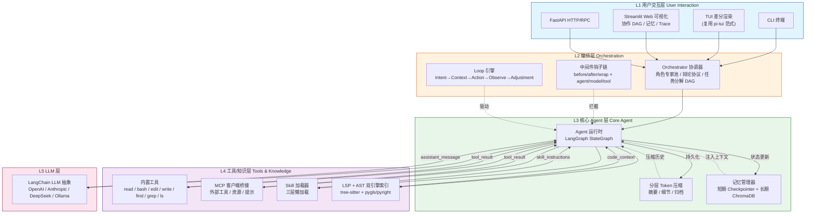
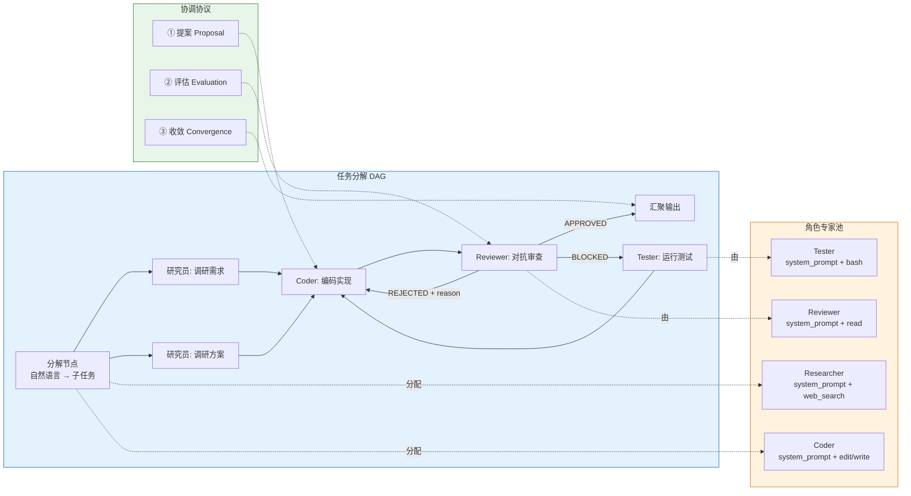
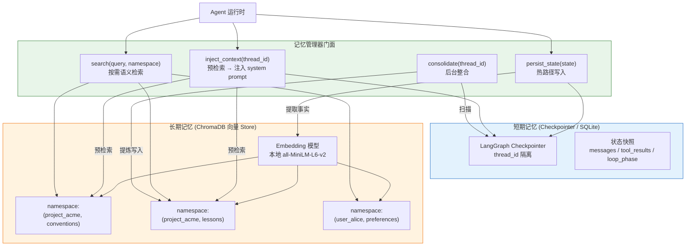
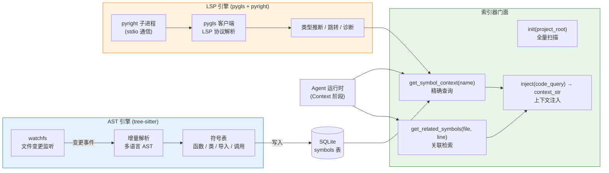
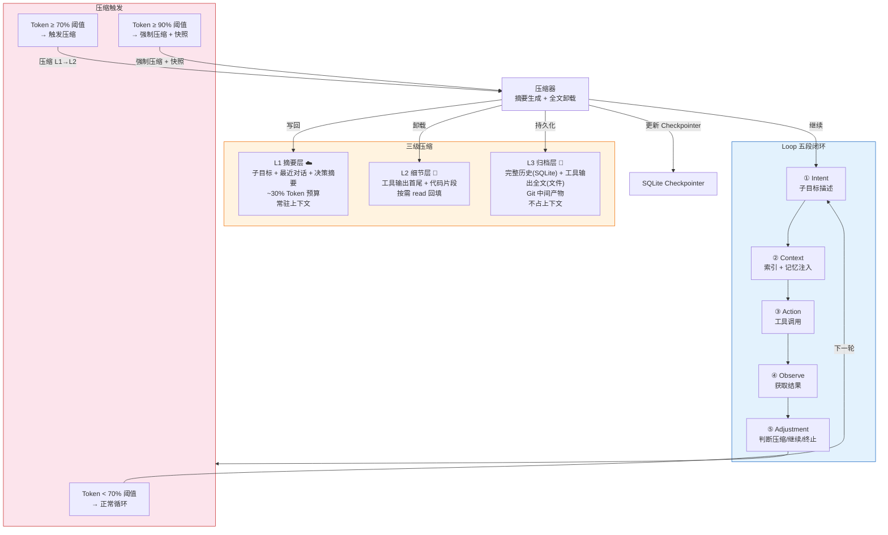
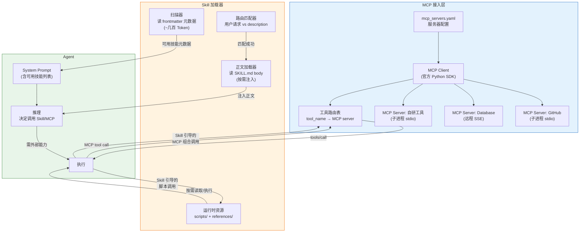
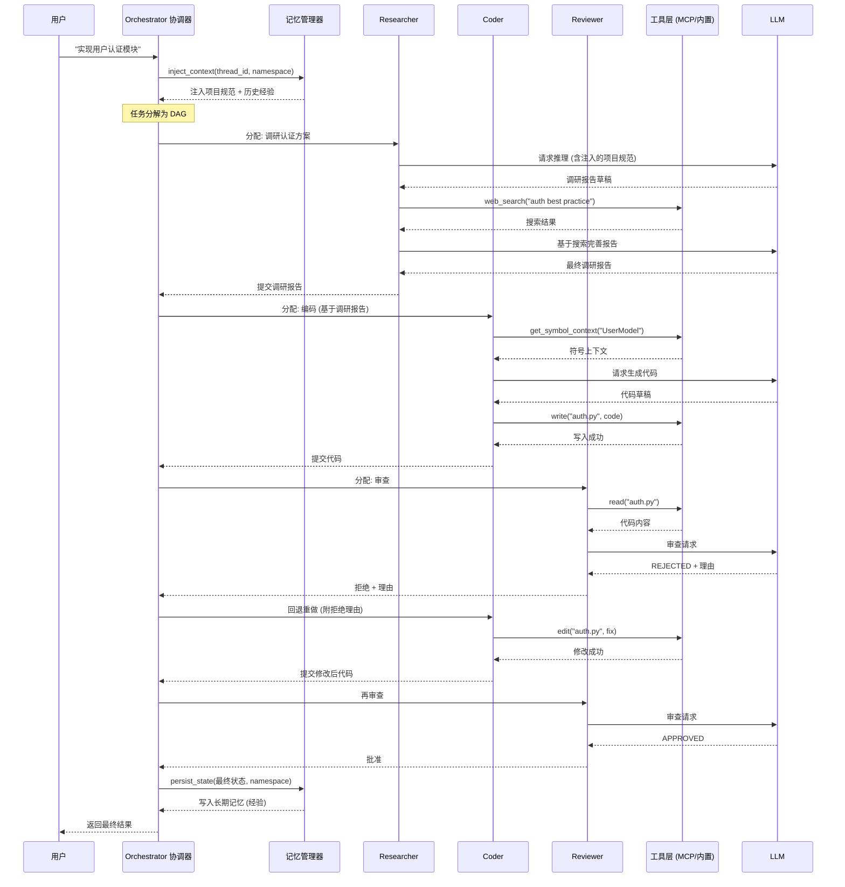
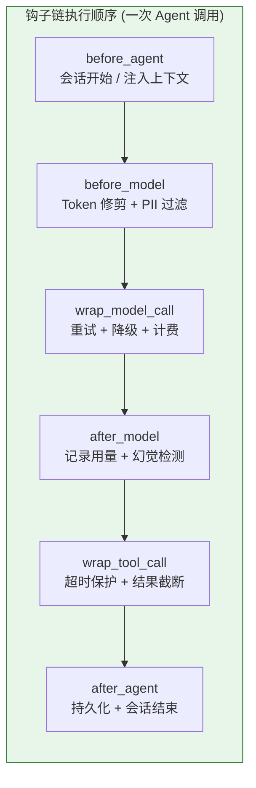

# Terminal CodingAgent —— 系统架构文档

> 文档版本：v1.0 | 日期：2026-07-13 | 作者：架构组

---

## 1. 文档说明

### 1.1 本文档的位置

本文档属于 **Terminal CodingAgent** 系列设计文档中的第二篇，位于 `docs/02_系统架构文档.md`。它是整个项目的"技术总图"，后续所有模块的详细设计、接口契约、实现任务拆解均以此文档为锚点展开。

系列文档：

| 编号 | 文档 |
|------|------|
| 01 | [产品需求文档](01_产品需求文档.md) |
| **02** | **系统架构文档（本文档）** |
| 03 | [项目开发文档](03_项目开发文档.md) |
| 04 | [核心模块设计](04_核心模块设计.md) |
| 05 | [测试与运维手册](05_测试与运维手册.md) |

### 1.2 前置阅读

在阅读本文档前，建议按顺序具备以下知识：

1. 原始 pi 项目的包结构，理解 pi-ai / pi-agent-core / pi-tui / pi-coding-agent / pi-orchestrator 五个包的职责边界。
2. 7 份参考资料（路径见 README 参考资料映射表），对应以下主题：
   - 大模型18 多智能体 —— LangGraph 图结构与多 Agent 协作范式
   - 大模型19 中间件 —— 钩子类型与拦截模型
   - 大模型20 MCP —— 协议与客户端桥接
   - 大模型21 Skills —— 三层懒加载与目录约定
   - 大模型22 记忆 —— 长短期两层协同
   - 大模型23 Harness —— 六层架构与上下文工程
   - 大模型24 Loop —— 五段闭环与六种模式

### 1.3 适用范围

| 角色 | 关注章节 | 阅读目的 |
|------|----------|----------|
| 系统架构师 | 全文 | 确认技术选型与分层边界 |
| Python 开发工程师 | 第 5、6、8、9 节 | 理解模块接口与数据契约 |
| 前端/可视化工程师 | 第 5.1、7 节 | 理解 Streamlit 层与数据流 |
| 测试/QA 工程师 | 第 10、11 节 | 理解容错与安全边界 |
| 项目经理 | 第 2、3、12 节 | 理解交付范围与可扩展性 |

---

## 2. 设计目标与约束

### 2.1 功能性需求顶层

Terminal CodingAgent（以下简称 **TCA**）在保留原始 pi 项目"自扩展 coding agent CLI"定位的基础上，通过引入 Python 技术栈实现 5 项差异化能力：

| # | 能力 | 用户可感知价值 |
|---|------|----------------|
| D1 | 多 Agent 协作与可视化 | 复杂编码任务自动拆解为"Researcher→Coder→Reviewer"流水线，Streamlit 面板实时展示协作 DAG 与中间产物 |
| D2 | 跨会话项目长期记忆与知识积累 | 新会话启动时自动注入项目规范、历史决策、踩坑经验，不再"每次从零开始" |
| D3 | LSP + AST 双引擎代码索引与上下文注入 | 代码补全/导航/重构基于真实语义，而非文本模糊匹配 |
| D4 | 结构化分层 Token 压缩与会话状态持久化 | 长任务不爆上下文，断点可恢复，Loop 五段闭环自主推进 |
| D5 | MCP + Skill 接入 + 中间件钩子链 | 外部工具即插即用，项目规范以 Skill 文件形式沉淀，全链路可观测可拦截 |

### 2.2 非功能性需求顶层

| 维度 | 指标 | 说明 |
|------|------|------|
| **性能** | 单轮 LLM 响应 P95 ≤ 30s | 不含工具执行时间；索引构建首次 ≤ 60s/万行 |
| **可靠性** | 工具调用失败可降级率 ≥ 99% | 任一工具失败不导致整个 Agent 崩溃 |
| **可观测** | 全链路 Trace 覆盖率 100% | 通过中间件钩子记录每次 model/tool 调用 |
| **安全** | 工具沙箱隔离、API Key 不落盘明文 | 最小权限原则 |
| **可扩展** | 新增 LLM 提供商 ≤ 1 人日；新增工具类型 ≤ 0.5 人日 | 插件化设计 |
| **兼容性** | Python 3.11+，Windows/Linux/macOS | 跨平台 |

### 2.3 设计原则

1. **可演进（Evolvable）**：每一层都是"接口 + 实现"分离，当前用 SQLite 跑通的模块未来可无缝换成 PostgreSQL，当前用 Streamlit 的 UI 未来可换成 Web SPA，不推翻架构。
2. **可替换每一层（Layer Replaceable）**：LLM 层（LangChain 抽象）、编排层（LangGraph）、记忆层（ChromaDB/SQLite）、工具层（MCP/Skill）——每一层都有明确的接口契约，实现可独立替换。
3. **最小权限（Least Privilege）**：工具沙箱默认无网络、无写权限，按需显式开启；MCP 服务器以子进程运行，权限受 OS 用户限制。
4. **可观测（Observable）**：中间件钩子链贯穿 before/after/wrap 全节点，所有状态变更写入结构化日志与 Trace。
5. **上下文经济（Context Economy）**：参考大模型23 Harness 的"上下文管理工程化"思想——工具输出卸载、Skill 延迟加载、Token 分层压缩，确保每一寸上下文窗口都用在刀刃上。

### 2.4 顶层约束

- **Python 单语言**：增强部分全部用 Python 3.11+ 实现，通过子进程或 HTTP 与原始 TypeScript pi 互操作（可选桥接）。
- **两周交付**：以"跑通闭环"为优先级，不追求生产级完备；每个子系统先实现最小可用路径（MVP）。
- **不重复造轮子**：LangGraph/LangChain 能做的编排交给它；tree-sitter 能做的 AST 交给它；MCP 官方 SDK 能做的桥接交给它。本项目只做"胶水 + 差异化"。

### 2.5 L 编号术语表

本文档存在 4 套不同的"L 编号"用法，后续章节引用时统一加语义前缀：

| 前缀 | 范围 | 含义 | 主要章节 |
|------|------|------|---------|
| **架构 L1-L5** | 五层架构 | L1 用户交互 / L2 编排 / L3 核心 Agent / L4 工具知识 / L5 LLM | §5.1-§5.5、§10.1 容错矩阵、§12 可扩展性 |
| **任务 L1-L4** | 任务分级 | L1 模型调用 / L2 单 Agent / L3 多 Agent 协作 / L4 Dynamic Workflow | §5.6 |
| **压缩 L1-L3** | Token 分层压缩 | L1 摘要 / L2 折叠 / L3 归档 | §6.4、§10.4 指标 |
| **隔离 L1-L3** | 工具安全隔离 | L1 进程隔离 / L2 权限限制 / L3 容器隔离 | §11.1 |

**跨文档引用约定**：当一个章节同时出现多种 L 编号时，需加语义前缀避免歧义，例如"压缩 L3"、"架构 L3"、"任务 L3"。

---

## 3. 技术栈全景表

下表列出 TCA 的完整技术栈，并标注每个组件"替代了原始 pi 哪个模块"以及"为什么选它"。

| # | 组件 | 版本范围 | 职责 | 替代/对应原 pi 模块 | 选型理由 |
|---|------|----------|------|---------------------|----------|
| 1 | **Python** | 3.11+ | 运行时语言 | — (原 pi 用 TS) | 生态：LangGraph/tree-sitter/ChromaDB 均为 Python 一等公民 |
| 2 | **LangGraph** | `==0.2.x` | 多 Agent 编排：StateGraph、节点/边、条件路由、Checkpointer | pi-orchestrator (实验性) | 原生支持循环图、Human-in-the-loop、持久化检查点；比 CrewAI 更底层、比 AutoGen 更规范。锁定具体版本以避免 2026 上半年多次 breaking change（PRD §9.1） |
| 3 | **LangChain** | `>=0.3,<1.0` | 多提供商 LLM 抽象、Tool 协议、Message 模型 | pi-ai (统一多提供商 LLM API) | 统一 OpenAI/Anthropic/DeepSeek/Ollama 等接口；与 LangGraph 无缝衔接 |
| 4 | **LangGraph Checkpointer** | 随 LangGraph | 短期记忆：会话状态快照、断点恢复 | pi-agent-core (状态管理/JSONL 会话) | 原生支持 SQLite/Postgres/内存后端；thread_id 隔离 |
| 5 | **SQLite** | 3.35+ | 结构化存储：会话、检查点、经验规则、项目元数据 | pi-agent-core (JSONL 会话) | 零配置、单文件、跨平台；比 JSONL 支持索引查询 |
| 6 | **ChromaDB** | `>=0.5,<1.0` | 长期记忆向量库：语义检索、命名空间隔离 | — (pi 无长期记忆) | 嵌入式向量库，无需额外服务；支持元数据过滤与命名空间 |
| 7 | **tree-sitter** | `>=0.22,<1.0` | AST 解析：多语言语法树、符号提取 | — (pi 用文本 grep) | 增量解析、多语言绑定、工业级稳定 |
| 8 | **pygls** | `>=1.3,<2.0` | LSP 客户端：与 pyright/语言服务器通信 | — (pi 无 LSP) | Python LSP 客户端标准实现 |
| 9 | **pyright** | `>=1.1,<2.0` | LSP 服务器：类型推断、跳转、诊断 | — (pi 无 LSP) | 微软出品，Python 类型推断最强；可作为子进程调用 |
| 10 | **MCP 官方 Python SDK** | `>=1.0,<2.0` | MCP 客户端桥接外部工具/资源/提示 | — (pi 无 MCP) | Anthropic 官方标准；FastMCP 简化服务端开发 |
| 11 | **langchain_mcp_adapters** | `>=0.1` | 将 MCP 工具转为 LangChain Tool 对象，供 LangGraph 图直接调用 | — | 避免手写 JSON-RPC 包装；与 §6.5 的自研最小 MCPClient 互补（生产用适配器，调试用自研） |
| 12 | **自研 Markdown Skill 加载器** | — | 三层懒加载：元数据扫描→正文读取→运行时资源 | pi-coding-agent (技能) | 对齐大模型21 的目录约定；比硬编码 prompt 更可维护 |
| 13 | **Streamlit** | `>=1.30,<2.0` | 可视化：协作 DAG、记忆浏览、Trace 面板 | pi-tui (终端 UI) | Python 原生 Web UI，开发最快；可展示图结构 |
| 14 | **FastAPI** | `>=0.110,<1.0` | API/RPC：对外暴露 Agent 服务、Webhook | — (pi 无 HTTP 接口) | 异步、自动 OpenAPI 文档、与 LangChain 异步生态契合 |
| 15 | **pydantic + dotenv + yaml** | pydantic v2 / dotenv `>=0.21` / pyyaml `>=6.0` | 配置校验、环境变量、YAML 项目规范 | pi-coding-agent (设置) | 类型安全、IDE 友好 |
| 16 | **pytest** | `>=8.0` | 单元/集成测试 | — | Python 标准测试框架 |

> **关键决策说明**：
> - 为什么用 LangGraph 而非 CrewAI/AutoGen？LangGraph 是"图"抽象，支持条件边和循环，天然适合实现大模型24 的 Loop 五段闭环；CrewAI 偏高层封装，AutoGen 偏对话驱动，两者都不如图结构直观可控。
> - 为什么 ChromaDB 而非 Pinecone/Milvus？嵌入式、零运维、两周交付窗口内最快跑通；未来可替换为 Milvus（接口抽象在记忆层）。
> - 为什么保留 Streamlit 而非直接复用 pi-tui？Streamlit 擅长展示图、表、Trace，适合"可视化"差异化目标；终端 TUI 留给原始 pi 的交互范式。

---

## 4. 总体架构图

TCA 采用 **五层架构**，自顶向下依次为：用户交互层 → 编排层 → 核心 Agent 层 → 工具/知识层 → LLM 层。数据总体流向为"用户输入向下逐层分发，结果向上逐层汇聚"。



**数据流向说明**：

1. **下行流（请求）**：用户输入经 L1 任一入口进入 → L2 Orchestrator 分解任务并选择专家 Agent → L3 Agent 运行时执行 Loop → 调用 L4 工具/知识 → 请求 L5 LLM 推理。
2. **上行流（响应）**：LLM 返回 assistant_message → Agent 执行工具 → 工具结果回灌状态 → 编排层判断是否继续循环或返回 → 交互层渲染。
3. **横切流（记忆/压缩/中间件）**：记忆管理器在 Loop 各阶段注入/读取上下文；Token 压缩在上下文接近阈值时触发；中间件钩子链在 agent/model/tool 各节点拦截。

---

## 5. 分层详细设计

### 5.1 L1 用户交互层

**职责**：接收用户输入、渲染 Agent 输出、展示协作可视化。

| 组件 | 职责 | 与其他层的接口 |
|------|------|----------------|
| CLI 终端 | 命令行交互，兼容原始 pi 的使用习惯 | 调用编排层 `Orchestrator.run(task, config)` |
| TUI 差分渲染 | 复用 pi-tui 范式，终端内富文本展示 | 订阅编排层事件流 |
| Streamlit Web 可视化 | 展示协作 DAG、记忆浏览、Trace 面板、Token 用量 | 通过 FastAPI 读取编排层/记忆层状态 |
| FastAPI HTTP/RPC | 对外暴露 Agent 服务，支持 Webhook、第三方集成 | 封装编排层接口为 REST |

**接口契约**：所有交互入口最终统一调用编排层的 `Orchestrator` 入口方法，入口差异仅在于输入来源（stdin / HTTP body / WebSocket message），不引入不同的 Agent 执行路径。

### 5.2 L2 编排层

**职责**：任务分解、Agent 协调、中间件调度、Loop 驱动。

| 组件 | 职责 | 与其他层的接口 |
|------|------|----------------|
| Orchestrator 协调器 | 维护角色专家池、执行协调/辩论协议、生成任务分解 DAG | 调用 L3 Agent 运行时；读取 L4 Skill 加载器 |
| 中间件钩子链 | 在 agent/model/tool 各节点拦截，实现日志、限流、PII 检测、重试 | 横切注入 L3 Agent 运行时 |
| Loop 引擎 | 实现 Intent→Context→Action→Observe→Adjustment 五段闭环 | 驱动 L3 Agent 内循环；写入 L3 记忆管理器 |

**接口契约**：编排层通过 `AgentRuntime.invoke(state, config)` 调用核心 Agent 层；通过 `MiddlewareManager` 注册/执行钩子；通过 `LoopEngine.tick()` 推进 Loop 阶段。

### 5.3 L3 核心 Agent 层

**职责**：Agent 状态机执行、Token 压缩、记忆注入/回写。

| 组件 | 职责 | 与其他层的接口 |
|------|------|----------------|
| Agent 运行时 (LangGraph StateGraph) | 节点执行、条件路由、状态增量更新 | 接收 L2 编排；调用 L4 工具；请求 L5 LLM |
| 分层 Token 压缩 | 摘要/细节/归档三级压缩；工具输出卸载 | 被 L2 Loop 引擎触发；读写 L4 索引 |
| 记忆管理器 | 短期 Checkpointer 管理；长期 ChromaDB 读写；命名空间隔离 | 接收 L2 Loop 引擎的注入/回写请求 |

**接口契约**：Agent 运行时暴露 `invoke` / `ainvoke` / `stream` 三种调用方式；记忆管理器暴露 `inject_context(thread_id)` 和 `persist_state(state)` 两个核心方法。

### 5.4 L4 工具/知识层

**职责**：提供代码操作、外部工具接入、Skill 规范、代码索引与上下文注入。

| 组件 | 职责 | 与其他层的接口 |
|------|------|----------------|
| 内置工具 | read / bash / edit / write / find / grep / ls（对齐原始 pi 工具集） | 被 L3 Agent 运行时调用 |
| MCP 客户端桥接 | 连接外部 MCP Server，动态发现 tools/resources/prompts | 将 MCP 工具转为 LangChain Tool 注册到 Agent |
| Skill 加载器 | 三层懒加载：元数据扫描→正文读取→运行时资源 | 被 L2 Orchestrator 按需调用 |
| LSP + AST 双引擎索引 | tree-sitter 解析 AST；pygls 连接 LSP；上下文注入 | 被 L3 Agent 运行时在 Context 阶段调用 |

**接口契约**：所有工具统一实现 LangChain `Tool` 协议（`name` / `description` / `args_schema` / `_arun`）；索引器暴露 `query_symbol(name)` 和 `get_context(file, line, col)` 接口。

### 5.5 L5 LLM 层

**职责**：统一多提供商 LLM 调用。

| 组件 | 职责 | 与其他层的接口 |
|------|------|----------------|
| LangChain LLM 抽象 | 统一 OpenAI / Anthropic / DeepSeek / Ollama 接口 | 被 L3 Agent 运行时调用 |
| Provider Adapter | 处理认证、重试、流式响应、Token 计费 | 中间件钩子可拦截 model_call |

**接口契约**：所有 LLM 实现 `BaseChatModel` 接口；通过 `configurable_fields` 支持运行时切换模型。

### 5.6 任务分级（L1-L4）

分层架构定义了“代码怎么组织”，但**没说一个任务该用哪条路径**。根据 Agent 工程的业内分级口径，TCA 将任务按“决策复杂度 / 协作度”划为 4 级：

| 级别 | 名称 | 适用场景 | TCA 落点 | 决策权 |
|------|------|---------|----------|--------|
| **L1** | 模型调用 | 单步、确定性输出 | 检测类 Tool：`check_ai_tells`、`check_length` | 无（纯函数） |
| **L2** | 单 Agent | 多步但路径固定、仅一个领域 | PolishAgent 单次润色；Coder 写入文件 | Agent 自主决策 |
| **L3** | 协作 Agent | 多专业能力、需要审查 / 验证 | Coder → Reviewer → Coder 重做 反馈循环 | 角色间协商 |
| **L4** | Dynamic Workflow | 跨阶段、需要先建完整计划 | Orchestrator 拆 DAG + 调度专家 | Orchestrator 决策 |

**分级判断标准**（什么时候用哪级）：

| 任务特征 | 推荐级别 |
|---------|----------|
| 一步得出结论 / 不需要工具调用 | L1 |
| 多步、需要工具调用但路径固定 | L2 |
| 多步、需多专业能力协作（写入 + 审查 / 代码 + 测试） | L3 |
| 跨阶段（调研 → 设计 → 实现 → 验证）、需 Orchestrator 拆解 | L4 |

**实现映射**：

- **L1** → `src/tools/` 下的纯函数 / 检测类 Tool；不接 Agent 运行时。
- **L2** → `create_react_agent`（LangChain）拼一个独立 Agent 节点。
- **L3** → `StateGraph` + 多个 Agent 节点 + 条件边，驱动角色间反馈。
- **L4** → `StateGraph` + `Orchestrator` 调度节点 + 子任务 DAG。

**与五大新增子系统的关系**：

| 子系统 | 主导级别 | 说明 |
|--------|---------|------|
| Multi-Agent Orchestrator（§6.1）| L3 / L4 | 是 L3 协作与 L4 Dynamic Workflow 的载体 |
| 记忆与代码索引（§6.2 / §6.3）| L2 | 为 Agent 提供上下文检索能力 |
| Token 压缩与 Loop（§6.4）| 横切 L1-L4 | 所有级别的对话 / 工具输出都要走压缩 |
| MCP + Skill 接入（§6.5）| L2 / L3 | Skill 是 L2 的领域手册，MCP 工具是 L3 的能力补充 |

**设计意图**：明确每条任务路径在哪一层被处理，避免 L1 任务被错跑到 L4 协调器（开销浪费）、L4 任务被错压到 L2 单 Agent（决策不够）。

---

## 6. 五大新增子系统设计决策

### 6.1 Multi-Agent Orchestrator（多 Agent 编排器）

#### 设计决策（>200 字）

参考大模型18 中 LangGraph 的"图结构化工作流 + 共享状态管理 + 节点执行体 + 动态路由判断"四大组件，以及 CrewAI 的"角色专家池 + 协作流程"思想，TCA 的编排器采用 **"协调器 + 角色专家池 + 任务分解 DAG"** 三层结构。

**为什么不用纯 CrewAI 或纯 AutoGen？** CrewAI 的 Process 层（顺序/层级）适合固定流水线，但对"条件分支 + 循环反思"支持较弱；AutoGen 的 GroupChat 是对话驱动，难以精确控制执行拓扑。LangGraph 的 StateGraph 支持条件边（conditional edges），天然适合实现"研究员完成→如果质量不达标→回退重做"这类循环反思逻辑，这与大模型24 Loop 的 Observe→Adjustment 阶段高度契合。

**角色专家池**：预定义 Researcher（调研）、Coder（编码）、Reviewer（审查）、Tester（测试）四个角色，每个角色绑定独立的 system prompt、工具子集、LLM 配置（如 Reviewer 可用更强模型）。角色不是硬编码类，而是通过 `RoleConfig`（pydantic 模型）声明，支持运行时注册新角色。**Orchestrator** 是协调器本身，不在池中，详见 §1.2.1（04 文档）。

**协调/辩论协议**：协调器采用"提案-评估-收敛"三步协议——Researcher 产出调研报告 → Coder 基于报告产出代码 → Reviewer 对抗性审查（参考大模型24 的 Maker-Checker 模式）→ 若 Reviewer 拒绝，附带拒绝理由回退到 Coder 修改，最多 N 轮收敛。

**任务分解 DAG**：用户输入的自然语言任务首先经过"分解节点"生成 DAG（用 LangGraph 的 StateGraph 描述），DAG 节点是原子任务，边是依赖关系。DAG 支持并行分支（如"调研 A 库"和"调研 B 库"可并行）。



**关键数据结构**：

```python
from pydantic import BaseModel
from typing import Literal

class RoleConfig(BaseModel):
    name: str
    system_prompt: str
    tools: list[str]          # 工具名白名单
    model: str = "default"    # 可指定更强模型
    max_iterations: int = 3

class TaskNode(BaseModel):
    id: str
    role: str                 # 绑定 RoleConfig.name
    description: str
    depends_on: list[str] = []
    status: Literal["pending", "running", "done", "failed"] = "pending"
    output: str | None = None
    rejection_reason: str | None = None
```

### 6.2 跨会话记忆系统

#### 设计决策（>200 字）

参考大模型22 的"短期记忆 (Checkpointer, thread_id 绑定) + 长期记忆 (Store, 命名空间隔离)"两层模型，以及大模型23 Harness 的"记忆文件 + 索引检索层"思想，TCA 采用 **"短期 Checkpointer / 长期 ChromaDB 向量 Store / 命名空间"** 三层架构。

**为什么分两层而非一层？** 短期记忆（对话消息历史）是线性的、高频的、按 thread_id 严格隔离的，用 LangGraph 原生 Checkpointer（SQLite 后端）最合适——它每次节点执行后自动快照，支持断点恢复。长期记忆（用户偏好、项目规范、踩坑经验）是跨会话的、需要语义检索的，用 ChromaDB 向量库 + 命名空间隔离最合适。两者通过"记忆管理器"统一门面暴露给 Agent，Agent 不感知底层存储差异。

**命名空间设计**：沿用大模型22 的 `(entity, category)` 元组命名空间，例如 `(project_acme, "conventions")`、`(project_acme, "lessons")`、`(user_alice, "preferences")`。命名空间严格隔离，检索时只命中当前项目 + 当前用户的命名空间，杜绝跨项目污染。

**三类记忆**（对齐大模型22）：
- **语义记忆**：用户偏好、技术决策（"项目用 pydantic v2"）
- **情景记忆**：few-shot 示例（"上次类似 bug 的修复方案"）
- **程序性记忆**：自动优化的 Prompt 规则

**写入模式**：热路径写入（Agent 实时调用 `upsert_memory` 工具）+ 后台整合（异步任务扫描历史对话提取）。**读取模式**：预检索（会话开始注入系统提示）+ 按需检索（对话中调用 `search_memories` 工具）。



**关键接口**：

```python
class MemoryManager:
    def __init__(self, checkpointer, vector_store, embedder):
        self.checkpointer = checkpointer      # LangGraph SQLiteCheckpointer
        self.store = vector_store             # ChromaDB PersistentClient
        self.embedder = embedder              # SentenceTransformer

    async def inject_context(self, thread_id: str, namespace: tuple[str, str]) -> str:
        """会话启动时预检索长期记忆，返回注入 system prompt 的上下文文本"""
        ...
    
    async def persist_state(self, state: AgentState, namespace: tuple[str, str]) -> None:
        """热路径写入：从状态中提取事实写入向量库"""
        ...
    
    async def search(self, query: str, namespace: tuple[str, str], limit: int = 5) -> list[MemoryItem]:
        """按需语义检索"""
        ...

    async def run_consolidation(self, thread_id: str, namespace: tuple[str, str]) -> int:
        """后台整合：扫描短期历史，提炼写入长期记忆，返回写入条数"""
        ...
```

### 6.3 LSP + AST 双引擎代码索引

#### 设计决策（>200 字）

参考大模型23 Harness 的"上下文工程"思想——"怎么给 AI 喂信息"是 Harness 的核心职责之一，以及原始 pi 项目仅用文本 grep 定位代码的局限，TCA 引入 **tree-sitter (AST 引擎) + pygls/pyright (LSP 引擎)** 双引擎，实现"结构感知的代码上下文注入"。

**为什么需要双引擎而非单一？** tree-sitter 提供**快速、静态、跨语言**的 AST 解析——能高效提取函数签名、类结构、导入关系、调用图，但无法做类型推断。pyright (通过 pygls 通信) 提供**精确的类型推断、跳转定义、诊断**——能回答"这个变量是什么类型""这个函数在哪里定义""这里有没有类型错误"。两者互补：tree-sitter 负责"广度扫描"（整个项目的骨架索引），pyright 负责"深度查询"（单个符号的精确语义）。

**索引流程**：
1. **初始化阶段**：tree-sitter 扫描项目目录，对支持的语言构建 AST，提取 symbols → 存入 SQLite 符号表（带文件路径、行号、作用域）。
2. **监听阶段**：注册文件系统监听器（watchdog），文件变更时增量更新 tree-sitter AST 与 SQLite 符号表。
3. **查询阶段**：Agent 在 Context 阶段调用索引器：`get_symbol_context(name)` 先查 SQLite 命中精确位置，再通过 pygls 请求 pyright 获取类型/文档，拼装为紧凑的上下文字符串注入 Prompt。

**上下文注入时机**：遵循大模型23 的"技能与延迟加载"原则——不在启动时全量注入索引，而是在 Agent 判断需要某代码信息时按需调用索引器，确保上下文窗口不被无关代码污染。



**关键接口**：

```python
class CodeIndexer:
    def __init__(self, project_root: Path, sqlite_path: Path):
        self.root = project_root
        self.db = sqlite3.connect(sqlite_path)
        self.lsp_client = PyrightLSPClient()  # pygls 封装
        self.parsers: dict[str, tree_sitter.Parser] = {}  # 语言 → 解析器

    def init(self) -> IndexStats:
        """全量扫描项目，构建符号表；返回索引统计"""
        ...

    def get_symbol_context(self, name: str, max_snippets: int = 3) -> str:
        """精确查询：返回函数签名 + 文档字符串 + 类型 + 代码片段"""
        ...

    def get_related_symbols(self, file: str, line: int, col: int) -> str:
        """关联检索：根据光标位置获取相关符号上下文"""
        ...

    def on_file_changed(self, file_path: str) -> None:
        """文件系统变更回调：增量更新 AST 与符号表"""
        ...
```

**SQLite 符号表结构**（详见第 8 节完整 Schema）：

```sql
CREATE TABLE symbols (
    id INTEGER PRIMARY KEY,
    name TEXT NOT NULL,
    kind TEXT NOT NULL,          -- function / class / variable / import
    file TEXT NOT NULL,
    line_start INTEGER,
    line_end INTEGER,
    signature TEXT,              -- 函数签名
    docstring TEXT,              -- 文档字符串（tree-sitter 提取）
    namespace TEXT,              -- 所属模块/类
    embedding BLOB               -- 可选：符号向量，用于语义检索
);
CREATE INDEX idx_symbols_name ON symbols(name);
CREATE INDEX idx_symbols_file ON symbols(file);
```

### 6.4 分层 Token 压缩

#### 设计决策（>200 字）

参考大模型23 Harness 的"上下文管理工程化"三手段（压缩 Compaction / 工具输出卸载 Tool Output Offloading / 延迟加载 Skills），以及大模型24 Loop 的 **Intent → Context → Action → Observe → Adjustment** 五段闭环，TCA 设计 **"摘要/细节/归档"三级分层 Token 压缩**，并将压缩策略嵌入 Loop 引擎的每个阶段。

**为什么是三级而非传统的"截断 OR 摘要"二选一？** 纯截断丢失早期关键信息；纯摘要损失细节。三级结构参考了操作系统的内存分层（L1/L2/RAM/Disk）：
- **摘要层（L1，常驻上下文）**：当前子目标 + 最近 2-3 轮对话 + 关键决策摘要。占用 Token 预算的 ~30%。
- **细节层（L2，按需加载）**：近期工具输出（首尾保留，中段卸载到文件）、相关代码片段。Agent 可通过 `read` 工具按需回填上下文。
- **归档层（L3，持久化磁盘）**：完整历史对话（SQLite）、工具输出全文（文件系统）、中间产物（Git）。不占上下文，但可 restore。

**与 Loop 五段闭环的映射**：
- **Intent**：摘要层加载子目标描述。
- **Context**：索引器按需注入代码上下文；记忆管理器注入项目规范。
- **Action**：工具调用执行。
- **Observe**：工具输出 → 摘要关键信号写入层，全文卸载到层。
- **Adjustment**：判断是否触发压缩（Token 用量超阈值）→ 是则压缩层 → 继续循环。

**会话状态持久化**：每次循环迭代后，完整状态（含三层元数据）通过 Checkpointer 快照写入 SQLite，支持断点恢复（Agent 崩溃/用户中断后可从最近检查点继续）。



**关键接口**：

```python
class TieredCompressor:
    def __init__(self, llm, checkpointer, token_budget: int = 8000):
        self.llm = llm
        self.checkpointer = checkpointer
        self.budget = token_budget

    def estimate_tokens(self, messages: list) -> int:
        """估算当前上下文 Token 数（字符数 // 3 粗估）"""
        ...

    def compress(self, state: AgentState, tier: str = "auto") -> CompressResult:
        """压缩：超阈值时触发，生成摘要、卸载全文、写回状态"""
        ...

    def offload_tool_output(self, tool_result: str, keep_head: int = 5, keep_tail: int = 3) -> OffloadResult:
        """工具输出卸载：保留首尾行，中段写入文件，上下文保留指针"""
        ...

    def snapshot(self, thread_id: str, state: AgentState) -> CheckpointMeta:
        """状态持久化：写入 SQLite Checkpointer"""
        ...
```

### 6.5 MCP + Skill 接入

#### 设计决策（>200 字）

参考大模型20 MCP 的"统一协议 + 动态发现 + 双向通信"三大优势，以及大模型21 Skills 的"三层懒加载（元数据 → 正文 → 运行时资源）"技能封装范式，TCA 将 MCP 定位为**外部工具接入层**、将 Skill 定位为**项目规范编排层**，两者协同工作：Skill 的正文里可以指导 Agent 调用多个 MCP 工具。

**MCP 客户端桥接**：使用官方 `mcp` Python SDK + `langchain_mcp_adapters` 将 MCP 工具转为 LangChain Tool。MCP 服务器以子进程启动（stdio 传输）或远程连接（SSE/WebSocket）。客户端维护"工具路由表"：当 LLM 决定调用某工具时，客户端将 tool_name + params 打包为 MCP `tools/call`，结果转为模型可消费的文本。

**Skill 加载器对齐大模型21 目录约定**：每个 Skill 是一个文件夹，必需文件 `SKILL.md`（含 frontmatter 的 `name` / `description` +正文执行规范），可选 `scripts/`、`references/`、`assets/`、`templates/`。加载器三阶段：
1. **扫描阶段**：启动时遍历 `skills/` 目录下所有 `SKILL.md`，仅读取 frontmatter 元数据（几百 Token），构建"可用技能列表"注入系统提示。
2. **路由阶段**：Agent 根据用户请求匹配 `description` 中的触发词，决定是否加载该 Skill 正文。
3. **执行阶段**：读取 `SKILL.md` 正文注入上下文；按正文指引调用 `scripts/` 脚本或 `references/` 参考文档。

**MCP 与 Skill 的协作**：一个高级 Skill（如"代码审查报告生成"）的正文可以写："先用 MCP GitHub 工具获取 PR diff，再用 MCP Slack 工具通知审查员，最后按本 Skill 模板生成报告"。Skill 提供流程编排，MCP 提供原子能力——与大模型21 的"Skills 负责编排、MCP 负责连通"一致。



**关键接口**：

```python
class MCPServerRegistry:
    """MCP 服务器注册与连接管理"""
    def __init__(self, config_path: Path):
        self.config = yaml.safe_load(config_path.read_text())
        self.clients: dict[str, ClientSession] = {}

    async def start_all(self) -> None:
        """启动配置中所有 MCP 服务器子进程"""
        ...

    async def list_all_tools(self) -> list[Tool]:
        """动态发现所有服务器工具，返回 LangChain Tool 列表"""
        ...

    async def call_tool(self, server: str, tool: str, args: dict) -> str:
        """路由工具调用到对应 MCP 服务器"""
        ...

class SkillLoader:
    """Skill 三层懒加载器"""
    def __init__(self, skills_dir: Path):
        self.skills_dir = skills_dir
        self.catalog: list[SkillMetadata] = []  # 仅元数据

    def scan(self) -> list[SkillMetadata]:
        """阶段1: 扫描所有 SKILL.md frontmatter"""
        ...

    def route(self, user_query: str) -> SkillMetadata | None:
        """阶段2: 根据用户请求匹配最相关 Skill"""
        ...

    def load(self, skill_name: str) -> str:
        """阶段3: 读取 SKILL.md 正文"""
        ...

    def run_script(self, skill_name: str, script: str, args: list[str]) -> str:
        """阶段3: 执行 Skill 内置脚本"""
        ...
```

---

## 7. 数据流

### 7.1 时序图 1：用户发起编码任务 → 多 Agent 协作 → 工具调用 → 记忆更新



### 7.2 时序图 2：新会话启动 → 长期记忆检索 → 上下文注入 → Loop 开始

```mermaid
sequenceDiagram
    participant U as 用户
    participant O as Orchestrator
    participant CK as SQLite Checkpointer
    participant V as ChromaDB 向量库
    participant I as LSP+AST 索引器
    participant AG as Agent 运行时
    participant C: 分层压缩器
    participant LLM as LLM

    U->>O: "继续昨天的认证模块工作"

    Note over O: 新会话开始 (新 thread_id)

    O->>CK: 检查是否有历史检查点?
    CK-->>O: 无 (新 thread)

    O->>V: search("认证模块 进度 决策", namespace=(project,conversations))
    V-->>O: 返回相关记忆条:
昨天完成调研, 使用 JWT 方案, 代码被拒 1 次, 已修复

    O->>I: get_related_symbols("auth.py", 1, 0)
    I-->>O: 当前文件符号上下文

    O->>O: 组装 System Prompt:<br/>+ 项目规范 (Skill)<br/>+ 历史记忆摘要<br/>+ 代码上下文

    O->>AG: invoke(initial_state, config)
    AG->>C: estimate_tokens(messages)
    C-->>AG: 当前 1200/8000 (15%)

    loop Loop 循环 (每轮)
        AG->>LLM: 推理 (当前上下文)
        LLM-->>AG: assistant_message (可能含 tool_call)
        AG->>AG: 执行工具
        AG->>C: observe → 工具输出卸载?
        C-->>AG: 首尾保留, 中段卸载到文件
        AG->>C: estimate_tokens → 是否超阈值?
        alt Token ≥ 70%
            AG->>C: compress(state)
            C->>CK: snapshot(thread_id, state)
            C-->>AG: 压缩后状态
        end
        AG->>AG: adjustment → 继续 or 终止
    end

    AG->>CK: 最终状态快照
    AG-->>O: 返回结果
    AG->>V: 后台整合: 提炼本次经验写入长期记忆
    O-->>U: 返回结果
```

---

## 8. 数据存储设计

### 8.1 SQLite Schema

SQLite 承担三类存储：**会话状态**（Checkpointer 后端）、**结构化业务数据**（经验规则、项目元数据、会话元数据）、**代码索引符号表**。以下是完整建表 SQL：

```sql
-- ============================================================
-- 1. Checkpointer 表（LangGraph 自动管理，此处列出供参考）
-- ============================================================
-- LangGraph 的 SqliteSaver 会自动创建以下表结构：
-- checkpoints (thread_id, checkpoint_ns, checkpoint_id, parent_checkpoint_id, type, checkpoint, metadata)
-- checkpoint_blobs (thread_id, checkpoint_ns, channel, version, type, blob)
-- checkpoint_writes (thread_id, checkpoint_ns, checkpoint_id, task_id, idx, channel, type, blob)

-- ============================================================
-- 2. 会话元数据表
-- ============================================================
CREATE TABLE IF NOT EXISTS sessions (
    id TEXT PRIMARY KEY,                    -- thread_id (UUID)
    project TEXT NOT NULL,                  -- 项目标识 (命名空间第一段)
    title TEXT,                             -- 会话标题（自动生成或用户填写）
    created_at TEXT NOT NULL,               -- ISO8601
    updated_at TEXT NOT NULL,               -- ISO8601
    status TEXT DEFAULT 'active',           -- active / archived / deleted
    token_usage_total INTEGER DEFAULT 0,    -- 累计 Token 消耗
    message_count INTEGER DEFAULT 0,        -- 消息总数
    metadata TEXT                           -- JSON 扩展字段
);
CREATE INDEX idx_sessions_project ON sessions(project);
CREATE INDEX idx_sessions_updated ON sessions(updated_at);

-- ============================================================
-- 3. 经验规则表（程序性记忆的结构化存储）
-- ============================================================
CREATE TABLE IF NOT EXISTS lessons (
    id TEXT PRIMARY KEY,                    -- UUID
    project TEXT NOT NULL,
    category TEXT NOT NULL,                 -- convention / anti_pattern / decision / fix
    title TEXT NOT NULL,
    content TEXT NOT NULL,                  -- 规则正文
    source_thread_id TEXT,                  -- 来源会话（可为空）
    confidence REAL DEFAULT 1.0,            -- 置信度 0-1
    times_applied INTEGER DEFAULT 0,        -- 被引用次数
    created_at TEXT NOT NULL,
    updated_at TEXT NOT NULL,
    FOREIGN KEY (source_thread_id) REFERENCES sessions(id)
);
CREATE INDEX idx_lessons_project ON lessons(project);
CREATE INDEX idx_lessons_category ON lessons(category);

-- ============================================================
-- 4. 项目元数据表
-- ============================================================
CREATE TABLE IF NOT EXISTS projects (
    id TEXT PRIMARY KEY,                    -- 项目标识 (命名空间第一段)
    root_path TEXT NOT NULL,                -- 项目根目录
    name TEXT NOT NULL,
    description TEXT,
    tech_stack TEXT,                        -- JSON 数组: ["python", "fastapi", "sqlite"]
    default_model TEXT,                     -- 项目默认 LLM
    skill_dirs TEXT,                        -- JSON 数组: 扫描的 Skill 目录
    mcp_servers TEXT,                       -- JSON 数组: 启用的 MCP 服务器
    indexed_at TEXT,                        -- 最近一次索引时间
    created_at TEXT NOT NULL,
    updated_at TEXT NOT NULL
);

-- ============================================================
-- 5. 代码索引符号表（LSP+AST 双引擎写入）
-- ============================================================
CREATE TABLE IF NOT EXISTS symbols (
    id INTEGER PRIMARY KEY AUTOINCREMENT,
    name TEXT NOT NULL,
    kind TEXT NOT NULL,                     -- function / class / variable / import / module
    file TEXT NOT NULL,                     -- 相对路径
    line_start INTEGER NOT NULL,
    line_end INTEGER,
    signature TEXT,                         -- 函数签名
    docstring TEXT,                         -- 文档字符串
    namespace TEXT,                         -- 所属模块/类 (如 UserService.create)
    embedding BLOB,                         -- 可选: 符号向量 (ChromaDB 主存, 此处备份)
    project TEXT NOT NULL,
    updated_at TEXT NOT NULL
);
CREATE INDEX idx_symbols_name ON symbols(name);
CREATE INDEX idx_symbols_file ON symbols(file);
CREATE INDEX idx_symbols_project ON symbols(project);
CREATE INDEX idx_symbols_namespace ON symbols(namespace);

-- ============================================================
-- 6. 中间件 Trace 表（可观测性）
-- ============================================================
CREATE TABLE IF NOT EXISTS traces (
    id INTEGER PRIMARY KEY AUTOINCREMENT,
    session_id TEXT NOT NULL,
    trace_type TEXT NOT NULL,               -- agent_start / agent_end / model_call / tool_call / compression
    hook_name TEXT,                         -- 触发钩子名
    duration_ms INTEGER,                    -- 耗时
    input_tokens INTEGER,
    output_tokens INTEGER,
    status TEXT DEFAULT 'ok',               -- ok / error / timeout
    error_message TEXT,
    payload TEXT,                           -- JSON: 精简后的输入/输出
    created_at TEXT NOT NULL,
    FOREIGN KEY (session_id) REFERENCES sessions(id)
);
CREATE INDEX idx_traces_session ON traces(session_id);
CREATE INDEX idx_traces_type ON traces(trace_type);
CREATE INDEX idx_traces_created ON traces(created_at);
```

### 8.2 ChromaDB 集合与命名空间

ChromaDB 作为长期记忆向量库，采用 **PersistentClient** 模式（数据落盘到本地目录），按集合 + 命名空间组织：

| 集合名 | 用途 | 元数据字段 | 命名空间规则 |
|--------|------|------------|--------------|
| `project_memories` | 项目级长期记忆 | `project`, `category`, `confidence`, `created_at`, `source_thread` | `(project_id, category)` — category ∈ {conventions, lessons, decisions, episodic} |
| `user_preferences` | 用户偏好 | `user_id`, `preference_type`, `weight` | `(user_id, "preferences")` |
| `code_chunks` | 代码语义块（可选，大规模项目启用） | `file`, `symbol`, `kind`, `project` | `(project_id, "code")` |

**集合定义示例**：

```python
import chromadb
from chromadb.utils import embedding_functions

client = chromadb.PersistentClient(path="./data/chroma")

# 默认使用本地嵌入模型（无需外部 API）
ef = embedding_functions.SentenceTransformerEmbeddingFunction(
    model_name="all-MiniLM-L6-v2"
)

project_collection = client.get_or_create_collection(
    name="project_memories",
    embedding_function=ef,
    metadata={"hnsw:space": "cosine"}  # 余弦相似度
)

# 写入示例
project_collection.add(
    ids=["lesson_001"],
    documents=["JWT 认证中间件必须验证 token 过期时间，上次因未校验导致安全漏洞"],
    metadatas=[{
        "project": "acme_api",
        "category": "lessons",
        "confidence": 1.0,
        "created_at": "2026-07-13T10:00:00Z",
        "source_thread": "thread-abc-123"
    }]
)

# 检索示例（严格命名空间隔离）
results = project_collection.query(
    query_texts=["认证模块安全要求"],
    n_results=5,
    where={"project": "acme_api"}  # 只检索当前项目
)
```

### 8.3 文件目录布局

```
├── data/                          # 运行时数据（gitignore）
│   ├── pi.db                     # SQLite: 会话/经验/符号/Trace
│   ├── chroma/                   # ChromaDB 持久化目录
│   ├── checkpoints/              # Checkpointer 快照（如用文件后端）
│   └── logs/                     # 结构化日志
│       └── pi_2026-07-13.log
│
├── skills/                        # Skill 目录（大模型21 约定）
│   ├── project-conventions/
│   │   ├── SKILL.md              # frontmatter + 正文
│   │   ├── references/
│   │   │   └── api-style.md
│   │   └── scripts/
│   │       └── lint_check.py
│   ├── code-review/
│   │   ├── SKILL.md
│   │   └── references/
│   │       └── checklist.md
│   └── bug-fix/
│       ├── SKILL.md
│       └── templates/
│           └── report.md
│
├── config/
│   ├── settings.yaml             # 全局配置（模型/Token 预算/沙箱）
│   ├── mcp_servers.yaml          # MCP 服务器配置
│   └── .env                      # API Key（gitignore）
│
├── src/                          # 源码（模块边界以开发文档 §3 为权威）
│   ├── config/                   # 配置解析（pydantic-settings）
│   │   └── settings.py
│   ├── agent_core/               # Agent 抽象（消息、节点、StateGraph）
│   │   ├── graph.py              #   LangGraph 图构建入口
│   │   ├── message.py            #   AgentMessage / ToolCall / ToolResult
│   │   ├── types.py              #   SessionState（TypedDict）
│   │   └── prompts.py
│   ├── llm/                      # LLM 多提供商抽象
│   │   ├── base.py               #   LLMProvider Protocol
│   │   ├── registry.py           #   PROVIDERS 注册表
│   │   ├── anthropic_provider.py
│   │   ├── openai_provider.py
│   │   ├── google_provider.py
│   │   └── faux_provider.py      #   测试用假 LLM（不调真 API）
│   ├── multi_agent/              # 多 Agent 协作编排
│   │   ├── orchestrator.py       #   主协调者 + Supervisor / 对等协商
│   │   ├── roles.py              #   角色专家池
│   │   ├── protocol.py           #   协调/辩论协议
│   │   ├── loop_engine.py        #   Loop 五段闭环
│   │   └── reviewer.py           #   Maker-Checker 辩论收敛
│   ├── memory/                   # 长短期记忆 + Token 压缩
│   │   ├── long_term.py          #   ChromaDB 向量检索
│   │   ├── short_term.py         #   LangGraph Checkpointer 封装
│   │   ├── rules_db.py           #   SQLite 经验规则表（FTS5）
│   │   ├── manager.py            #   MemoryManager 门面
│   │   └── compressor.py         #   三级 Token 压缩（L1/L2/L3）
│   ├── code_index/               # LSP + AST 双引擎索引
│   │   ├── ast_indexer.py        #   tree-sitter AST 索引
│   │   ├── lsp_client.py         #   pygls + pyright LSP 客户端
│   │   ├── hybrid_index.py       #   双引擎合并检索
│   │   └── context_injector.py   #   Token 预算内的上下文注入
│   ├── mcp/                      # MCP 接入
│   │   ├── client.py             #   MCP 会话管理（stdio/SSE）
│   │   ├── tool_adapter.py       #   MCP 工具 → LangChain Tool
│   │   └── config_loader.py      #   读 mcp_servers.yaml
│   ├── skill/                    # Markdown Skill 加载器
│   │   ├── loader.py             #   扫描并解析 SKILL.md
│   │   ├── manifest.py           #   SkillManifest 数据模型
│   │   ├── trigger.py            #   关键词 / 意图路由
│   │   └── executor.py           #   Skill→LangGraph 子图
│   ├── middleware/               # 横切关注点
│   │   ├── token_counter.py      #   Token 计数 + 日志
│   │   ├── retry.py              #   重试策略（tenacity 封装）
│   │   ├── observability.py      #   追踪上下文传播
│   │   └── guardrails.py         #   安全护栏（输出过滤、PII）
│   ├── tools/                    # 内置 LangChain 工具
│   │   ├── description.py        #   工具描述模板引擎
│   │   ├── file_tools.py         #   读 / 写 / 搜索
│   │   ├── shell_tools.py        #   受限 shell
│   │   └── web_tools.py          #   Web 搜索 / 抓取
│   ├── cli/                      # 命令行入口
│   │   ├── main.py               #   CLI 主循环（typer）
│   │   └── commands/             #   session / skill / config 子命令
│   ├── api/                      # FastAPI Web 层
│   │   ├── app.py                #   FastAPI 应用工厂
│   │   ├── deps.py               #   依赖注入
│   │   └── routers/              #   /sessions /agent /memory /tools
│   └── utils/                    # 通用工具（薄、无状态）
│       ├── ids.py
│       ├── time.py
│       └── text.py
│
└── tests/                        # pytest 测试（位于 src/ 外）
    ├── unit/
    ├── integration/
    ├── e2e/
    ├── architecture/             # 架构测试（依赖方向约束）
    │   └── test_dependency_rules.py
    └── fixtures/                 # 共享 fixture / 测试数据
│
├── docs/                         # 设计文档
│   ├── 01_产品需求文档.md
│   ├── 02_系统架构文档.md        # 当前文档
│   └── ...
│
├── pyproject.toml                # 项目元数据 + 依赖
├── requirements.lock             # 锁定版本（供应链安全）
└── README.md
```

---

## 9. 中间件钩子链

### 9.1 设计决策

参考大模型19 的中间件模型——"节点式钩子 (node-style) 在特定执行点顺序运行；包裹式钩子 (wrap-style) 拦截执行和控制"——TCA 将中间件钩子链映射到 LangGraph 的 hooks 机制，实现全链路可观测、可拦截、可重试。

**为什么需要中间件而非硬编码？** 日志、限流、PII 检测、重试等是**横切关注点**，如果散落在每个工具/Agent 里，修改一处要改全局。中间件将这些关注点收拢为可插拔的"链"，符合大模型23 Harness 六层架构的 L6"约束、校验与恢复层"。

### 9.2 钩子类型与 LangGraph 映射

| 大模型19 钩子 | 类型 | LangGraph 映射 | 用途 |
|---------------|------|----------------|------|
| `before_agent` | 节点式 | `on_chain_start` (agent 节点入口) | 注入会话级上下文、记录会话开始 |
| `after_agent` | 节点式 | `on_chain_end` (agent 节点出口) | 记录会话结束、持久化最终状态 |
| `before_model` | 节点式 | 自定义中间件方法，在 LLM 调用前执行 | Token 修剪、PII 过滤、动态 Prompt |
| `after_model` | 节点式 | 自定义中间件方法，在 LLM 调用后执行 | 记录 Token 用量、检测幻觉 |
| `wrap_model_call` | 包裹式 | 包装 `model.invoke` 的异步生成器 | 重试、缓存、降级、计费 |
| `wrap_tool_call` | 包裹式 | 包装 `tool._arun` 的调用 | 重试、超时、参数校验、结果脱敏 |

### 9.3 Python 代码示例

以下示例展示基于 LangGraph 中间件机制（`AgentMiddleware` 风格）的钩子链实现：

```python
import time, logging, uuid
from abc import ABC
from typing import Any
from langgraph.prebuilt import create_react_agent
from langgraph.checkpoint.sqlite import SqliteSaver

logger = logging.getLogger("pi.middleware")


# ── 中间件基类（最小 ABC，定义钩子签名）──────────────────────────
class AgentMiddleware(ABC):
    """钩子基类，子类按需覆盖节点式 / 包裹式方法"""
    def before_agent(self, state, runtime): ...
    def after_agent(self, state, runtime): ...
    def before_model(self, state, runtime): ...
    def after_model(self, state, runtime): ...
    def wrap_model_call(self, request, handler): ...
    async def wrap_tool_call(self, request, handler): ...


# ─────────────────────────────────────────────
# 1. 节点式钩子：before_agent / after_agent
# ─────────────────────────────────────────────
class SessionLifecycleMiddleware(AgentMiddleware):
    """会话生命周期：记录开始/结束，写入 Trace 表"""

    def before_agent(self, state, runtime):
        session_id = runtime.configurable.get("thread_id", "unknown")
        state["_session_start"] = time.time()
        logger.info(f"[agent_start] session={session_id}")
        # 写入 Trace
        self._write_trace(session_id, "agent_start", hook="before_agent")

    def after_agent(self, state, runtime):
        session_id = runtime.configurable.get("thread_id", "unknown")
        duration = time.time() - state.get("_session_start", 0)
        logger.info(f"[agent_end] session={session_id} duration={duration:.2f}s")
        self._write_trace(session_id, "agent_end", hook="after_agent",
                          duration_ms=int(duration * 1000))

    def _write_trace(self, session_id, trace_type, **kwargs):
        # 写入 SQLite traces 表（省略连接细节）
        pass


# ─────────────────────────────────────────────
# 2. 节点式钩子：before_model（Token 修剪 + PII 过滤）
# ─────────────────────────────────────────────
import re
from langchain_core.messages import trim_messages

class TokenTrimMiddleware(AgentMiddleware):
    """before_model: 修剪历史消息防止 Token 溢出"""

    def __init__(self, max_tokens: int = 6000):
        self.max_tokens = max_tokens

    def before_model(self, state, runtime):
        messages = state.get("messages", [])
        # 粗估 Token：中文 1 字 ≈ 1.5 Token
        def token_counter(msgs):
            return int(sum(len(str(m.content)) for m in msgs) * 1.5)

        trimmed = trim_messages(
            messages,
            max_tokens=self.max_tokens,
            token_counter=token_counter,
            strategy="last",
            start_on="human",
            include_system=True,
        )
        return {"messages": trimmed}


class PIIFilterMiddleware(AgentMiddleware):
    """before_model: 检测并脱敏 PII（手机号/身份证/密码）"""

    PATTERNS = {
        "phone": (r"1[3-9]\d{9}", "[PHONE]"),
        "id_card": (r"\d{17}[\dXx]", "[ID_CARD]"),
        "password": (r"(密码|password)\s*[:=]\s*\S+", "[PASSWORD_REDACTED]"),
    }

    def before_model(self, state, runtime):
        msgs = state.get("messages", [])
        cleaned = []
        for m in msgs:
            content = getattr(m, "content", "")
            for name, (pat, repl) in self.PATTERNS.items():
                content = re.sub(pat, repl, content)
            if content != getattr(m, "content", ""):
                cleaned.append(m.copy(update={"content": content}))
            else:
                cleaned.append(m)
        return {"messages": cleaned}


# ─────────────────────────────────────────────
# 3. 包裹式钩子：wrap_model_call（重试 + 降级）
# ─────────────────────────────────────────────
class RetryModelMiddleware(AgentMiddleware):
    """wrap_model_call: 模型调用失败时重试 + 降级到备用模型"""

    def __init__(self, max_retries: int = 2, fallback_model=None):
        self.max_retries = max_retries
        self.fallback_model = fallback_model

    def wrap_model_call(self, request, handler):
        """request 包含 model, messages, tools 等"""
        last_err = None
        for attempt in range(self.max_retries + 1):
            try:
                return handler(request)  # 执行实际调用
            except Exception as e:
                last_err = e
                logger.warning(f"[model_call] attempt {attempt+1} failed: {e}")
                if attempt < self.max_retries:
                    time.sleep(2 ** attempt)  # 指数退避
        # 全部重试失败 → 降级
        if self.fallback_model:
            logger.error(f"[model_call] falling back to {self.fallback_model}")
            request.model = self.fallback_model
            return handler(request)
        raise last_err


# ─────────────────────────────────────────────
# 4. 包裹式钩子：wrap_tool_call（超时 + 结果脱敏）
# ─────────────────────────────────────────────
class SafeToolMiddleware(AgentMiddleware):
    """wrap_tool_call: 工具调用超时保护 + 结果截断"""

    def __init__(self, timeout: int = 30, max_result_len: int = 4000):
        self.timeout = timeout
        self.max_result_len = max_result_len

    async def wrap_tool_call(self, request, handler):
        import asyncio
        tool_name = request.tool.name
        start = time.time()
        try:
            result = await asyncio.wait_for(handler(request), timeout=self.timeout)
            duration = time.time() - start
            # 结果截断（防止工具输出撑爆上下文）
            if isinstance(result, str) and len(result) > self.max_result_len:
                result = result[:self.max_result_len] + "\n...[TRUNCATED]"
            logger.info(f"[tool_call] {tool_name} ok {duration:.2f}s")
            return result
        except asyncio.TimeoutError:
            logger.error(f"[tool_call] {tool_name} TIMEOUT after {self.timeout}s")
            return f"⚠️ Tool '{tool_name}' timed out after {self.timeout}s"


# ─────────────────────────────────────────────
# 5. 组装：创建带中间件链的 Agent
# ─────────────────────────────────────────────
def create_agent_with_middleware(llm, tools, checkpointer):
    middleware = [
        SessionLifecycleMiddleware(),
        TokenTrimMiddleware(max_tokens=6000),
        PIIFilterMiddleware(),
        RetryModelMiddleware(max_retries=2, fallback_model="gpt-4o-mini"),
        SafeToolMiddleware(timeout=30),
    ]
    agent = create_react_agent(
        model=llm,
        tools=tools,
        checkpointer=checkpointer,
        middleware=middleware,
    )
    return agent
```

### 9.4 钩子链执行顺序



---

## 10. 错误处理与容错策略

### 10.1 分层容错矩阵

| 故障类型 | 发生层 | 策略 | 实现方式 |
|----------|--------|------|----------|
| LLM API 超时 | L5 | 重试 + 降级 | `RetryModelMiddleware` 指数退避，失败后切备用模型 |
| LLM 返回格式错误 | L5 | 重试 + 格式修正 | 捕获 `OutputParserException`，附带错误信息重新请求 |
| 工具执行失败 | L4 | 重试 + 跳过 + 通知 Agent | `SafeToolMiddleware` 超时保护；失败返回错误信息让 Agent 决策 |
| MCP 服务器断连 | L4 | 自动重连 + 工具下线 | 心跳检测；断连时从路由表移除，恢复后重新注册 |
| 索引构建失败 | L4 | 降级为文本 grep | 索引器异常时返回空上下文，Agent 回退到原始 grep 工具 |
| 记忆检索失败 | L3 | 跳过注入，不阻塞会话 | `inject_context` 捕获异常返回空字符串，记录错误日志 |
| Token 压缩失败 | L3 | 强制截断（保底） | 压缩 LLM 调用失败时，回退到简单截断策略 |
| 多 Agent 死锁 | L2 | 最大轮次限制 + 超时 | 协调器设置 `max_rounds`（默认 10），超时强制终止并返回当前最优结果 |
| Checkpointer 写入失败 | L3 | 内存缓冲 + 告警 | 写入失败时保留内存状态，告警通知，不中断当前会话 |

### 10.2 死锁防护

多 Agent 协作中最典型死锁场景：Reviewer 持续拒绝 → Coder 反复修改 → 无限循环。

**防护机制**：

```python
class DeadlockGuard:
    def __init__(self, max_rounds: int = 10, max_rejections: int = 3):
        self.max_rounds = max_rounds
        self.max_rejections = max_rejections

    def check(self, dag: TaskDAG) -> GuardDecision:
        # 1. 全局轮次限制
        if dag.total_rounds >= self.max_rounds:
            return GuardDecision.TERMINATE_BEST_EFFORT  # 返回当前最优
        
        # 2. 单节点拒绝次数限制
        for node in dag.nodes:
            if node.rejection_count >= self.max_rejections:
                return GuardDecision.ESCALATE_TO_HUMAN  # 升级给人类
        
        # 3. 循环检测（同一状态重复出现）
        if dag.detect_cycle():
            return GuardDecision.RESTART_WITH_NEW_APPROACH
        
        return GuardDecision.CONTINUE
```

### 10.3 记忆/索引失败兜底

```python
class MemoryManager:
    async def inject_context(self, thread_id, namespace) -> str:
        try:
            # 尝试从 ChromaDB 检索
            results = await self._query_vector_store(namespace)
            return self._format(results)
        except Exception as e:
            logger.warning(f"[memory] vector store failed: {e}, fallback to SQLite")
            try:
                # 降级：从 SQLite lessons 表读取
                return await self._query_lessons_table(namespace)
            except Exception as e2:
                logger.error(f"[memory] fallback also failed: {e2}")
                return ""  # 最终兜底：空字符串，不阻塞会话
```

### 10.4 稳定性指标与告警体系

§10.1–§10.3 是“出错时怎么兑底”的事前处理，本节定义**事后怎么观测与告警**。为避免指标膨胀，TCA 采用 4 类 × 6 项 + 4 级告警 的精简结构。

**4 类指标**：

| 类别 | 指标 | 采集点 | 参考阈值 |
|------|------|--------|----------|
| **可用性** | Checkpointer 写入成功率 | `checkpoint_write` 出口 | ≥ 99.9% |
| | MCP 服务器连接可用率 | `mcp_health` 心跳 | ≥ 99.5% |
| | 会话恢复成功率 | `resume` 出口 | ≥ 99% |
| **性能** | LLM 调用 P95 延迟 | `model_call` 中间件 | ≤ 5s |
| | Token 压缩 P95 延迟 | `compressor.decide` | ≤ 800ms |
| | 工具调用 P95 延迟 | `tool_invoke` 出口 | ≤ 3s |
| **资源** | 内存 RSS | 进程级 / 30s 采样 | ≤ 2 GB |
| | Checkpointer DB 大小 | SQLite 文件 | ≤ 500 MB |
| | ChromaDB 集合大小 | Chroma 元数据 | ≤ 100 万 docs |
| **质量** | Reviewer 驳回率 | Reviewer 节点输出 | ≤ 30% |
| | 内循环平均重试次数 | 辩论节点 counter | ≤ 2 |
| | 上下文超预算次数 / 小时 | 压缩 L3 触发频率 | ≤ 5 次/h |

**4 级告警**：

| 级别 | 含义 | 默认动作 |
|------|------|---------|
| **INFO** | 阈值处于绿色区间 | 仅记 log，不通知 |
| **WARN** | 阈值趋近上限（80%）| log + Streamlit 面板顶部提示条 |
| **ERROR** | 阈值越限但未阻塞 | log + 写 PROV + 通知面板 |
| **CRITICAL** | 连续 3 个周期超限 / 阻塞 | 写 PROV + 推送告警 + 暂停新增任务 |

**采集与上报接口**：

```python
# 文件：src/observability/metrics.py
from dataclasses import dataclass, field
from collections import deque
from time import time
from enum import IntEnum


class AlertLevel(IntEnum):
    INFO = 0
    WARN = 1
    ERROR = 2
    CRITICAL = 3


@dataclass
class MetricPoint:
    name: str
    value: float
    timestamp: float = field(default_factory=time)
    tags: dict[str, str] = field(default_factory=dict)


class MetricsRegistry:
    """进程内指标注册表 + 滑动窗口告警判断。"""

    def __init__(self, window_size: int = 10):
        self.points: dict[str, deque[MetricPoint]] = {}
        self.window = window_size

    def record(self, point: MetricPoint) -> AlertLevel:
        bucket = self.points.setdefault(point.name, deque(maxlen=self.window))
        bucket.append(point)
        return self._judge(point.name, bucket)

    def _judge(self, name: str, bucket: deque[MetricPoint]) -> AlertLevel:
        """根据 name 匹配的阈值返回告警级别（实现略，遵循上表参考阈值）。"""
        # TODO(M4): 接各指标名 → 阈值的映射表
        return AlertLevel.INFO

    def snapshot(self) -> dict[str, list[MetricPoint]]:
        """返回当前窗口的快照，供 Streamlit 面板读取。"""
        return {name: list(b) for name, b in self.points.items()}
```

**与中间件的关系**：以上 12 项指标的采集点**全部分布在中间件钩子上**（§9），中间件本身不需要实现告警逻辑，只负责 `record()`。

**设计意图**：

- **不另起一个 Prometheus 栈**——单机本地场景下，Streamlit 面板 + PROV 事件流足以诊断问题。
- **不抓 16 项、只抓 6 项**——抓 12 项仍可能过度；6 项是 TCA 当前业务下的最小可观测量集，多抓一项要证明价值。
- **CRITICAL 主动暂停**——避免“系统繁忙但无响应”这类隐性状态；连续 3 周期超限 + 暂停新增任务比“一直重试”更可控。

---

## 11. 安全架构

### 11.1 工具沙箱

| 沙箱级别 | 实现方式 | 适用场景 |
|----------|----------|----------|
| **L1 进程隔离** | 工具在子进程运行，主进程无直接文件系统访问 | 默认级别，所有内置工具 |
| **L2 权限限制** | 通过 OS 用户权限限制可访问目录（chroot / 容器用户） | bash 工具 |
| **L3 容器隔离** | Docker / Podman 容器运行，限制网络、CPU、内存 | 高风险操作（生产环境部署） |

**沙箱配置**（`settings.yaml`）：

```yaml
sandbox:
  level: L1                    # L1 / L2 / L3
  allowed_dirs:                # 工具可访问的目录白名单
    - "./src"
    - "./tests"
  blocked_commands:            # bash 工具黑名单
    - "rm -rf"
    - "sudo"
    - "curl"                   # 默认禁用网络
  network: false               # 工具是否可访问网络
  max_execution_time: 30       # 秒
```

### 11.2 API Key 存储

- **不落盘明文**：API Key 仅通过 `.env` 文件（gitignored）或操作系统密钥环（`keyring` 库）存储。
- **内存中使用**：启动时加载到内存，进程退出即销毁。
- **不进入日志/Trace**：`PIIFilterMiddleware` 在写入 Trace 前过滤 `sk-`、`xai-` 等 Key 前缀。

### 11.3 PII 防护

| 环节 | 措施 |
|------|------|
| 输入 | `PIIFilterMiddleware` 在 `before_model` 脱敏 |
| 存储 | Trace 表不记录原始消息，仅记录脱敏后摘要 |
| 输出 | `after_model` 检测模型输出是否含 PII 模式，有则告警 |
| 传输 | FastAPI 层使用 HTTPS（生产环境）；请求日志不含 body |
| 长期记忆 | 写入 ChromaDB 前经 PII 过滤，避免敏感信息持久化 |
| 会话结束 | 提供 `pi forget --session=<id>` 命令清除指定会话所有记忆 |

### 11.4 供应链安全

| 措施 | 实现 |
|------|------|
| **依赖锁定** | `requirements.lock`（`pip freeze` 生成）提交到仓库，CI 使用锁定版本安装 |
| **最小依赖** | 仅引入必要库；每周审计 `pip-audit` 检查已知漏洞 |
| **私有 PyPI** | 企业内部可搭建 devpi，所有依赖经扫描后入库 |
| **SBOM** | `pip install cyclonedx-bom` 生成软件物料清单 |
| **签名验证** | CI 验证依赖 hash（`requirements.lock` 含 `sha256`） |

```toml
# pyproject.toml 片段：依赖版本范围约束
[project]
dependencies = [
    "langgraph==0.2.*",                  # 锁定主版本（PRD §9.1 风险应对）
    "langchain>=0.3,<1.0",
    "langchain-openai>=0.2.0",
    "langchain-anthropic>=0.2.0",
    "langchain-google-genai>=2.0.0",
    "chromadb>=0.5,<1.0",
    "tree-sitter>=0.22,<1.0",
    "tree-sitter-python>=0.23.0",
    "pygls>=1.3,<2.0",
    "pyright>=1.1.370",
    "mcp>=1.0,<2.0",
    "streamlit>=1.30,<2.0",
    "fastapi>=0.110,<1.0",
    "pydantic>=2.0,<3.0",
    "pydantic-settings>=2.0.0",
    "python-dotenv>=1.0.0",
    "pyyaml>=6.0",
    "pytest>=8.0",
]
```

---

## 12. 可扩展性策略

### 12.1 新增 LLM 提供商

**目标**：≤ 1 人日完成。

**步骤**：
1. 在 `providers.yaml` 添加提供商配置（base_url、model、auth 方式）。
2. 在 `src/llm/registry.py` 的 `PROVIDERS` 注册表注册新提供商的 `ChatModel` 构造函数。
3. 无需修改 Agent 编排层——LLM 抽象在 LangChain `BaseChatModel` 接口之后。

```yaml
# config/providers.yaml 示例
providers:
  moonshot:
    base_url: "https://api.moonshot.cn/v1"
    api_env: "MOONSHOT_API_KEY"
    models: ["moonshot-v1-8k"]
    auth_header: "Authorization: Bearer {key}"
```

```python
# provider.py 注册（伪代码）
PROVIDER_REGISTRY["moonshot"] = lambda cfg: ChatOpenAI(
    base_url=cfg.base_url,
    api_key=os.environ[cfg.api_env],
    model=cfg.default_model,
)
```

### 12.2 新增工具类型

**目标**：≤ 0.5 人日完成。

三种路径，由简到繁：

| 路径 | 适用场景 | 工作量 |
|------|----------|--------|
| A. 内置函数 + `@tool` 装饰器 | 简单工具（纯计算/文件操作） | 写一个函数，注册到工具列表 |
| B. MCP 外部服务器 | 已有 MCP Server 的实现 | 在 `mcp_servers.yaml` 添加条目 |
| C. 自定义 Skill | 复合流程（多步骤决策） | 创建 `skills/xxx/SKILL.md` |

**路径 A 示例**：

```python
from langchain_core.tools import tool

@tool
def calculate_complexity(code: str) -> str:
    """计算代码的圈复杂度，返回复杂度评分与建议"""
    # 实现逻辑...
    return f"圈复杂度: {score}, 建议: {suggestion}"

# 注册：在 create_agent 的 tools 列表追加即可
tools = [calculate_complexity, *existing_tools]
```

### 12.3 新增记忆后端

**目标**：替换 ChromaDB 为 Milvus/Pinecone 不改 Agent 代码。

**实现**：`MemoryManager` 依赖 `VectorStore` 接口，不同后端实现该接口：

```python
from abc import ABC, abstractmethod

class VectorStore(ABC):
    @abstractmethod
    def add(self, ids, documents, metadatas): ...
    
    @abstractmethod
    def query(self, query_text, where, n_results) -> list: ...

class ChromaBackend(VectorStore):    # 当前实现
    ...

class MilvusBackend(VectorStore):    # 未来替换
    ...

# MemoryManager 构造时注入
store = MilvusBackend(url="http://localhost:19530")  # 仅改这一行
mem = MemoryManager(checkpointer=ck, vector_store=store, embedder=emb)
```

### 12.4 扩展性总览表

| 扩展维度 | 扩展点 | 扩展方式 | 影响范围 |
|----------|--------|----------|----------|
| LLM 提供商 | `PROVIDER_REGISTRY` | 配置 + 注册函数 | 仅 L5 |
| 工具类型 | `@tool` / MCP / Skill | 注册即可 | 仅 L4 |
| 记忆后端 | `VectorStore` 接口 | 实现接口 | 仅 L3 |
| 中间件 | `AgentMiddleware` 子类 | 注册到中间件列表 | 横切 L2-L3 |
| 角色专家 | `RoleConfig` | 声明式配置 | 仅 L2 |
| Loop 阶段 | `LoopEngine` 钩子 | 覆盖阶段方法 | 仅 L2 |
| 交互入口 | `Orchestrator.run()` 封装 | 新增入口调用编排层 | 仅 L1 |

---

## 13. 本章小结与延伸阅读

### 13.1 本章小结

本文档给出了 Terminal CodingAgent 的完整系统架构，核心结论：

1. **五层架构**（用户交互 → 编排 → 核心 Agent → 工具/知识 → LLM）实现了关注点分离，每一层可独立演进和替换。
2. **五大差异化子系统**（多 Agent 编排、跨会话记忆、LSP+AST 索引、分层 Token 压缩、MCP+Skill 接入）均扎根于参考资料的工程范式——分别对应大模型18/22/23/20+21/24，不是空中楼阁。
3. **中间件钩子链**（大模型19）横切全链路，是可观测性、安全性、容错性的基础设施。
4. **数据流**明确了"请求下行、结果上行、记忆/压缩横切"三条流向。
5. **数据存储**以 SQLite 为结构化枢纽、ChromaDB 为向量枢纽，通过接口抽象保证可替换。
6. **任务分级（L1-L4）**（§5.6）明确了不同任务该走哪条路径——L1 检测类 Tool、L2 单 Agent、L3 多 Agent 协作、L4 Dynamic Workflow。
7. **稳定性指标体系**（§10.4）定义了 4 类 × 6 项 + 4 级告警，是事后可观测与主动告警的依据。

### 13.2 延伸阅读

| 资料 | 关联章节 | 说明 |
|------|----------|------|
| 大模型18 多智能体介绍 | §6.1 Multi-Agent Orchestrator | LangGraph 图结构、CrewAI 角色池、DeepAgents |
| 大模型19 中间件介绍 | §9 中间件钩子链 | 节点式/包裹式钩子、装饰器/类写法 |
| 大模型20 MCP 介绍及使用 | §6.5 MCP+Skill 接入 | MCP Server/Client、MultiServerMCPClient |
| 大模型21 Skills 介绍及使用 | §6.5 MCP+Skill 接入 | 三层懒加载、SKILL.md 目录约定 |
| 大模型22 Agent 记忆介绍 | §6.2 跨会话记忆系统 | 短期 Checkpointer / 长期 Store / 命名空间 / 三类记忆 |
| 大模型23 Harness Engineering | §6.3 LSP+AST、§6.4 分层压缩 | 六层架构、上下文管理工程化 |
| 大模型24 Loop Engineering | §6.4 分层压缩 | Intent→Context→Action→Observe→Adjustment 五段闭环 |

### 13.3 后续文档

本文档是"技术总图"，四份配套文档在此基础上展开：

| 文档 | 覆盖范围 |
|---|---|
| [03 项目开发文档](03_项目开发文档.md) | 环境准备、目录约定、编码规范、构建与测试 |
| [04 核心模块设计](04_核心模块设计.md) | 5 项差异化模块的接口、流程与完整可运行示例 |
| [05 测试与运维手册](05_测试与运维手册.md) | 测试金字塔、CI/CD、部署与运维 |

> **文档维护说明**：本架构文档随实现进展持续更新。任何模块接口变更需同步更新本节对应章节与接口契约表。变更记录记录于文档头版本号与日期。

> **文档版本**：v1.1 · 2026-07-14
> **v1.1 变更**：§5.6 任务分级（L1-L4）（新增） · §10.4 稳定性指标与告警体系（新增）