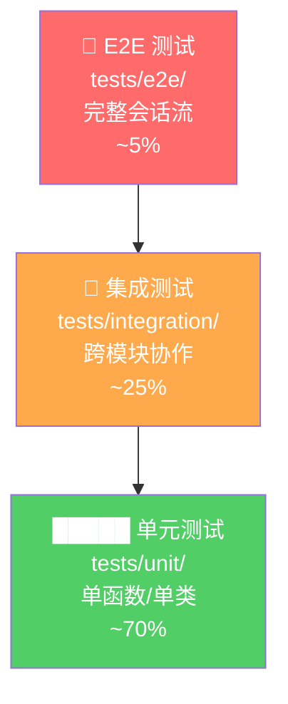
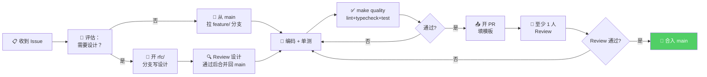

# 03_项目开发文档 — Terminal CodingAgent

> 文档版本：v1.0 ｜ 更新日期：2026-07-13 ｜ 维护者：TCA 团队

---

## 1. 文档说明

### 1.1 文档位置

本文档位于 `docs/03_项目开发文档.md`，是 Terminal CodingAgent 的工程实施约定，定义：

- 环境准备与首次启动的标准化步骤
- 源码目录结构（**本文档 §3 是模块边界的权威方案，其他文档中的目录描述以本文档为准**）
- 编码规范（ruff / mypy / pre-commit / pydantic / Protocol）
- 构建与测试约定（Makefile / pytest / faux provider）
- Git 工作流（分支命名 / Conventional Commits / PR 模板）
- 故障模式与定位

### 1.2 前置阅读

建议按顺序先读：

| 序号 | 文档 | 覆盖范围 |
|------|------|----------|
| 01 | `docs/01_产品需求文档.md` | 项目要做什么、5 项差异化价值 |
| 02 | `02_系统架构文档.md` | 系统由哪些组件组成、数据流、协议 |

跳过前两篇不影响"跑起来"，但会影响"为什么这样设计"的理解。

### 1.3 适用范围

- 实施者：负责按本文档落地代码与测试
- 代码评审者：参照本文档的编码规范与目录边界
- 新加入成员：作为 onramp 文档使用

### 1.4 用途索引

| 任务 | 直奔章节 |
|------|---------|
| 环境准备与首次启动 | 第 2 章 |
| 看整体目录结构 | 第 3 章 |
| 加一个新功能 | 第 4 章 模块边界 + 第 11 章 最佳实践 |
| 写一个假 LLM 提供者跑测试 | 第 8 章 faux provider |
| 遇到故障定位 | 第 10 章 故障模式与定位 |
| 提交 PR 前检查 | 第 9 章 Git 流程 + 第 5 章 编码规范 |

---

## 2. 环境准备与首次启动

> 目标：从零到 `Hello, agent` 出现在终端。

### 2.1 环境要求

| 组件 | 最低版本 | 推荐安装方式 |
|------|---------|-------------|
| Python | 3.11+ | `pyenv install 3.12.0 && pyenv local 3.12.0` |
| 包管理 | — | `uv`（比 pip 快 10x）或 `venv+pip` |
| Git | 2.30+ | 系统自带 |
| Node.js | — | **仅参考原项目时用**，TCA 本身不依赖 |

验证 Python 版本：

```bash
python --version  # 必须 >= 3.11
```

### 2.2 克隆与安装

#### 2.2.1 克隆

```bash
git clone https://github.com/your-org/pi-agent-harness.git
cd pi-agent-harness
```

#### 2.2.2 创建虚拟环境 + 安装依赖

**方案 A：推荐（uv）**

```bash
# 安装 uv（如果还没有）
curl -LsSf https://astral.sh/uv/install.sh | sh

# 创建 venv + 安装依赖
uv venv --python 3.12
source .venv/bin/activate  # Windows: .venv\Scripts\activate
uv pip install -r requirements.txt
uv pip install -r requirements-dev.txt
```

**方案 B：标准 venv + pip**

```bash
python -m venv .venv
source .venv/bin/activate  # Windows: .venv\Scripts\activate
pip install --upgrade pip
pip install -r requirements.txt
pip install -r requirements-dev.txt
```

#### 2.2.3 关键依赖说明

`requirements.txt` 核心包（节选，与架构文档 §11.4 一致）：

```text
# LLM 多提供商抽象
langchain>=0.3,<1.0
langchain-openai>=0.2.0
langchain-anthropic>=0.2.0
langchain-google-genai>=2.0.0

# 多 Agent 编排（锁定主版本，参见 PRD §9.1）
langgraph==0.2.*

# 长期记忆向量库
chromadb>=0.5,<1.0

# 结构化存储
sqlalchemy>=2.0.0

# LSP + AST
pygls>=1.3,<2.0
tree-sitter>=0.22,<1.0
tree-sitter-python>=0.23.0
pyright>=1.1.370  # 可选，作为 LSP 服务端

# MCP 官方 SDK
mcp>=1.0,<2.0
langchain-mcp-adapters>=0.1

# API / 序列化 / 配置
fastapi>=0.110,<1.0
uvicorn[standard]>=0.30.0
pydantic>=2.0,<3.0
pydantic-settings>=2.0.0
python-dotenv>=1.0.0
pyyaml>=6.0

# 可视化
streamlit>=1.30,<2.0

# 日志
structlog>=24.0.0

# 工具
rich>=13.0.0      # 终端高亮
httpx>=0.27.0     # HTTP 客户端
tenacity>=8.0.0   # 重试

# 测试
pytest>=8.0
pytest-asyncio>=0.23.0
pytest-mock>=3.12.0
pytest-randomly>=3.15.0
pytest-cov>=5.0.0
```

### 2.3 配置

#### 2.3.1 环境变量模板

项目根目录复制一份 `.env`：

```bash
cp .env.example .env
```

`.env.example` 示例（关键配置，注释版）：

```dotenv
# ============================
# 必须配置（缺一则启动失败）
# ============================
# 至少配置一个 LLM provider，优先级见下面
ANTHROPIC_API_KEY=sk-ant-xxxx
OPENAI_API_KEY=sk-xxxx

# 选择默认使用的 provider + model
LLM_DEFAULT_PROVIDER=anthropic
LLM_DEFAULT_MODEL=claude-sonnet-4-20250514

# ============================
# 可选配置（有合理默认值）
# ============================
# Chroma 向量库存储路径
CHROMA_PERSIST_DIR=./data/chroma

# SQLite 结构化存储路径
SQLITE_DB_PATH=./data/app.db

# LangGraph Checkpointer（会话断点恢复）
CHECKPOINT_DB_PATH=./data/checkpoints.db

# 日志级别：DEBUG/INFO/WARNING/ERROR
LOG_LEVEL=INFO
LOG_FORMAT=text  # text 或 json

# FastAPI 端口
API_HOST=0.0.0.0
API_PORT=8000

# Streamlit 端口
DASHBOARD_PORT=8501

# Skill 扫描目录（多个用冒号分隔）
SKILL_DIRS=./skills:~/.pi-agent/skills

# MCP 服务器配置文件路径
MCP_CONFIG_PATH=./config/mcp_servers.yaml
```

#### 2.3.2 Settings 类（Python pydantic-settings 示例）

项目统一通过 `pydantic-settings` 管理配置，所有字段有默认值和自动 `.env` 加载：

```python
# src/config/settings.py
from __future__ import annotations

from functools import lru_cache
from pathlib import Path
from typing import Literal

from pydantic import Field, SecretStr, field_validator
from pydantic_settings import BaseSettings, SettingsConfigDict


class LLMSettings(BaseSettings):
    """LLM 提供者配置，每个 provider 独立命名空间。"""
    model_config = SettingsConfigDict(env_prefix="LLM_", env_file=".env")

    default_provider: Literal["anthropic", "openai", "google", "faux"] = "anthropic"
    default_model: str = "claude-sonnet-4-20250514"


class AnthropicSettings(BaseSettings):
    model_config = SettingsConfigDict(env_prefix="ANTHROPIC_", env_file=".env")

    api_key: SecretStr | None = None
    timeout: int = 60


class OpenAISettings(BaseSettings):
    model_config = SettingsConfigDict(env_prefix="OPENAI_", env_file=".env")

    api_key: SecretStr | None = None
    timeout: int = 60


class ChromaSettings(BaseSettings):
    model_config = SettingsConfigDict(env_prefix="CHROMA_", env_file=".env")

    persist_dir: Path = Field(default=Path("./data/chroma"))

    @field_validator("persist_dir")
    @classmethod
    def _mkdir(cls, v: Path) -> Path:
        v.mkdir(parents=True, exist_ok=True)
        return v


class Settings(BaseSettings):
    """全局配置聚合根。"""
    model_config = SettingsConfigDict(
        env_file=".env",
        env_file_encoding="utf-8",
        extra="ignore",       # 忽略 .env 中多余字段
        case_sensitive=False,
    )

    # 子命名空间
    llm: LLMSettings = Field(default_factory=LLMSettings)
    anthropic: AnthropicSettings = Field(default_factory=AnthropicSettings)
    openai: OpenAISettings = Field(default_factory=OpenAISettings)
    chroma: ChromaSettings = Field(default_factory=ChromaSettings)

    # 基础
    log_level: Literal["DEBUG", "INFO", "WARNING", "ERROR"] = "INFO"
    log_format: Literal["text", "json"] = "text"
    api_host: str = "0.0.0.0"
    api_port: int = 8000
    dashboard_port: int = 8501
    skill_dirs: list[str] = Field(default_factory=lambda: ["./skills"])
    mcp_config_path: Path = Field(default=Path("./config/mcp_servers.yaml"))


@lru_cache
def get_settings() -> Settings:
    """进程单例，避免重复解析 .env。"""
    return Settings()
```

**使用方式**：在任何模块里只调用 `get_settings()`，不要在业务代码里直接 `os.getenv`。

```python
from src.config.settings import get_settings

settings = get_settings()
print(settings.llm.default_model)
```

#### 2.3.3 MCP 服务器配置（`config/mcp_servers.yaml`）

```yaml
mcpServers:
  # 本地 STDIO 服务端示例
  math_server:
    command: python
    args: ["./mcp_servers/math_server.py"]
    transport: stdio

  # HTTP 服务端示例
  web_search:
    url: "http://localhost:3001/mcp"
    transport: http
```

### 2.4 首次运行

> 以下命令均在项目根目录、已激活 venv 下执行。

#### 2.4.1 方式一：CLI 主循环（最直观）

```bash
python -m src.cli.main
```

预期输出：

```
[Pi Agent] 已进入交互模式，输入 /help 查看帮助。
> _
```

输入 `你好，请介绍自己`，如能收到模型回复则 LLM 链路打通。

#### 2.4.2 方式二：Streamlit 仪表盘（可视化）

```bash
streamlit run streamlit_app/app.py --server.port ${DASHBOARD_PORT:-8501}
```

浏览器打开 `http://localhost:8501`，应能看到 Agent 拓扑图、记忆面板、工具调用时间线。

#### 2.4.3 方式三：FastAPI（RPC 入口）

```bash
uvicorn src.api.app:app --host 0.0.0.0 --port 8000 --reload
```

健康检查：

```bash
curl http://localhost:8000/health
# 预期响应：{"status": "ok", "version": "0.1.0", "providers": ["anthropic", "openai"]}
```

Swagger UI 浏览 API： `http://localhost:8000/docs`

### 2.5 验证安装成功的一条命令

```bash
python -c "from src.config.settings import get_settings; print('settings OK'); from src.agent_core.graph import build_graph; print('graph OK')"
```

同时输出 `settings OK` 和 `graph OK` 表示核心依赖链路打通。

---

## 3. 项目目录结构

下面是完整目录树，`#` 后为每个目录/核心文件的职责注释。

```
pi-agent-harness/
├── .env.example                   # 环境变量模板（复制为 .env）
├── .env                           # 本地机密，不入库
├── .gitignore                     # Python + 数据目录忽略规则
├── .pre-commit-config.yaml        # ruff/mypy/prettier 钩子
├── pyproject.toml                 # 项目元数据 + ruff/mypy/pytest 配置
├── Makefile                       # dev/test/lint 一键目标
├── README.md                      # 项目简介
├── requirements.txt               # 生产依赖
├── requirements-dev.txt           # 开发依赖：pytest、pytest-asyncio、pytest-mock、pytest-randomly、pytest-cov、ruff、mypy、factory-boy、faker
│
├── data/                          # 运行时数据（gitignore）
│   ├── chroma/                    #   Chroma 向量库持久化目录
│   ├── app.db                     #   SQLite 主库（memory_items / skill_registry 表）
│   ├── checkpoints.db             #   LangGraph 会话断点恢复
│   └── logs/                      #   日志文件（jsonl）
│
├── skills/                        # 自研 Markdown Skill 定义目录
│   ├── code-review/               #   示例：代码审查 skill
│   │   ├── SKILL.md               #     Skill 清单（manifest + 指令）
│   │   └── templates/             #     模板文件
│   └── commit-message/            #   示例：生成提交信息 skill
│       └── SKILL.md
│
├── config/                        # 配置 YAML
│   ├── mcp_servers.yaml           #   MCP 服务端清单
│   └── settings.yaml              #   可选：YAML 格式全局配置（优先级低于 .env）
│
├── mcp_servers/                   # 自托管 MCP 服务端
│   └── math_server.py             #   示例：数学工具 MCP 服务端
│
├── docs/                          # 项目文档
│   ├── 01_产品需求文档.md
│   ├── 02_系统架构文档.md
│   ├── 03_项目开发文档.md         #   ← 本文件
│   ├── 04_核心模块设计.md
│   └── 05_测试与运维手册.md
│
├── streamlit_app/                 # Streamlit 可视化层
│   ├── app.py                     #   入口（多页聚合）
│   ├── pages/
│   │   ├── 1_agent_graph.py       #     LangGraph 拓扑可视化
│   │   ├── 2_memory_explorer.py   #     记忆探索器
│   │   └── 3_tool_calls.py        #     工具调用时间线
│   └── components/                #   可复用 UI 组件
│       └── message_card.py
│
├── tests/                         # 测试（pytest 发现根目录）
│   ├── conftest.py                #   全局 fixture
│   ├── unit/                      #   单元测试
│   │   ├── config/
│   │   ├── agent_core/
│   │   ├── memory/
│   │   ├── llm/
│   │   └── skill/
│   ├── integration/               #   集成测试（跨模块）
│   │   ├── test_graph_flow.py
│   │   ├── test_memory_roundtrip.py
│   │   └── test_mcp_e2e.py
│   ├── e2e/                       #   端到端（完整会话）
│   │   └── test_full_session.py
│   └── fixtures/                  #   共享 fixture / 测试数据
│       ├── faux_llm.py            #   仿 faux provider（对应 src/llm/faux_provider.py）
│       └── sample_skills/         #   测试用 skill 样例
│
│   └── architecture/              #   架构测试（CI 依赖方向约束）
│       └── test_dependency_rules.py
│
└── src/                           # 主源码
    ├── __init__.py
    │
    ├── config/                    # 配置解析（pydantic-settings）
    │   ├── __init__.py
    │   ├── settings.py            #   Settings / get_settings 单例
    │   └── logging.py             #   structlog 初始化
    │
    ├── exceptions.py              #   自定义异常层级（PiAgentError/MemoryError/SkillError…）
    │
    ├── agent_core/                # Agent 核心抽象
    │   ├── __init__.py
    │   ├── types.py               #   Protocol/Alias（AgentState 等）
    │   ├── message.py             #   AgentMessage / ToolCall / ToolResult
    │   ├── graph.py               #   LangGraph StateGraph 构建入口
    │   ├── node.py                #   节点基类
    │   └── prompts.py             #   系统提示模板
    │
    ├── llm/                       # LLM 多提供商抽象
    │   ├── __init__.py
    │   ├── base.py                #   BaseLLM Protocol（通用接口）
    │   ├── registry.py            #   注册表（provider 名 → 类）
    │   ├── anthropic_provider.py
    │   ├── openai_provider.py
    │   ├── google_provider.py
    │   └── faux_provider.py       #   测试用假 LLM（不调用真 API）
    │
    ├── multi_agent/               # 多 Agent 协作编排
    │   ├── __init__.py
    │   ├── orchestrator.py        #   主协调者（继承原 pi orchestrator）
    │   ├── planner.py             #   任务拆解
    │   ├── executor.py            #   执行节点
    │   └── reviewer.py            #   质检节点
    │
    ├── memory/                    # 长期记忆（Chroma + SQLite）
    │   ├── __init__.py
    │   ├── chroma_store.py        #   ChromaDB 向量检索
    │   ├── sqlite_store.py        #   SQLite 结构化存取
    │   ├── item.py                #   MemoryItem 数据模型
    │   └── compressor.py          #   结构化分层 Token 压缩
    │
    ├── code_index/                # 代码索引（LSP + AST 双引擎）
    │   ├── __init__.py
    │   ├── ast_indexer.py         #   tree-sitter AST 索引
    │   ├── lsp_client.py          #   pygls LSP 客户端
    │   ├── hybrid_index.py        #   双引擎合并检索
    │   └── models.py             #   符号 / 引用 / 定义数据类
    │
    ├── mcp/                       # MCP 接入
    │   ├── __init__.py
    │   ├── client.py              #   MCP 会话管理（多服务端聚合）
    │   ├── tool_adapter.py        #   MCP 工具 → LangChain 工具 适配
    │   └── config_loader.py       #   读 mcp_servers.yaml
    │
    ├── skill/                     # Markdown Skill 加载器
    │   ├── __init__.py
    │   ├── loader.py              #   扫描并解析 SKILL.md
    │   ├── manifest.py            #   SkillManifest 数据模型
    │   └── executor.py            #   Skill→LangGraph 子图
    │
    ├── middleware/                # 中间件（横切关注点）
    │   ├── __init__.py
    │   ├── token_counter.py       #   Token 计数 + 日志
    │   ├── retry.py               #   重试策略（tenacity 封装）
    │   ├── observability.py       #   追踪上下文传播
    │   └── guardrails.py          #   安全护栏（输出过滤）
    │
    ├── tools/                     # 内置 LangChain 工具
    │   ├── __init__.py
    │   ├── description.py         #   工具描述模板引擎
    │   ├── browser.py             #   浏览器工具（参考原 pi）
    │   ├── file_tools.py          #   文件读写/搜索
    │   ├── shell_tools.py         #   受限 shell
    │   └── web_tools.py           #   Web 搜索/抓取
    │
    ├── cli/                       # 命令行入口
    │   ├── __init__.py
    │   ├── main.py                #   CLI 主循环（typer）
    │   └── commands/
    │       ├── session_cmd.py     #   会话管理
    │       ├── skill_cmd.py       #   skill 管理
    │       └── config_cmd.py      #   配置查看
    │
    ├── api/                       # FastAPI Web 层
    │   ├── __init__.py
    │   ├── app.py                 #   FastAPI 应用工厂
    │   ├── deps.py                #   依赖注入
    │   ├── routers/
    │   │   ├── sessions.py        #   /api/v1/sessions
    │   │   ├── agent.py           #   /api/v1/agent/chat
    │   │   ├── skills.py          #   /api/v1/skills
    │   │   ├── memory.py          #   /api/v1/memory
    │   │   └── tools.py           #   /api/v1/tools
    │   └── schemas/
    │       └── chat.py            #   请求/响应 schema（pydantic）
    │
    └── utils/                     # 通用工具（尽量薄、无状态）
        ├── __init__.py
        ├── ids.py                 #   ID 生成
        ├── time.py                #   UTC 时间
        └── text.py                #   字符串截断、slugify
```

### 3.1 目录约定速查

| 规则 | 示例 |
|------|------|
| 主源码一律在 `src/` 下，测试一律在 `tests/` | 禁止在项目根散落 `.py` |
| 数据/运行产物进 `data/`，已 gitignore | 克隆即为空 |
| `config/` 仅放静态配置模板，机密进 `.env` | `.env` 禁止入库 |
| `skills/` 中每个子目录对应一个 skill，必备 `SKILL.md` | `skills/code-review/SKILL.md` |
| `docs/` 与 `tests/` 同步更新 | PR 文档缺失会被拒 |

---

## 4. 模块划分与职责边界

> 原则：**单向依赖**。`src/` 中越靠近根部的模块越稳定、越被依赖；越靠近叶子（如 `tools/`）越具体、越依赖别人。

### 4.1 模块职责表

| 模块 | 职责（一句话） | 对外接口（暴露给谁） | 依赖的模块（仅列出跨模块的） |
|------|--------------|---------------------|---------------------------|
| `config` | 解析/校验/暴露配置 | **所有模块** | — |
| `agent_core` | Agent 消息、节点、图抽象 | `multi_agent`, `api`, `cli` | `config`, `utils` |
| `llm` | LLM 多提供商抽象 | `agent_core`, `multi_agent` | `config`, `middleware` |
| `multi_agent` | 多 Agent 任务拆解/编排/监督 | `api`, `cli`, `skill` | `agent_core`, `llm`, `tools`, `memory` |
| `memory` | 记忆读写、向量/结构化存储、Token 压缩 | `multi_agent`, `skill`, `api` | `config`, `utils` |
| `code_index` | 代码 AST+LSP 双引擎索引 | `tools`, `multi_agent` | `config` |
| `mcp` | MCP 会话、工具适配 | `tools`, `multi_agent` | `config` |
| `skill` | Markdown skill 加载与执行 | `multi_agent`, `api` | `agent_core`, `memory` |
| `middleware` | Token 计数、重试、追踪、护栏 | 所有需要横切能力的模块 | `config`, `utils` |
| `tools` | 内置 LangChain 工具集 | `multi_agent` | `agent_core`, `mcp`, `code_index`, `middleware` |
| `cli` | CLI 编排 | 终端用户 | `multi_agent`, `config` |
| `api` | HTTP/RPC 入口 | HTTP 客户端 | `multi_agent`, `config`, `agent_core` |
| `utils` | 通用薄函数 | 所有模块（仅依赖 stdlib） | — |

### 4.2 依赖方向约束（必须遵守）

```
config  utils
   ↓      ↓
agent_core ← llm
   ↓
multi_agent ← memory ← code_index
   ↓   ↓
  skill tools ← mcp
   ↓   ↓
  api  cli
```

**禁止反向依赖**（例如 `config` 不得 import `memory`，`tools` 不得 import `api`）。违反即 CI 失败（见 `tests/architecture/test_dependency_rules.py`）。

### 4.3 接口抽象：Protocol 为首选

跨模块耦合一律用 `typing.Protocol`（结构化子类型），不用 ABC：

```python
# src/llm/base.py
from typing import Protocol, AsyncIterator

class LLMProvider(Protocol):
    """所有 provider（真实/faux/第三方）实现的接口。"""
    name: str

    async def ainvoke(self, messages: list["AgentMessage"], **kwargs: object) -> "AgentMessage": ...
    async def astream(self, messages: list["AgentMessage"], **kwargs: object) -> AsyncIterator[str]: ...
```

第三方集成只做"适配器"，把外部 API 套上 `LLMProvider` 协议即可。新增 provider 只需：
1. 在 `src/llm/` 下新建 `xxx_provider.py` 实现协议；
2. 在 `src/llm/registry.py` 注册一行。

无需改动 `agent_core` 或 `multi_agent`。

---

## 5. 编码规范

> 规范不是束缚，是让 2 周后的你还能读懂 2 周前的代码。

### 5.1 风格工具链

| 工具 | 职责 | 配置位置 |
|------|------|---------|
| **ruff** | 格式化 + lint（替代 black + isort + flake8） | `pyproject.toml` `[tool.ruff]` |
| **mypy** | 静态类型检查 | `pyproject.toml` `[tool.mypy]` |
| **pre-commit** | 提交前自动跑 ruff/mypy | `.pre-commit-config.yaml` |

**ruff 配置示例**（`pyproject.toml`）：

```toml
[tool.ruff]
line-length = 100
target-version = "py311"
src = ["src", "tests"]

[tool.ruff.lint]
select = ["E", "F", "I", "N", "UP", "B", "SIM", "TCH", "RUF"]
ignore = ["E500"]  # 行太长由 formatter 处理

[tool.ruff.lint.per-file-ignores]
"tests/*" = ["S101"]  # 测试允许 assert
```

**mypy 配置**：

```toml
[tool.mypy]
python_version = "3.11"
strict = true
warn_unused_configs = true
disallow_untyped_defs = true
check_untyped_defs = true
no_implicit_optional = true
exclude = ["tests/fixtures/", "streamlit_app/"]
```

### 5.2 命名约定

| 类别 | 约定 | 示例 |
|------|------|------|
| 模块 | 小写蛇形，短 | `agent_core`, `code_index` |
| 包 | 小写，无下划线 | `llm`, `tools` |
| 类 | PascalCase | `AgentMessage`, `MemoryStore` |
| 函数/方法 | 小写蛇形 | `build_graph`, `add_memory` |
| 常量 | 大写蛇形 | `MAX_RETRIES`, `DEFAULT_MODEL` |
| 私有成员 | 前缀 `_` | `_cache`, `_validate` |
| 协议 | 名词 + `Protocol` 或 名词 | `LLMProvider`（Protocol 类本身不加后缀也行） |
| 异常 | 后缀 `Error` | `MemoryError`, `SkillLoadError` |
| 测试文件 | `test_*.py` | `test_memory_store.py` |
| 测试函数 | `test_<行为>_<条件>` | `test_add_memory_dedup` |

### 5.3 全项目一致的模式

#### 5.3.1 pydantic BaseModel 做消息/工具描述

所有跨边界的数据（API 请求/响应、工具入参/出参、LLM 消息）一律用 pydantic v2：

```python
# src/agent_core/message.py
from __future__ import annotations

from datetime import datetime, timezone
from enum import Enum
from typing import Any, Literal
from uuid import uuid4

from pydantic import BaseModel, Field


class Role(str, Enum):
    SYSTEM = "system"
    USER = "user"
    ASSISTANT = "assistant"
    TOOL = "tool"


class ToolCall(BaseModel):
    """LLM 请求的一次工具调用。"""
    id: str = Field(default_factory=lambda: f"tc_{uuid4().hex[:12]}")
    name: str
    arguments: dict[str, Any] = Field(default_factory=dict)


class ToolResult(BaseModel):
    """工具执行结果回传给 LLM。"""
    call_id: str
    name: str
    content: str
    is_error: bool = False


class AgentMessage(BaseModel):
    """Agent 交互中的单条消息。"""
    role: Role
    content: str
    name: str | None = None
    tool_calls: list[ToolCall] = Field(default_factory=list)
    tool_result: ToolResult | None = None
    created_at: datetime = Field(default_factory=lambda: datetime.now(timezone.utc))
    metadata: dict[str, Any] = Field(default_factory=dict)
```

#### 5.3.2 Protocol 做接口抽象

```python
# src/memory/base.py
from typing import Protocol

class MemoryStore(Protocol):
    async def add(self, item: "MemoryItem") -> str: ...
    async def search(self, query: str, k: int = 5) -> list["MemoryItem"]: ...
    async def get(self, id: str) -> "MemoryItem | None": ...
```

#### 5.3.3 @dataclass 做值对象

不可变、无行为、需要 `__eq__` 的纯数据用 `@dataclass(frozen=True)`：

```python
from dataclasses import dataclass

@dataclass(frozen=True)
class TokenBudget:
    """Token 预算值对象。"""
    prompt: int
    completion: int
    total: int
```

### 5.4 错误处理规范

#### 5.4.1 自定义异常层级

```python
# src/exceptions.py
class PiAgentError(Exception):
    """所有自定义异常的根。外部兜底只捕获这一类。"""

class ConfigError(PiAgentError):
    """配置缺失或非法。"""

class MemoryError(PiAgentError):
    """记忆读写失败。"""

class SkillError(PiAgentError):
    """Skill 加载/执行失败。"""

class SkillLoadError(SkillError):
    """SKILL.md 解析失败。"""

class SkillExecutionError(SkillError):
    """Skill 执行中失败。"""

class LLMProviderError(PiAgentError):
    """LLM 调用失败。"""

class ToolExecutionError(PiAgentError):
    """工具执行失败。"""
```

#### 5.4.2 何时 raise / 何时返回 Result

| 场景 | 做法 |
|------|------|
| 调用方**无法继续**（配置缺失、关键依赖不可用） | **raise** 自定义异常 |
| 调用方**可以降级**（记忆检索为空、可选工具失败） | 返回空值 / 默认值，**不 raise** |
| 工具执行失败 | 返回 `ToolResult(is_error=True)`，**不 raise**（让 LLM 看到错误并自我纠正） |

#### 5.4.3 禁止裸 except

```python
def _fallback_demo():
    """错误处理示例：禁止吞异常，应该记录 + 给默认值。"""
    # ❌ 禁止
    try:
        ...
    except:
        pass

    # ✅ 正确
    try:
        ...
    except SpecificError as e:
        logger.warning("fallback", error=str(e))
        return default
```

### 5.5 日志规范

使用 `structlog`（结构化日志），**禁止 `print`**。

```python
# src/config/logging.py
import logging
import structlog

def setup_logging(level: str = "INFO", fmt: str = "text") -> None:
    """应用启动时调用一次。"""
    logging.basicConfig(format="%(message)s", level=getattr(logging, level))
    processors = [
        structlog.contextvars.merge_contextvars,
        structlog.processors.add_log_level,
        structlog.processors.TimeStamper(fmt="iso"),
    ]
    if fmt == "json":
        processors.append(structlog.processors.JSONRenderer())
    else:
        processors.append(structlog.dev.ConsoleRenderer())
    structlog.configure(
        processors=processors,
        wrapper_class=structlog.make_filtering_bound_logger(getattr(logging, level)),
    )
```

**业务代码使用**：

```python
# src/memory/chroma_store.py
import structlog

logger = structlog.get_logger(__name__)

class ChromaMemoryStore:
    async def search(self, query: str, k: int = 5) -> list[MemoryItem]:
        logger.info("memory_search", query=query, k=k)
        try:
            results = await self._query(query, k)
        except Exception as e:
            logger.error("memory_search_failed", error=str(e), query=query)
            raise MemoryError("chroma search failed") from e
        logger.info("memory_search_done", n_results=len(results))
        return results
```

**日志最佳实践**：
- 关键路径必须有 `info` 入口/出口
- 异常必须 `error` 并带 `error=str(e)`
- 禁止记录 API Key、Token 等敏感字段
- 使用 `structlog.contextvars.bind_contextvars(session_id=...)` 给整条调用链加上下文

---

## 6. 核心数据模型

下面列出全项目最常用、跨模块共享的数据模型。所有模型用 pydantic v2 定义，字段注释即文档。

### 6.1 AgentMessage / ToolCall / ToolResult

见 5.3.1 节。

### 6.2 MemoryItem

```python
# src/memory/item.py
from __future__ import annotations

from datetime import datetime, timezone
from enum import Enum
from typing import Any
from uuid import uuid4

from pydantic import BaseModel, Field


class MemoryTier(str, Enum):
    """记忆分层：工作记忆 / 短期 / 长期。"""
    WORKING = "working"
    SHORT = "short"
    LONG = "long"


class MemoryItem(BaseModel):
    """一条长期记忆。"""
    id: str = Field(default_factory=lambda: f"mem_{uuid4().hex[:12]}")
    content: str                              # 记忆文本
    tier: MemoryTier = MemoryTier.LONG        # 分层
    importance: float = Field(default=0.5, ge=0.0, le=1.0)  # 重要性
    source: str | None = None                 # 来源：session_id / skill / tool
    tags: list[str] = Field(default_factory=list)
    metadata: dict[str, Any] = Field(default_factory=dict)
    created_at: datetime = Field(default_factory=lambda: datetime.now(timezone.utc))
    updated_at: datetime = Field(default_factory=lambda: datetime.now(timezone.utc))
    ttl_seconds: int | None = None            # 可选 TTL（见 §12.3 样例）
```

### 6.3 SkillManifest

```python
# src/skill/manifest.py
from __future__ import annotations

from typing import Any

from pydantic import BaseModel, Field


class SkillParameter(BaseModel):
    """Skill 暴露给 LLM 的参数。"""
    name: str
    description: str
    required: bool = False
    type: str = "string"


class SkillManifest(BaseModel):
    """SKILL.md 解析后的清单。"""
    name: str                                 # 唯一标识（目录名）
    version: str = "0.1.0"
    description: str                          # 一句话描述
    instructions: str                         # 给 LLM 的长指令
    parameters: list[SkillParameter] = Field(default_factory=list)
    tags: list[str] = Field(default_factory=list)
    author: str | None = None
    metadata: dict[str, Any] = Field(default_factory=dict)
```

### 6.4 SessionState（LangGraph 状态）

```python
# src/agent_core/types.py
from typing import Annotated, Any, TypedDict

from langgraph.graph.message import add_messages


class SessionState(TypedDict):
    """LangGraph 状态对象，在节点间流转。"""
    messages: Annotated[list[Any], add_messages]   # 对话历史（自动追加）
    session_id: str
    current_agent: str                             # 当前活跃 agent 名
    tool_calls_budget: int                         # 剩余工具调用次数
    memory_hits: list[Any]                         # 本次检索到的记忆
    metadata: dict[str, Any]                       # 扩展字段
```

### 6.5 ToolDescription（LangChain 工具描述）

```python
# src/tools/description.py
from pydantic import BaseModel, Field


class ToolDescription(BaseModel):
    """工具的元数据，用于注册到 LLM。"""
    name: str
    description: str
    parameters_schema: dict[str, Any] = Field(default_factory=dict)
    return_type: str = "string"
    examples: list[dict[str, Any]] = Field(default_factory=list)
```

### 6.6 模型关系图

```
┌─────────────────┐      ┌──────────────┐      ┌──────────────┐
│  SessionState   │1───＊ │ AgentMessage  │1───＊ │  ToolCall    │
│  (LangGraph)    │      │              │      └──────┬───────┘
└────────┬────────┘      └──────────────┘             │
         │                                            │ 1───1
         │ 0..*                                       ▼
         │                                     ┌──────────────┐
         └────────────────────────────────────▶│  ToolResult  │
                                               └──────────────┘

┌──────────────┐      ┌──────────────┐
│ MemoryItem   │      │SkillManifest │
└──────────────┘      └──────────────┘
```

---

## 7. 构建与运行

### 7.1 Makefile 目标列表

```makefile
# Makefile
# 注意：Makefile 的命令行必须以 tab 开头（不是空格），否则 make 报 *** missing separator
.PHONY: help dev test test-unit test-integration test-e2e test-cov \
        lint lint-fix typecheck quality \
        run-api run-dashboard run-cli build clean

PYTHON := python
PIP := pip
PYTEST := pytest
RUFF := ruff
MYPY := mypy

help:                            ## 显示所有可用目标
	@grep -E '^[a-zA-Z_-]+:.*?## .*$$' $(MAKEFILE_LIST) | \
		awk 'BEGIN {FS = ":.*?## "}; {printf "\033[36m%-20s\033[0m %s\n", $$1, $$2}'

# ---------- 环境 ----------
dev:                             ## 安装生产+开发依赖
	$(PIP) install -r requirements.txt
	$(PIP) install -r requirements-dev.txt
	pre-commit install

# ---------- 测试 ----------
test:                            ## 跑全量测试
	$(PYTEST) tests/ -x -q

test-unit:                       ## 仅单元测试
	$(PYTEST) tests/unit/ -x -q

test-integration:                ## 仅集成测试
	$(PYTEST) tests/integration/ -x -q

test-e2e:                        ## 仅端到端测试
	$(PYTEST) tests/e2e/ -x -q

test-cov:                        ## 带覆盖率
	$(PYTEST) tests/ --cov=src --cov-report=term-missing --cov-fail-under=70

# ---------- 质量 ----------
lint:                            ## ruff lint + format 检查
	$(RUFF) check src/ tests/
	$(RUFF) format --check src/ tests/

lint-fix:                        ## 自动修复
	$(RUFF) check --fix src/ tests/
	$(RUFF) format src/ tests/

typecheck:                       ## mypy 类型检查
	$(MYPY) src/

quality: lint typecheck          ## 全量质量检查

# ---------- 运行 ----------
run-api:                         ## 启动 FastAPI
	uvicorn src.api.app:app --host 0.0.0.0 --port 8000 --reload

run-dashboard:                    ## 启动 Streamlit
	streamlit run streamlit_app/app.py --server.port 8501

run-cli:                         ## 启动 CLI
	$(PYTHON) -m src.cli.main

# ---------- 构建 ----------
build:                           ## 构建 wheel
	$(PYTHON) -m build

clean:                           ## 清理缓存/数据
	find . -type d -name __pycache__ -exec rm -rf {} + 2>/dev/null || true
	rm -rf .pytest_cache .mypy_cache .ruff_cache dist build *.egg-info
	rm -rf data/chroma/* data/*.db data/logs/*
```

### 7.2 环境变量分级

| 环境 | 文件 | 用途 |
|------|------|------|
| dev | `.env` + `.env.dev` | 本地开发，`LOG_LEVEL=DEBUG`，用 `faux` provider |
| test | `.env.test` | CI 跑测试，`LLM_DEFAULT_PROVIDER=faux`，`CHROMA_PERSIST_DIR=:memory:` |
| prod | `.env.prod`（不入库，CI 注入） | 生产，`LOG_LEVEL=WARNING`，`LOG_FORMAT=json` |

`.env.example` 已列出所有字段（见 2.3.1）。

---

## 8. 测试规范

### 8.1 测试金字塔



**比例原则**：单元测试占 70%，集成 25%，E2E 5%。E2E 最慢最贵，只覆盖"用户完整走通一个核心场景"。

### 8.2 pytest 配置

`pyproject.toml` 中：

```toml
[tool.pytest.ini_options]
testpaths = ["tests"]
python_files = ["test_*.py"]
python_functions = ["test_*"]
asyncio_mode = "auto"                    # 异步测试自动识别
addopts = "-ra -q --strict-markers"
markers = [
    "slow: 慢测试（集成/E2E）",
    "unit: 单元测试",
    "integration: 集成测试",
    "e2e: 端到端测试",
]
```

### 8.3 conftest.py fixtures 示例

```python
# tests/conftest.py
from __future__ import annotations

import os
import tempfile
from pathlib import Path
from typing import AsyncIterator

import pytest
import pytest_asyncio
from langgraph.checkpoint.sqlite.aio import AsyncSqliteSaver

from src.agent_core.message import AgentMessage, Role
from src.config.settings import Settings, get_settings
from src.llm.faux_provider import FauxLLMProvider
from src.memory.chroma_store import ChromaMemoryStore
from src.memory.sqlite_store import SQLiteMemoryStore


# ---------- 基础 fixtures ----------

@pytest.fixture
def fake_llm() -> FauxLLMProvider:
    """不调用真 API 的假 LLM。"""
    return FauxLLMProvider(responses=["你好，我是假 LLM", "42"])


@pytest.fixture
def sample_message() -> AgentMessage:
    return AgentMessage(role=Role.USER, content="你好")


@pytest.fixture
def sample_messages() -> list[AgentMessage]:
    return [
        AgentMessage(role=Role.SYSTEM, content="你是一个助手"),
        AgentMessage(role=Role.USER, content="你好"),
    ]


# ---------- 存储 fixtures（临时/内存） ----------

@pytest.fixture
async def tmp_sqlite_db() -> AsyncIterator[SQLiteMemoryStore]:
    """每次测试用临时 SQLite，测试完即删。"""
    with tempfile.TemporaryDirectory() as tmp:
        db_path = Path(tmp) / "test.db"
        store = SQLiteMemoryStore(db_path=db_path)
        await store.setup()
        yield store


@pytest.fixture
async def memory_chroma() -> AsyncIterator[ChromaMemoryStore]:
    """内存模式 Chroma（不写磁盘）。"""
    store = ChromaMemoryStore(persist_dir=None)  # None → 内存模式
    yield store


# ---------- 配置覆盖 ----------

@pytest.fixture
def test_settings(tmp_path: Path) -> Settings:
    """测试专用配置，所有路径指向 tmp_path。"""
    return Settings(
        log_level="DEBUG",
        chroma=ChromaSettings(persist_dir=tmp_path / "chroma"),
    )


# ---------- LangGraph Checkpointer ----------

@pytest_asyncio.fixture
async def checkpointer() -> AsyncIterator[AsyncSqliteSaver]:
    """内存模式 checkpointer。"""
    async with AsyncSqliteSaver.from_conn_string(":memory:") as cp:
        yield cp
```

### 8.4 faux provider（仿 pi 的假 LLM）

仿照原 pi 项目的 faux provider，写一个**不调用真 API** 的假 LLM，用于测试和离线开发：

```python
# src/llm/faux_provider.py
"""离线假 LLM：不调用任何真 API，按预设响应列表返回。

用途：
  - 单元测试（确定性输出）
  - CI 环境（无 API Key 也能跑）
  - 离线开发（飞机上也能写代码）
"""
from __future__ import annotations

import asyncio
from typing import AsyncIterator

from src.agent_core.message import AgentMessage, Role


class FauxLLMProvider:
    """按顺序返回预设响应；耗尽后循环。"""

    name: str = "faux"

    def __init__(self, responses: list[str] | None = None, latency: float = 0.0) -> None:
        """
        Args:
            responses: 预设响应列表，默认 ["faux-response"]。
            latency: 模拟网络延迟（秒），默认 0。
        """
        self._responses = responses or ["faux-response"]
        self._i = 0
        self._latency = latency

    async def ainvoke(
        self,
        messages: list[AgentMessage],
        **kwargs: object,
    ) -> AgentMessage:
        """同步式调用：返回一条完整消息。"""
        if self._latency:
            await asyncio.sleep(self._latency)
        content = self._next()
        return AgentMessage(role=Role.ASSISTANT, content=content)

    async def astream(
        self,
        messages: list[AgentMessage],
        **kwargs: object,
    ) -> AsyncIterator[str]:
        """流式调用：逐字符 yield。"""
        content = self._next()
        for ch in content:
            if self._latency:
                await asyncio.sleep(self._latency / 10)
            yield ch

    def _next(self) -> str:
        r = self._responses[self._i % len(self._responses)]
        self._i += 1
        return r
```

**注册到 registry**：

```python
# src/llm/registry.py
from src.llm.base import LLMProvider
from src.llm.faux_provider import FauxLLMProvider

PROVIDERS: dict[str, type[LLMProvider]] = {
    "faux": FauxLLMProvider,
    # "anthropic": AnthropicProvider,
    # "openai": OpenAIProvider,
}


def get_provider(name: str) -> LLMProvider:
    if name not in PROVIDERS:
        raise ConfigError(f"未知 provider: {name}，可选: {list(PROVIDERS)}")
    return PROVIDERS[name]()
```

### 8.5 回归测试命名与放置约定

| 测试类型 | 放置路径 | 命名 |
|---------|---------|------|
| 单元 | `tests/unit/<模块>/test_*.py` | `test_<函数>_<条件>_<预期>` |
| 集成 | `tests/integration/test_*.py` | `test_<场景>_with_<依赖>` |
| E2E | `tests/e2e/test_*.py` | `test_user_flow_<场景>` |
| 架构约束 | `tests/architecture/test_dependency_rules.py` | `test_no_reverse_dependency` |

**示例**：

```python
# tests/unit/memory/test_chroma_store.py
import pytest

@pytest.mark.unit
class TestChromaMemoryStore:
    async def test_add_and_search_returns_item(self, memory_chroma):
        """添加一条记忆后，搜索相关词应能召回。"""
        await memory_chroma.add(MemoryItem(content="Python 3.12 发布了"))
        results = await memory_chroma.search("Python 版本")
        assert len(results) >= 1
        assert "Python" in results[0].content

    async def test_search_empty_returns_empty(self, memory_chroma):
        """空库搜索返回空列表，不报错。"""
        results = await memory_chroma.search("anything")
        assert results == []
```

---

## 9. Git 分支与提交流程

### 9.1 分支命名

| 前缀 | 用途 | 示例 |
|------|------|------|
| `feature/` | 新功能 | `feature/memory-ttl` |
| `fix/` | 修复 bug | `fix/chroma-lock-timeout` |
| `rfc/` | 设计讨论（先写文档再写代码） | `rfc/multi-agent-handoff` |
| `chore/` | 构建/依赖/杂务 | `chore/bump-langgraph-0.3` |
| `docs/` | 文档更新 | `docs/quickstart-zh` |
| `test/` | 补充测试 | `test/fake-provider-coverage` |

**主分支**：`main`（受保护，只能通过 PR 合入）。

### 9.2 Commit 规范（Conventional Commits 中文版）

```
<类型>(<范围>): <中文描述>

[可选正文]

[可选脚注]
```

**类型**：

| 类型 | 含义 | 示例 |
|------|------|------|
| `feat` | 新功能 | `feat(memory): 给 MemoryItem 加 TTL 字段` |
| `fix` | 修复 bug | `fix(chroma): 修复并发写入锁超时` |
| `docs` | 文档 | `docs: 更新快速上手章节` |
| `test` | 测试 | `test(skill): 为 loader 加单测` |
| `refactor` | 重构（不改变行为） | `refactor(llm): 用 Protocol 替换 ABC` |
| `chore` | 杂务 | `chore: 升级 ruff 到 0.6` |
| `perf` | 性能 | `perf(code_index): AST 索引缓存` |
| `ci` | CI 配置 | `ci: 加 mypy 到 pre-commit` |

**范围**：模块名，如 `memory`、`llm`、`api`、`cli`。

**脚注**（可选）：

- 关联 issue：`Closes #42`、`Refs #100`
- 破坏性变更：`BREAKING CHANGE: <描述>`

**完整示例**：

```
feat(memory): 给 MemoryItem 加 TTL 字段

- 新增 ttl_seconds 字段，默认 None（永久）
- Chroma 元数据同步写入
- 过期记忆由 compressor 定期清理

Closes #42
```

### 9.3 PR 模板要点

`.github/pull_request_template.md`：

```markdown
## 变更摘要
<!-- 一两句话说清楚做了什么 -->

## 变更类型
- [ ] feat（新功能）
- [ ] fix（修复）
- [ ] docs（文档）
- [ ] refactor（重构）
- [ ] test（测试）
- [ ] chore（杂务）

## 关联 Issue
Closes #

## 测试说明
<!-- 如何验证的？跑了哪些测试？ -->

## 自查清单
- [ ] 新增代码有对应单元测试
- [ ] `make lint` 通过
- [ ] `make typecheck` 通过
- [ ] `make test` 通过
- [ ] 文档已更新（如适用）
- [ ] 无敏感信息（API Key）提交
```

### 9.4 pre-commit 配置

`.pre-commit-config.yaml`：

```yaml
repos:
  - repo: https://github.com/astral-sh/ruff-pre-commit
    rev: v0.6.0
    hooks:
      - id: ruff
        args: [--fix]
      - id: ruff-format

  - repo: https://github.com/pre-commit/mirrors-mypy
    rev: v1.11.0
    hooks:
      - id: mypy
        args: [--strict, --ignore-missing-imports]
        additional_dependencies:
          - pydantic>=2.0
          - langchain-core>=0.3
        exclude: tests/

  - repo: https://github.com/pre-commit/pre-commit-hooks
    rev: v4.6.0
    hooks:
      - id: trailing-whitespace
      - id: end-of-file-fixer
      - id: check-yaml
      - id: check-added-large-files
        args: ['--maxkb=500']
```

**安装**：

```bash
pre-commit install
```

---

## 10. 故障模式与定位

下面列出启动与开发过程中 **最高频** 的 10 类故障，每条按"现象 → 原因 → 解决"格式给出。

### 10.1 KeyError: 'ANTHROPIC_API_KEY'

**现象**：启动时报 `KeyError: 'ANTHROPIC_API_KEY'`。

**原因**：未复制 `.env.example` 为 `.env`，或 `.env` 中缺少对应字段。

**解决**：

```bash
cp .env.example .env
# 编辑 .env 填入真实 API Key
```

### 10.2 Chroma 路径不存在 / Permission Denied

**现象**：`chromadb.errors.PersistentNotFound` 或 `PermissionError: [Errno 13]`。

**原因**：`CHROMA_PERSIST_DIR` 指向的目录不存在或无写权限。

**解决**：已在 `ChromaSettings._mkdir` 中自动创建。若仍报错，手动创建：

```bash
mkdir -p data/chroma
```

或在 `.env` 中改用临时路径：`CHROMA_PERSIST_DIR=./tmp/chroma`。

### 10.3 tree-sitter 语言包未下载

**现象**：`tree_sitter.Language` 构建失败，报 `FileNotFoundError: ...python.so`。

**原因**：tree-sitter 的"语言"是运行时动态编译/下载的，安装 `tree-sitter-python` 后仍需构建。

**解决**：首次使用前运行一次：

```python
import tree_sitter_python as tspython
from tree_sitter import Language, Parser

# 这会自动编译（仅首次慢）
lang = Language(tspython.language())
```

或项目已封装 `src/code_index/build_languages.py`，执行：

```bash
python -m src.code_index.build_languages
```

### 10.4 LangGraph 图中有环 / 节点无出路

**现象**：`GraphRecursionError` 或图编译时 silently hang。

**原因**：节点 A 调用 节点 B，B 又回到 A，且缺少终止条件。

**解决**：用 `langgraph.graph.StateGraph` 的 `add_conditional_edges` 明确终止路径；开发时用 Streamlit 拓扑可视化排查环（见 `streamlit_app/pages/1_agent_graph.py`）。

### 10.5 SQLite 被锁（database is locked）

**现象**：`sqlite3.OperationalError: database is locked`。

**原因**：多进程/多线程并发写同一 SQLite，且未启用 WAL 模式。

**解决**：已在 `SQLiteMemoryStore` 启用 `PRAGMA journal_mode=WAL`。若仍出现，检查是否有多个 Python 进程同时跑（如同时跑 CLI + Streamlit）。临时方案：给 `.env` 配不同的 `SQLITE_DB_PATH`。

### 10.6 LangGraph Checkpoint 恢复失败

**现象**：会话恢复时报 `CheckpointNotFound`。

**原因**：`CHECKPOINT_DB_PATH` 被清空或未持久化。

**解决**：`data/checkpoints.db` 不要手动删。长期保留策略在 `config/settings.yaml` 中配置（默认 7 天）。

### 10.7 MCP 服务端连接超时

**现象**：`MCPConnectionTimeout` 或 `ConnectionRefusedError`。

**原因**：`config/mcp_servers.yaml` 中命令路径错误，或服务端未启动。

**解决**：先单独跑服务端验证：

```bash
python ./mcp_servers/math_server.py
# 无报错则表示服务端 OK
```

再检查 yaml 中 `command` 路径是否相对于项目根。

### 10.8 ruff 格式化导致 CI 失败

**现象**：本地看起来没问题，CI 报 `ruff format --check` 失败。

**原因**：本地用了不同版本的 ruff，或未配置缩进。

**解决**：

```bash
make lint-fix   # 自动修复
git add -A && git commit -m "chore: ruff format"
```

确保 `pyproject.toml` 中 `line-length = 100` 与 CI 一致。

### 10.9 mypy 找不到第三方 stub

**现象**：`mypy` 报 `error: Cannot find module named 'chromadb'`。

**原因**：该库没提供类型 stub。

**解决**：在 `pyproject.toml` 添加：

```toml
[tool.mypy]
[[tool.mypy.overrides]]
module = "chromadb.*"
ignore_missing_imports = true
```

或在 `requirements-dev.txt` 安装 `types-chromadb`（如有）。

### 10.10 测试偶发失败（Flaky Tests）

**现象**：测试单独跑能通过，批量跑偶发失败。

**原因**：测试间共享状态（临时文件、全局变量、时间依赖）。

**解决**：

- 每个测试用独立 fixture（见 8.3）
- 不要依赖当前时间，用 `freeze_time` 或注入 `clock`
- 用 `pytest --randomly-order-seed=12345` 打乱顺序验证独立性

---

## 11. 最佳实践

> 这些不是强制规范，但踩过坑的人都这么说。

### 11.1 工具先读记忆再查索引

工具执行"搜索代码"前，**先查记忆**——用户可能刚刚告诉过你答案，省一次全量索引扫描。

```python
async def search_code(state: SessionState, query: str) -> str:
    # 1. 先查记忆（快）
    mem = await memory.search(query, k=3)
    if mem and mem[0].importance > 0.8:
        return f"从记忆中召回: {mem[0].content}"

    # 2. 再查代码索引（慢）
    return await code_index.search(query)
```

### 11.2 每次工具调用记观测

工具结果和调用上下文**必须记一条 MemoryItem**（至少 `tier=WORKING`），便于后续调试和跨会话复用。

```python
async def record_tool_observation(call, result, memory):
    """工具调用后，把结果记一条短期记忆（便于调试 / 跨会话复用）。"""
    await memory.add(MemoryItem(
        content=f"工具 {call.name}({call.arguments}) → {result.content[:200]}",
        tier=MemoryTier.WORKING,
        source="tool",
        tags=[call.name],
    ))
```

### 11.3 Skill 单测先行

先写 `tests/unit/skill/test_<name>.loader.py`，再写 `SKILL.md`。确保清单字段被 100% 解析。

```python
def test_code_review_manifest():
    manifest = load_manifest("skills/code-review/SKILL.md")
    assert manifest.name == "code-review"
    assert len(manifest.parameters) >= 1
```

### 11.4 Token 预算硬上限

`multi_agent.orchestrator` 给每个 SessionState 设 `tool_calls_budget`，**硬上限**防止死循环。降到 0 直接进入 `reviewer` 总结。

### 11.5 配置不写死字符串

所有魔法数字、URL、超时时长走 `Settings`，禁止在业务代码里写 `"http://..."`。

### 11.6 开发工作流

下面是一张推荐的日常开发工作流，从"拿到 issue"到"PR 合入"：



---

## 12. 可执行验证样例

> 下面三个样例由浅入深，每个都能独立运行；目标产出物都符合本文档编码规范与目录边界。完成标准：**有测试、能跑通、PR 描述清晰**。

---

### 12.1 样例：添加 Echo LLM 提供商

**目标**：新增 `EchoProvider`，无论输入什么都原样返回用户最后一句话（无需 API Key）。

**步骤**：

1. 在 `src/llm/echo_provider.py` 实现 `EchoProvider`（`name="echo"`）：
   - `ainvoke` 返回 `AgentMessage(role=ASSISTANT, content=messages[-1].content)`
   - `astream` 逐字符 yield
2. 在 `src/llm/registry.py` 注册
3. 写单测 `tests/unit/llm/test_echo_provider.py`
4. `.env` 设 `LLM_DEFAULT_PROVIDER=echo` 验证：`python -m src.cli.main`

**验收**：

```bash
make test-unit   # 新测试通过
make lint        # 无新增 warning
```

---

### 12.2 样例：MCP 数学工具

**目标**：自建一个 MCP 服务端，暴露 `add(a, b)` 工具；在 `tool_adapter.py` 注册。

**步骤**：

1. 在 `mcp_servers/math_server.py` 用 `mcp.server` 写 STDIO 服务端，暴露 `add(a: int, b: int) -> int`
2. 在 `config/mcp_servers.yaml` 注册 `math_server`
3. 跑 `python mcp_servers/math_server.py` 验证
4. 写集成测试 `tests/integration/test_math_mcp.py`：构造消息"1+1 等于几"，走完整 Agent 流，断言结果包含 `2`

**参考**：本文档 §6.1 `tool_adapter.py` 中的 MCP 工具 schema → LangChain `@tool` 转换。

---

### 12.3 样例：记忆 TTL

**目标**：实现 `MemoryItem` 的 TTL：超过 TTL 的记忆搜索时不再返回。

**步骤**：

1. `MemoryItem` 已有 `ttl_seconds` 字段（见 §6.2）——无需再加
2. 在 `ChromaMemoryStore.search()` 中增加过滤：`if item.is_expired(): continue`
3. 在 `SQLiteMemoryStore` 同样实现
4. 在 `memory/compressor.py` 加 `purge_expired()`，返回清理条数
5. 写单测：
   - `test_ttl_expired_item_excluded`：TTL=0 的记忆搜索不到
   - `test_ttl_valid_item_included`：TTL=None 的记忆始终可搜
   - `test_purge_expired`：清理后数据库条数减少
6. 在 `Settings` 中加 `memory_default_ttl_seconds: int | None = None`

**验收**：

```bash
make test-unit tests/unit/memory/
```

---

## 附录 A：常用命令速查

```bash
# 环境
python -m venv .venv && source .venv/bin/activate
pip install -r requirements.txt -r requirements-dev.txt

# 运行
python -m src.cli.main                          # CLI
streamlit run streamlit_app/app.py              # 仪表盘
uvicorn src.api.app:app --reload                # API

# 测试
pytest tests/unit/ -x -q                        # 单元
pytest tests/integration/ -x -q                 # 集成
pytest tests/ --cov=src --cov-fail-under=70     # 覆盖率

# 质量
ruff check src/ && ruff format --check src/     # lint
mypy src/                                       # 类型检查

# Git
pre-commit install                              # 安装钩子
pre-commit run --all-files                      # 手动跑
```

## 附录 B：文档导航

| 文档 | 内容 |
|------|------|
| `docs/01_产品需求文档.md` | 项目目标、5 差异化、用户故事 |
| `02_系统架构文档.md` | 系统架构、数据流、协议选型 |
| `docs/03_项目开发文档.md` | **本文件** — 开发上手 |
| `docs/04_核心模块设计.md` | FastAPI 端点、请求/响应 schema |
| `docs/05_测试与运维手册.md` | 常见问题、社区讨论精华 |

---

> **维护说明**：本文档随代码演进持续更新。发现过时内容请提 issue 或直接 PR。

