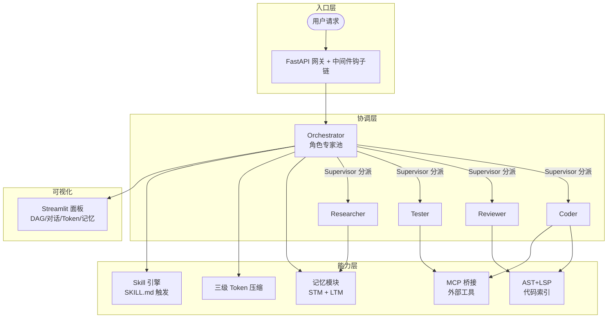
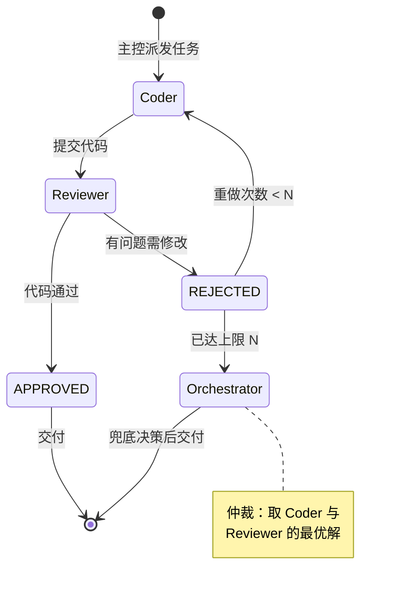
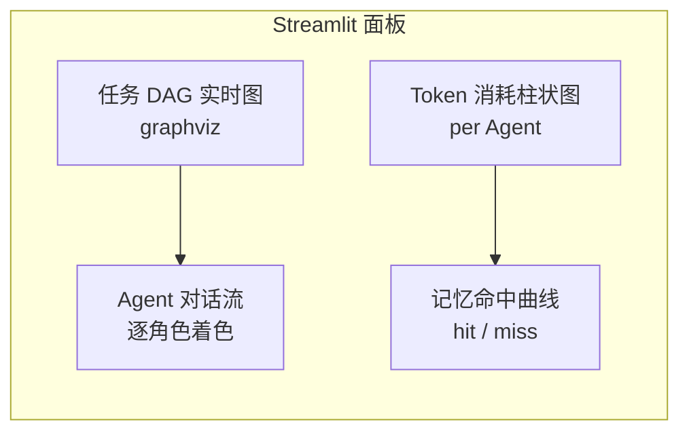
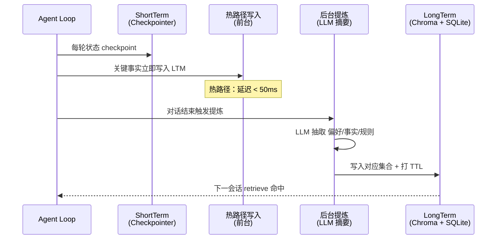
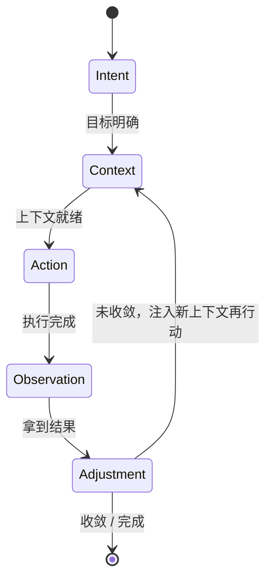
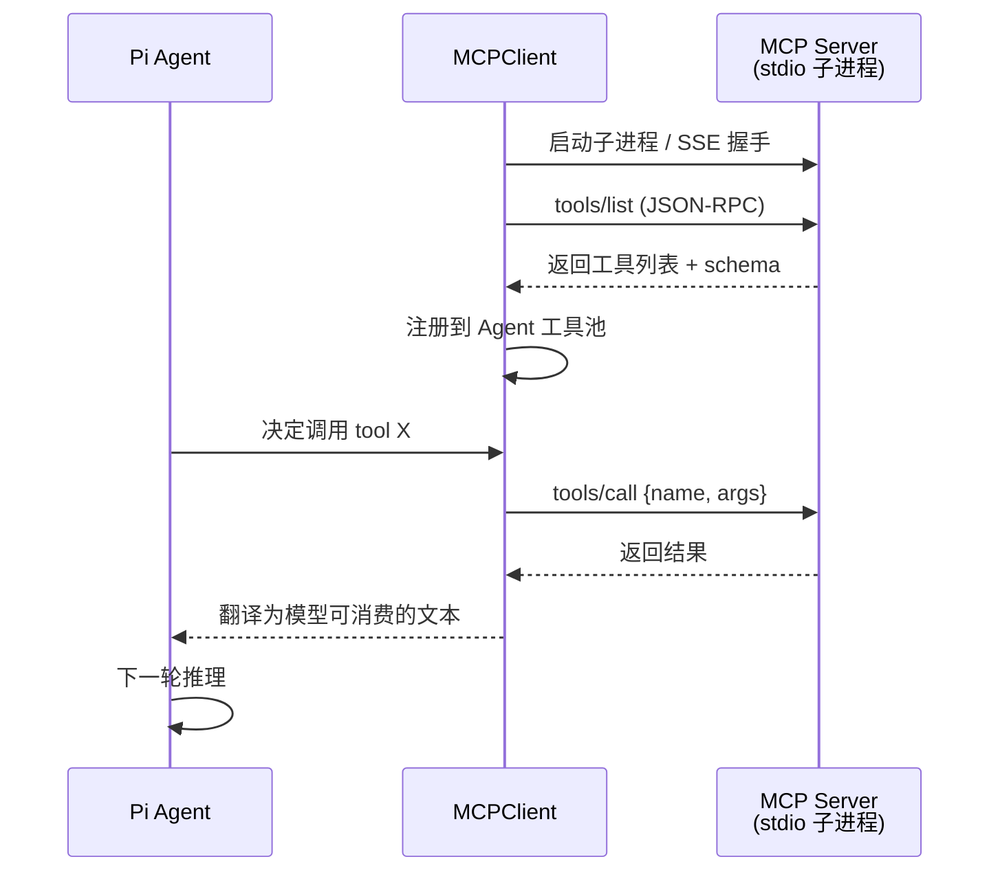
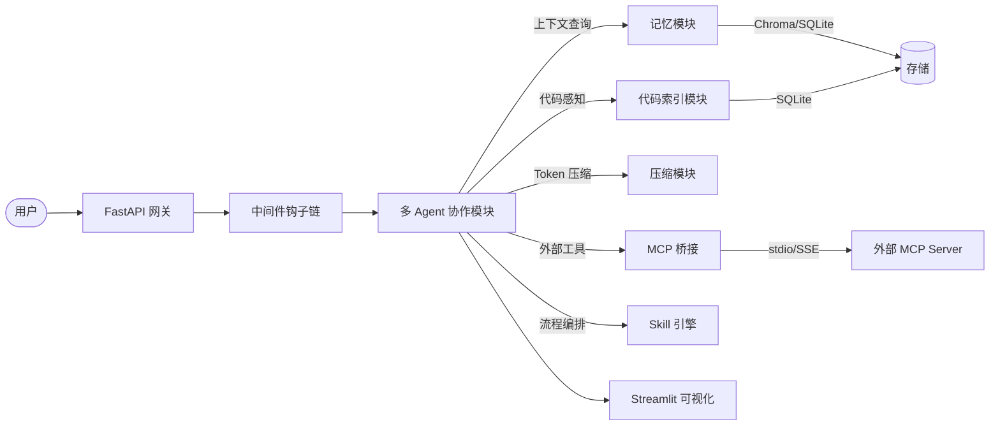
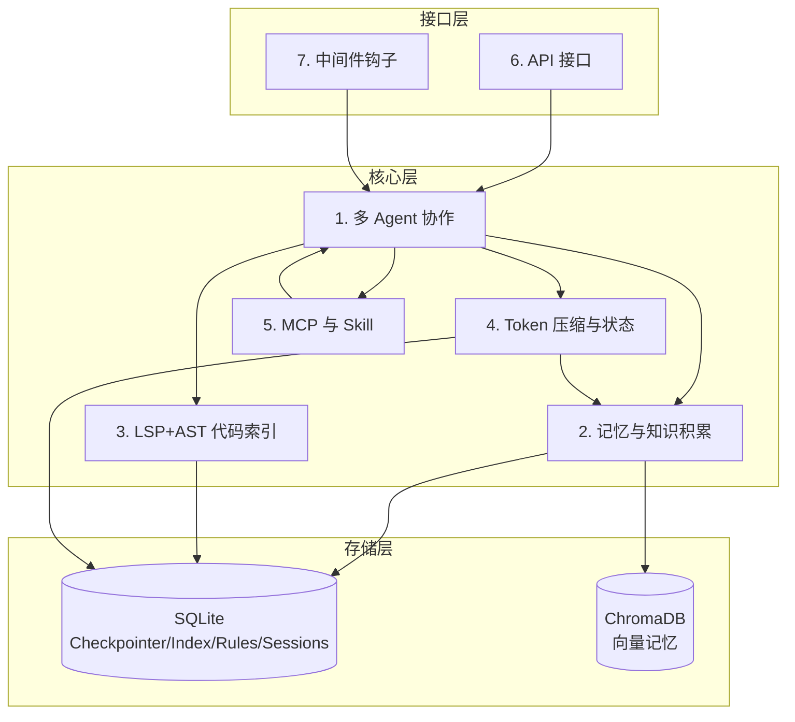

# 04 · 核心模块设计

> **Terminal CodingAgent · 核心模块设计文档**
> 本文档是整套技术文档的主干，串起 5 个核心模块与 API/中间件规范。

---

## 0. 文档说明

### 0.1 本文档在系列中的位置

```
docs/
├── 01_产品需求文档（PRD）        ← 做什么、为什么
├── 02_系统架构总览                ← 整体怎么切分
├── 03_项目开发文档                ← 怎么跑、怎么提交
├── 04_核心模块设计  ← 本文档     ← 每个模块怎么设计
└── 05_测试与运维手册              ← 怎么测、怎么上、怎么守
```

### 0.2 前置阅读

按顺序先读 01 PRD → 02 架构 → 03 项目开发文档，再读本文档：

- **01 PRD** 定义功能边界与非功能目标（Token 预算、延迟 SLO、角色清单），本文档的 5 模块直接承接这些目标
- **02 架构** 给出模块切分原则（Harness 六层、Context 工程、Loop 外循环）与共享技术栈
- **03 项目开发文档** 约定代码风格（ruff/mypy/pre-commit）、目录结构与包导入规范；本文档所有代码示例的包路径以开发文档 §3 为权威

仅需快速了解系统全貌时，可直接跳到第 7 节"模块依赖总图"再回头细读各节。

### 0.3 适用范围

| 角色 | 怎么用本文档 |
|---|---|
| 模块开发工程师 | 重点读第 1–5 节 + 第 6 节接口表，按示例代码开工 |
| API / 中间件开发者 | 重点读第 6、7 节，接口签名 + 钩子协议 |
| 技术负责人 / 架构师 | 重点读每节"设计动机"+ 第 7 节总图，做评审与取舍 |
| 测试 / 运维 | 扫读第 6 节接口表 → 接 05 测试运维手册 |

### 0.4 共享项目上下文

| 项 | 内容 |
|---|---|
| TCA 技术栈 | Python 3.11+ · LangGraph `==0.2.*` · LangChain `>=0.3` · LangGraph Checkpointer + SQLite · ChromaDB `>=0.5` · tree-sitter `>=0.22` · pygls + pyright · MCP 官方 Python SDK · 自研 Markdown Skill 加载器 · Streamlit · FastAPI · pydantic · pytest `>=8.0` |
| 核心参考资料 | 大模型 18（MAS）/ 19（中间件）/ 20（MCP）/ 21（Skills）/ 22（记忆）/ 23（Harness）/ 24（Loop Engineering） |

### 0.5 本文档结构

| 节 | 模块 | 关键问题 |
|---|---|---|
| 第 1 节 | 多 Agent 协作与可视化 | 多角色如何协作、如何收敛、如何可视化 |
| 第 2 节 | 跨会话长期记忆与知识积累 | 短期/长期两层、Chroma 集合、自动提炼 |
| 第 3 节 | LSP + AST 双引擎代码索引 | tree-sitter 解析 + pyright 语义、上下文注入 |
| 第 4 节 | 结构化分层 Token 压缩与状态持久化 | 三级压缩、Loop 五段闭环映射 |
| 第 5 节 | MCP 与 Skill 接入 | MCP 桥接、Skill 标准库、触发组合 |
| 第 6 节 | API 接口与中间件规范 | 接口签名表、REST+WS 端点、Hook 协议 |
| 第 7 节 | 模块依赖总图 | 整体依赖与数据流 |

每节按"设计动机 → 设计 → 图示 → 代码"统一节奏，全部 Python 代码完整可运行（附注释），全篇至少 8 个 Mermaid 图。

### 0.6 五模块整体协作图

建立**全局视图**——5 个核心模块如何串成一个完整的 Harness。下图是后续每节的总纲。



> **图的读法**：用户请求经 API 进入，Orchestrator 做任务分解（呼应大模型 18 的"分布式处理"），分派给专家；专家在能力层调用代码索引 / 记忆 / MCP 工具；压缩模块全程监控 Token 预算；最终状态实时反映到 Streamlit 面板。下一节起逐一展开每个方块。

---

## 第 1 节：多 Agent 协作与可视化模块

### 1.1 设计动机

参考资料 **大模型 18 · 多智能体介绍** 指出，MAS 相较单 Agent 的核心收益是三件事：**分布式处理**（大任务拆小子系统）、**协同工作**（多 Agent 协商/协调）、**自适应性**（根据环境调整策略）。 MAS 中 Agent 的**社交性（Social Ability）**——用自然语言与其他 Agent 交互——是区别于"工作流引擎"的关键。

Terminal CodingAgent 面对的真实任务（调研 → 写代码 → 审查 → 测试 → 发布）天然需要"专家团队"而非"全才"。本模块回答 4 个问题：

1. **角色怎么抽象** → 角色专家池（system_prompt + 工具子集）
2. **协调怎么进行** → Supervisor 与对等协商两种模式
3. **分歧怎么收敛** → 辩论 → 裁判收敛
4. **人类怎么介入** → Streamlit 可视化面板

### 1.2 角色专家池

每个角色是一个**带 system_prompt 与工具子集的 Agent**。用 Python `dataclass` 描述角色元信息，运行时由 `create_react_agent` 装配成 LangGraph 节点。

```python
# 文件：src/multi_agent/roles.py
from __future__ import annotations
from dataclasses import dataclass, field
from typing import Callable

# 类型别名：一个 LangChain 兼容工具就是一个可被 Agent 调用的 Callable
Tool = Callable[..., str]


@dataclass(frozen=True)
class AgentRole:
    """角色专家池中的单个角色。

    frozen=True 让角色对象可在多会话间复用、可被哈希进缓存。
    """
    name: str                       # 节点名，例如 "coder"
    display_name: str               # 展示名，例如 "代码工程师"
    system_prompt: str              # 注入模型的系统提示
    tools: tuple[Tool, ...] = ()    # 该角色可调用的工具子集（白名单）
    description: str = ""           # 用于 Supervisor 路由的自然语言描述


# ────────────────────────────────────────────────────────
# 五个核心角色（承接 PRD 中的角色清单）
# ────────────────────────────────────────────────────────

ORCHESTRATOR = AgentRole(
    name="orchestrator",
    display_name="主控 (Orchestrator)",
    system_prompt=(
        "你是项目的主控。职责：\n"
        "1) 把用户目标拆解为可执行的子任务 DAG；\n"
        "2) 将子任务分派给合适的专家 (coder/reviewer/tester/researcher)；\n"
        "3) 收集结果、判定是否收敛、决定下一步。\n"
        "你不直接写代码或做调研，只做规划与决策。"
    ),
    tools=(),  # Orchestrator 只调用子 Agent，不直接拿工具
    description="负责任务拆解与调度，不直接执行细节",
)

CODER = AgentRole(
    name="coder",
    display_name="代码工程师 (Coder)",
    system_prompt=(
        "你是代码工程师。职责：根据需求写出可运行的 Python 代码。\n"
        "要求：遵循 PEP 8、给关键函数写 docstring、优先用 stdlib。\n"
        "你的输出只包含代码块和简短说明，不要做架构决策。"
    ),
    tools=(),  # 实际注入：read_file / write_file / run_python
    description="负责编写与修改代码",
)

REVIEWER = AgentRole(
    name="reviewer",
    display_name="审查员 (Reviewer)",
    system_prompt=(
        "你是代码审查员。职责：审查代码的正确性、可读性、性能与安全。\n"
        "输出必须结构化：(P) 通过 / (R) 需修改 / (B) 阻断，附具体行号与理由。\n"
        "你不对需求本身提意见，只审查实现。"
    ),
    tools=(),  # 实际注入：read_file / grep / run_lint
    description="负责代码审查与质量把关",
)

TESTER = AgentRole(
    name="tester",
    display_name="测试工程师 (Tester)",
    system_prompt=(
        "你是测试工程师。职责：为给定代码编写并运行测试。\n"
        "优先用 pytest；关注边界条件与错误路径。\n"
        "输出：(P) 全部通过 / (F) 列出失败用例。"
    ),
    tools=(),  # 实际注入：write_file / run_test
    description="负责编写与运行测试",
)

RESEARCHER = AgentRole(
    name="researcher",
    display_name="研究员 (Researcher)",
    system_prompt=(
        "你是研究员。职责：检索资料、总结关键信息、给出有出处的结论。\n"
        "不写代码；所有事实必须给出来源链接或引用。"
    ),
    tools=(),  # 实际注入：web_search / read_url / memory_search
    description="负责信息检索与调研",
)
```

> **设计意图**：`frozen=True` 让角色对象在多个会话/多个 StateGraph 间**复用**，避免重复构造；`tools` 是**工具子集白名单**——这是 Harness（大模型 23）的核心思想：给 Agent 的**越少越可控**；`description` 给 Supervisor（或 AutoGen 式 Manager）做**路由**用，匹配"当前该谁接"。

#### 1.2.1 角色权限矩阵

5 个核心角色按权限类型分组，每组有明确的决策边界：

| 权限类型 | 角色 | 权限范围 | 决策权边界 |
|---|---|---|---|
| **Supervisor**（主管）| Orchestrator | 任务拆解、调度、子 Agent 仲裁 | 可拒绝专家输出、强制兜底决策；不直接执行细节 |
| **Worker**（执行）| Coder、Tester | 编写代码 / 编写并运行测试 | 仅在自身职责范围内自主决策；不评审其他角色输出 |
| **Verifier**（监督）| Reviewer | 审查代码质量、判定通过/驳回 | 可阻断流程（输出 B 级）；不直接修改代码 |
| **Specialist**（专项）| Researcher | 检索资料、引用溯源 | 不执行代码；输出需附引用 |

**权限硬约束**：

1. **Worker 不审 Worker** —— Coder 不评审 Coder 输出，Reviewer 是唯一审 Coder 的角色。
2. **Verifier 不修 Verifier** —— Reviewer 不审查 Reviewer 自身，不修改代码；驳回即返回 Worker。
3. **Specialist 不写 Specialist** —— Researcher 不写代码、不评审代码，只给信息。
4. **Supervisor 不执行** —— Orchestrator 不直接调工具，只调子 Agent。

> **设计意图**：把"做什么"和"做对没"分到不同角色，避免单个角色既要执行又要自我审查带来的偏见。这与 1.4 节的"辩论 / 收敛"机制配套——收敛靠角色对立，不是靠角色自我迭代。

### 1.3 协调协议

协调协议解决"多个角色如何串起来、谁先谁后、怎么应对条件分支"。
本模块提供**两种模式**，由配置文件切换：

#### 模式 A：Supervisor（层级型，呼应 CrewAI Hierarchical Process）

一个**经理 Agent** 持有所有任务的"视图"，逐一分派给下属 Agent，循环直到完成。
适合：目标清晰、步骤可枚举的任务（如"写一个 flask api + 测试"）。

#### 模式 B：对等协商（呼应 AutoGen GroupChat）

一个**共享黑板**（LangGraph State）挂在所有角色前，由 Manager 在每一步决定下一个发言角色。
适合：目标模糊、需要多方碰撞的研究型任务。

无论哪种模式，底层都用 **LangGraph StateGraph** 表示任务 DAG：

```python
# 文件：src/multi_agent/graph.py
from langgraph.graph import StateGraph, START, END
from typing import TypedDict, Annotated, Sequence
from langchain_core.messages import BaseMessage
import operator

# 共享黑板：所有 Agent 都读写的全局状态
class TaskState(TypedDict):
    # Annotated 让多条消息以"追加"而非"覆盖"方式合并
    messages: Annotated[Sequence[BaseMessage], operator.add]
    # DAG 追踪：当前节点、已做决策、产出物
    current_step: str
    artifacts: Annotated[dict, lambda left, right: {**left, **right}]
    # 辩论收敛用
    verdict: str
    converged: bool


def build_supervisor_graph(roles: dict[str, AgentRole], llm) -> StateGraph:
    """构建 Supervisor 协调图。

    拓扑：START → orchestrator → (coder | reviewer | tester | researcher)
          → orchestrator → END
    """
    g = StateGraph(TaskState)
    g.add_node("orchestrator", make_supervisor_node(roles, llm))
    for r in roles.values():
        if r.name == "orchestrator":
            continue
        g.add_node(r.name, make_agent_node(r, llm))
    # Orchestrator 后根据 current_step 动态路由到具体专家
    g.add_conditional_edges(
        "orchestrator",
        route_from_orchestrator,
        {r.name: r.name for r in roles.values()} | {"__end__": END},
    )
    # 专家完成后回到 orchestrator 重新决策
    for r in roles.values():
        if r.name != "orchestrator":
            g.add_edge(r.name, "orchestrator")
    g.set_entry_point("orchestrator")
    return g.compile()
```

### 1.4 辩论 / 收敛机制

当两个 Agent（如 Coder vs Reviewer）意见不一致时，需要一个**收敛策略**，否则会无限循环。
本模块参考 AutoGen 的"评论家终止"与 CrewAI 的"层级复核"，给出**两 Agent 对立 + 裁判收敛**三段式：

```
Coder 输出 → Reviewer 评估 → ① APPROVED → 结束
                            ② REJECTED + 改动量 < 阈值 → 回到 Coder 重做
                            ③ REJECTED + 已重做 N 次 → Orchestrator 仲裁，取最优
```

**关键参数**：`max_reviews`（默认 3）、`reviewer_threshold`（评审员给出 APPROVED 的门槛）。
这在 LangGraph 里表达为一个**循环 + 计数器 + 出口条件**。

状态图如下：



```python
def should_continue_review(state: TaskState) -> str:
    """出口条件：检查评审是否收敛。"""
    if state.get("verdict") == "APPROVED":
        return "__end__"
    n_reviews = state.get("n_reviews", 0)
    if n_reviews >= 3:
        return "__end__"  # 超过上限，Orchestrator 兜底
    return "coder"  # 未收敛，继续让 Coder 改
```

### 1.5 可视化（Streamlit 面板）

Streamlit 面板承接大模型 18 的"可视化多智能体工作流"。面板分 4 个区域：



**Streamlit 伪代码**（完整可运行）：

```python
# 文件：src/ui/streamlit_app.py
import streamlit as st
from src.multi_agent.graph import build_supervisor_graph

st.set_page_config(page_title="Terminal CodingAgent", layout="wide")
st.title("Terminal CodingAgent · 多 Agent 可视化")

# 左：任务 DAG；右：对话流
col_dag, col_chat = st.columns([1, 2])
with col_dag:
    st.subheader("任务 DAG（实时）")
    # graphviz 渲染当前 StateGraph，高亮 current_step
    st.graphviz_chart(render_dag(active_state))
with col_chat:
    st.subheader("Agent 对话流")
    for msg in st.session_state.transcript:
        with st.chat_message(msg["role"]):
            st.markdown(msg["content"])

# 底部：指标
col_tok, col_mem = st.columns(2)
with col_tok:
    st.metric("Token 消耗", f"{tokens} / {tokens_budget}")
    st.bar_chart(token_per_agent)
with col_mem:
    st.metric("记忆命中率", f"{hit_rate:.1%}")
    st.line_chart(memory_hits)
```

### 1.6 完整可运行示例：3 角色 StateGraph 跑 mock 任务

下面的示例**定义一个 3 角色（orchestrator / coder / reviewer）的 Supervisor 图，跑一条 mock 任务**。不依赖任何外部 LLM，用 `FakeListMessages` 模拟模型输出，可直接执行验证图结构。

```python
# 文件：examples/demo_3role_supervisor.py
"""3 角色 Supervisor StateGraph 完整可运行 demo。

运行：python examples/demo_3role_supervisor.py
"""
from typing import TypedDict, Annotated
from langgraph.graph import StateGraph, START, END
from langchain_core.messages import HumanMessage, AIMessage
import operator


# 1) 共享黑板
class DemoState(TypedDict):
    messages: Annotated[list, operator.add]
    step: str
    code: str
    review: str
    done: bool


# 2) 节点函数（模拟，不调 LLM）
def orchestrator_node(state: DemoState) -> dict:
    """mock 主控：决定下一步是谁。"""
    print("[orchestrator] 决定分派 …")
    return {
        "messages": [AIMessage(content="orchestrator: 请 Coder 写一个 add 函数")],
        "step": "coder",
    }


def coder_node(state: DemoState) -> dict:
    """mock 工程师：写一坨固定代码。"""
    code = "def add(a, b):\n    return a + b\n"
    print("[coder] 写完代码，交给 Reviewer …")
    # 把代码片段作为独立消息返回，避免在字符串里嵌套 Markdown 围栏
    return {
        "messages": [AIMessage(content="coder: 写出代码，见 code 字段")],
        "step": "reviewer",
        "code": code,
    }


def reviewer_node(state: DemoState) -> dict:
    """mock 审查员：3 次内收敛。"""
    n = state.get("n_reviews", 0)
    verdict = "APPROVED" if n >= 1 else "REJECTED"
    print(f"[reviewer] 第 {n+1} 次评审 → {verdict}")
    return {
        "messages": [AIMessage(content=f"reviewer: {verdict}")],
        "step": "orchestrator",
        "review": verdict,
        "n_reviews": n + 1,
        "done": verdict == "APPROVED",
    }


# 3) 条件边：Orchestrator 根据 step 路由
def route(state: DemoState) -> str:
    if state.get("done"):
        return "__end__"
    return state["step"]


# 4) 组装图
def build_demo_graph():
    g = StateGraph(DemoState)
    g.add_node("orchestrator", orchestrator_node)
    g.add_node("coder", coder_node)
    g.add_node("reviewer", reviewer_node)
    g.add_conditional_edges("orchestrator", route, {"coder": "coder", "reviewer": "reviewer", "__end__": END})
    g.add_edge("coder", "orchestrator")
    g.add_edge("reviewer", "orchestrator")
    return g.compile()


if __name__ == "__main__":
    g = build_demo_graph()
    init = {"messages": [HumanMessage(content="写一个 add 函数")], "done": False}
    # 跑图，LangGraph 在循环中自动路由
    for event in g.stream(init):
        print("--- event ---")
        print(event)
    print("\n✅ demo 跑通：3 角色 Supervisor 收敛。")
```

---

## 第 2 节：跨会话长期记忆与知识积累模块

### 2.1 设计动机

参考资料 **大模型 22 · Agent 记忆** 把记忆明确切为**短期 / 长期两层**：

| 维度 | 短期记忆 | 长期记忆 |
|---|---|---|
| 生命周期 | 单一线程内 | 跨线程、跨会话 |
| 作用范围 | 与 `thread_id` 绑定 | 按命名空间隔离 |
| 存储内容 | 对话消息历史、临时状态 | 用户偏好、事实知识、经验规则 |
| 核心组件 | Checkpointer（InMemorySaver / SqliteSaver） | Store / 向量库 |
| 管理策略 | 截断、删除、摘要 | 热路径 / 后台提炼、TTL |

TCA 的两层**都要做**：
- **短期**：用 LangGraph 自带的 Checkpointer，会话内零成本拿到多轮连贯。
- **长期**：ChromaDB 向量库 + SQLite 经验规则库，跨会话沉淀。
- **知识积累**：对话结束后自动提炼可复用事实，写入向量库——这是大模型 22 中 "Procedural Memory + Prompt 自优化" 的工程化。

### 2.2 短期记忆：LangGraph Checkpointer

```python
# 文件：src/memory/short_term.py
from langgraph.checkpoint.sqlite import SqliteSaver
from pathlib import Path

def make_short_term(db_path: str = "data/checkpoints.db") -> SqliteSaver:
    """创建 SQLite-backed 短期记忆。

    生产用 SQLite；测试时换成 InMemorySaver 即可，接口相同。
    """
    Path(db_path).parent.mkdir(parents=True, exist_ok=True)
    # SqliteSaver 让任意 thread_id 的状态持久化、可断点恢复
    return SqliteSaver.from_conn_string(db_path)
```

### 2.3 长期记忆：ChromaDB 集合设计

承接大模型 22 的**命名空间隔离**思想，分 4 个集合：

| 集合 | 命名空间 | 典型内容 |
|---|---|---|
| `user_memories` | `user/{user_id}` | 用户偏好、沟通风格、历史决策 |
| `project_memories` | `project/{project_path}` | 项目约定、技术栈、踩坑记录 |
| `facts` | 全局 | 通用事实、外部知识 |
| `rules` | 全局 | 编码规范、安全策略 |

**嵌入函数可插拔**：默认用 `all-MiniLM-L6-v2`，可在配置中换成 OpenAI / 自部署模型。

```python
# 文件：src/memory/long_term.py
from __future__ import annotations
import chromadb
from chromadb.utils import embedding_functions

NAMESPACES = ("user", "project", "facts", "rules")


class LongTermMemory:
    def __init__(self, persist_dir: str = "data/chroma",
                 embed_model: str = "all-MiniLM-L6-v2"):
        self.client = chromadb.PersistentClient(persist_dir)
        self.embed_fn = embedding_functions.SentenceTransformerEmbeddingFunction(
            model_name=embed_model
        )
        # 按 namespace 建集合（不存在就创建）
        self.collections = {
            ns: self.client.get_or_create_collection(
                name=f"{ns}_memories", embedding_function=self.embed_fn
            )
            for ns in NAMESPACES
        }

    def save(self, ns: str, doc_id: str, text: str, metadata: dict | None = None):
        self.collections[ns].upsert(
            ids=[doc_id], documents=[text], metadatas=[metadata or {}]
        )

    def retrieve(self, ns: str, query: str, top_k: int = 5) -> list[dict]:
        res = self.collections[ns].query(query_texts=[query], n_results=top_k)
        return [
            {"id": i, "text": d, "metadata": m}
            for i, d, m in zip(res["ids"][0], res["documents"][0], res["metadatas"][0])
        ]
```

### 2.4 知识积累：经验规则库 + 自动提炼

```python
# 文件：src/memory/rules_db.py
"""经验规则库：SQLite + FTS5 全文检索"""
from __future__ import annotations
import sqlite3
from pathlib import Path


class RulesDB:
    def __init__(self, db_path: str = "data/rules.db"):
        Path(db_path).parent.mkdir(parents=True, exist_ok=True)
        self.conn = sqlite3.connect(db_path)
        self.conn.execute("PRAGMA journal_mode=WAL")
        self.conn.execute(
            "CREATE VIRTUAL TABLE IF NOT EXISTS rules USING fts5("
            "rule_id UNINDEXED, content, tags, source UNINDEXED)"
        )

    def add_rule(self, rule_id: str, content: str, tags: str = "", source: str = ""):
        self.conn.execute(
            "INSERT INTO rules(rule_id, content, tags, source) VALUES (?,?,?,?)",
            (rule_id, content, tags, source),
        )
        self.conn.commit()

    def search(self, query: str, limit: int = 5) -> list[dict]:
        cur = self.conn.execute(
            "SELECT rule_id, content, tags FROM rules WHERE rules MATCH ? LIMIT ?",
            (query, limit),
        )
        return [dict(rule_id=r[0], content=r[1], tags=r[2]) for r in cur]
```

**自动提炼**：每段对话结束后，用一个轻量 LLM 做"反思摘要"——抽取"用户偏好 / 事实 / 规则"三种子类，分别写入对应集合。这是大模型 22 中 "Procedural Memory → prompt 自优化" 的落地。

### 2.5 写入 / 检索 / 遗忘策略



**策略要点**：
- **热路径写入**：Agent 在对话中识别到"用户偏好 / 关键事实"时立即同步写入（延迟 < 50ms），保证下一轮就能命中。
- **后台提炼**：对话结束后异步跑 LLM 摘要，避免阻塞用户。
- **TTL / 衰减**：每条记忆带 `expires_at`；Chroma 查询时过滤过期文档；SQLite 规则库按 `last_accessed` 排序，定期清理长尾。

### 2.6 上下文边界规则

记忆与索引系统提供完整能力，但**不是所有内容都应该进 LLM context**。超出窗口的信息一律走 Tool 检索，避免上下文污染与 Context Rot。

**进 LLM context（限制 ≤ 5 chunk / 4000 token）**：

| 类型 | 上限 | 说明 |
|------|------|------|
| 当前任务相关摘要 | ≤ 5 章 outline | 全量上下文的一部分；超出走 `memory_search` tool |
| 当前章节相关 lorebook claim | ≤ 20 条 | 超出走 `trivium_search` tool |
| 当前任务相关 world state | ≤ 3 条 | 超出走 `world_query` tool |
| 当前文件相关代码符号 | ≤ 5 个（签名 + 注释）| 超出走 `lsp_definition` / `ast_query` tool |
| 当前步骤的 tool 输出头尾 | 各 ≤ 100 token | 超出走 `read_file` tool（落盘完整内容）|

**进 Tool（不进 LLM context）**：

| 类型 | 处理方式 | 调用的 Tool |
|------|----------|-------------|
| 完整 lorebook（>20 条）| 按 query 走语义检索 | `trivium_search` |
| World Engine 全表 | 按 query 走状态查询 | `world_query` |
| 历史章节原文（>5 章）| 按关键词 / 时间检索 | `chapter_search` / `read_file` |
| 完整代码文件（>500 行）| 按符号 / 行号检索 | `ast_query` / `lsp_references` |
| 全量 Trace / PROV 记录 | 按 thread_id / step 检索 | `trace_query` |
| MCP 工具全量输出 | 落盘后按需读取 | `tool_output_load` |
| Skill 正文（>500 token）| 元数据常驻、正文按需 load | `skill_body` |

**二元决策表**（判断某条信息该不该进 context）：

```
是否与"当前步骤决策"直接相关？
  ├─ 是 → 评估大小：是否超过 LLM context 预算的 5%？
  │         ├─ 未超 → 进 context
  │         └─ 超过 → 走 Tool（返回指针 + 前 100 token 摘要）
  └─ 否 → 进 Tool（不参与本轮决策）
```

**设计依据**：

- **认知负荷**：人 / LLM 一次能处理的信息块有限（3-5 chunk），超出后边际收益迅速衰减、噪声迅速上升。
- **Context Rot**：context 越长、噪声越多，模型对核心指令的注意力越分散。
- **可观测**：进 context 的内容 = Agent 当下可见的事实；进 Tool 的内容 = 可被追溯调用的事实。前者是“热表”、后者是“冷库”。

**反例**（什么不该做）：

- ❌ 把全部 lorebook 塞进 sysprompt
- ❌ 把完整 PROV 事件流作为 system message 注入
- ❌ 把 MCP 工具返回的 50KB JSON 作为 HumanMessage 传递
- ❌ 把 skill 的 30KB 正文全量注入 context

### 2.7 完整 Python 示例：MemoryManager

```python
# 文件：src/memory/manager.py
"""MemoryManager：短期 + 长期 + 知识积累的统一入口。"""
from __future__ import annotations
import uuid
from datetime import datetime, timedelta
from .short_term import make_short_term
from .long_term import LongTermMemory
from .rules_db import RulesDB


class MemoryManager:
    def __init__(self, checkpoint_db: str = "data/checkpoints.db",
                 chroma_dir: str = "data/chroma",
                 rules_db: str = "data/rules.db"):
        self.short_term = make_short_term(checkpoint_db)
        self.long_term = LongTermMemory(chroma_dir)
        self.rules = RulesDB(rules_db)

    # ── 写入 ──────────────────────────────────────────────
    def save(self, ns: str, text: str, kind: str = "facts",
             ttl_days: int = 90, metadata: dict | None = None) -> str:
        """写入一条长期记忆。

        Args:
            ns: 命名空间，如 "user/alice" 或 "project/my-app"
            text: 记忆文本
            kind: 子集合 (user/project/facts/rules)
            ttl_days: 过期天数，None 表示永不过期
            metadata: 附加元数据
        Returns:
            doc_id
        """
        doc_id = str(uuid.uuid4())
        meta = {
            **(metadata or {}),
            "kind": kind,
            "created_at": datetime.utcnow().isoformat(),
            "expires_at": (
                (datetime.utcnow() + timedelta(days=ttl_days)).isoformat()
                if ttl_days else None
            ),
        }
        self.long_term.save(ns, doc_id, text, meta)
        return doc_id

    # ── 检索 ──────────────────────────────────────────────
    def retrieve(self, ns: str, query: str, top_k: int = 5) -> list[dict]:
        """语义检索，自动过滤过期文档。"""
        hits = self.long_term.retrieve(ns, query, top_k)
        now = datetime.utcnow().isoformat()
        return [h for h in hits if not h["metadata"].get("expires_at")
                or h["metadata"]["expires_at"] > now]

    # ── 知识积累（对话结束后调用）────────────────────────
    def consolidate(self, transcript: list[dict], llm) -> dict:
        """用 LLM 从对话 transcript 提炼可复用事实。

        Returns: {"saved": int, "rules": int}
        """
        # 构造提炼 prompt（承接大模型 22 的三类记忆）
        prompt = (
            "从以下对话中提炼：\n"
            "1) 用户偏好 (user)\n2) 通用事实 (facts)\n3) 行为规则 (rules)\n"
            "每条一行，格式：kind|text\n\n"
            f"对话：{transcript}\n"
        )
        resp = llm.invoke(prompt).content
        saved, rules = 0, 0
        for line in resp.strip().splitlines():
            if "|" not in line:
                continue
            kind, text = line.split("|", 1)
            kind, text = kind.strip(), text.strip()
            if kind == "rules":
                self.rules.add_rule(str(uuid.uuid4()), text, source="consolidate")
                rules += 1
            else:
                self.save(kind, text)
                saved += 1
        return {"saved": saved, "rules": rules}


# ── 使用示例 ──────────────────────────────────────────────
if __name__ == "__main__":
    from langchain_community.llms.fake import FakeListLLM

    mgr = MemoryManager(
        checkpoint_db=":memory:",  # 测试用内存
        chroma_dir="data/demo_chroma",
        rules_db=":memory:",
    )
    # 写入
    mgr.save("user/alice", "Alice 偏好简洁回复，不喜欢 emoji", ttl_days=30)
    mgr.save("project/my-app", "项目用 Python 3.11 + FastAPI", kind="project")
    # 检索
    hits = mgr.retrieve("user/alice", "Alice 的沟通偏好")
    print("命中：", hits)
    # 知识积累
    fake_llm = FakeListLLM(responses=["user|Alice 喜欢早上开会\nrules|回复不超过 3 行"])
    stats = mgr.consolidate([{"role": "user", "content": "hi"}], llm=fake_llm)
    print("提炼结果：", stats)
```

---

## 第 3 节：LSP + AST 双引擎代码索引模块

### 3.1 设计动机

参考资料 **大模型 23 · Harness Engineering** 把"上下文工程"列为 Harness 的核心职责——模型只能处理当前上下文窗口里的内容，**Harness 决定"喂什么、喂多少"**。
同时大模型 23 指出 Context Rot（上下文衰减）：信息越多，有效比例越低。

TCA 面对大型代码库时，**不能把整个代码库塞进 prompt**。本模块用**双引擎**解决"代码感知"：
- **AST 引擎**（tree-sitter）：快速解析结构，提取函数 / 类 / 导入 / 符号表。
- **LSP 引擎**（pygls + pyright）：提供跳转、引用、诊断、补全等精确语义。

两者协作：**AST 快速过滤候选 → LSP 精确语义确认**，在 Token 预算内注入最相关的代码上下文。

### 3.2 AST 引擎：tree-sitter 解析

```python
# 文件：src/code_index/ast_indexer.py
"""AST 引擎：tree-sitter 解析 → 符号表。"""
from __future__ import annotations
from dataclasses import dataclass, field
from pathlib import Path
from tree_sitter import Language, Parser
import tree_sitter_python as tspython


@dataclass
class Symbol:
    name: str
    kind: str            # function / class / import / variable
    start_line: int
    end_line: int
    docstring: str = ""
    references: list[tuple[str, int]] = field(default_factory=list)  # (file, line)


class ASTEngine:
    def __init__(self):
        # 预编译 Python 语言（生产环境应预编译 .so 缓存）
        self.lang = Language(tspython.language())
        self.parser = Parser(self.lang)

    def parse_file(self, path: str) -> list[Symbol]:
        src = Path(path).read_text(encoding="utf-8")
        tree = self.parser.parse(src.encode())
        return self._extract(tree.root_node, src)

    def _extract(self, node, src: str) -> list[Symbol]:
        syms = []
        # 递归提取函数 / 类定义
        for child in node.children:
            if child.type in ("function_definition", "class_definition"):
                name = child.child_by_field_name("name").text.decode()
                # 取 docstring（函数体第一行字符串表达式）
                doc = ""
                body = child.child_by_field_name("body")
                if body and body.children and body.children[0].type == "expression_statement":
                    stmt = body.children[0]
                    if stmt.children and stmt.children[0].type == "string":
                        doc = stmt.children[0].text.decode().strip("'\"")
                syms.append(Symbol(
                    name=name,
                    kind="function" if child.type == "function_definition" else "class",
                    start_line=child.start_point[0] + 1,
                    end_line=child.end_point[0] + 1,
                    docstring=doc,
                ))
            syms.extend(self._extract(child, src))
        return syms
```

### 3.3 LSP 引擎：pygls + pyright

```python
# 文件：src/code_index/lsp_client.py
"""LSP 引擎：通过 pyright 提供精确语义。

TODO(M4): 接入 pygls textDocument/references 接口，详见 §3.4 流程图。
生产可换成 pygls 自建 server，接口保持一致。
"""
from __future__ import annotations
import subprocess
import json
from dataclasses import dataclass


@dataclass
class Diagnostic:
    line: int
    column: int
    severity: str   # error / warning / info
    message: str


@dataclass
class Reference:
    file: str
    line: int
    column: int


class LSPEngine:
    def __init__(self, root: str):
        self.root = root

    def diagnostics(self, file: str) -> list[Diagnostic]:
        """跑 pyright 拿诊断。"""
        r = subprocess.run(
            ["pyright", "--outputjson", file],
            capture_output=True, text=True, cwd=self.root,
        )
        try:
            data = json.loads(r.stdout)
        except json.JSONDecodeError:
            return []
        return [
            Diagnostic(
                line=d["range"]["start"]["line"] + 1,
                column=d["range"]["start"]["character"],
                severity=d["severity"],
                message=d["message"],
            )
            for d in data.get("generalDiagnostics", [])
        ]

    def references(self, file: str, line: int, col: int) -> list[Reference]:
        """查找一处符号的所有引用（简化：grep + pyright）。

        生产环境应走 pygls textDocument/references。
        """
        # TODO(M4): 接入 pygls textDocument/references。当前返回空列表，
        # 上层应降级为 grep 近似搜索或等待 M4 完成。
        return []
```

### 3.4 双引擎协作流程

```mermaid
flowchart TD
    A[用户 query：<br/>"add 函数在哪定义"] --> B[AST 引擎<br/>tree-sitter 全量解析]
    B --> C{候选符号 > N?}
    C -->|是| D[按 query 关键词过滤<br/>保留 top-K]
    C -->|否| E[直接送 LSP]
    D --> E
    E --> F[LSP 引擎<br/>pyright 精确语义]
    F --> G[输出：定义位置 + 引用列表 + 诊断]
    G --> H[拼进 system prompt<br/>Token 预算内裁剪]
```

**为什么需要双引擎**：
- AST 快（毫秒级），但**无语义**（不知道 `add` 是哪个模块的）。
- LSP 精确，但**慢**（每次调用百毫秒级），且一次只能查一个符号。
- 双引擎 = **AST 缩小搜索空间 → LSP 只对候选做精确查询**，兼顾速度与准确。

### 3.5 上下文注入与 Token 裁剪

```python
# 文件：src/code_index/context_injector.py
"""把相关符号 + 引用关系 + 近期改动拼进 system prompt。"""
from __future__ import annotations
from .ast_engine import ASTEngine, Symbol


class ContextInjector:
    def __init__(self, token_budget: int = 4000):
        self.token_budget = token_budget
        self.ast = ASTEngine()

    def get_context_for(self, query: str, file: str) -> str:
        """主入口：给定 query 与当前文件，返回可注入 prompt 的上下文文本。"""
        syms = self.ast.parse_file(file)
        # 1) 按名字相似度过滤（TODO(M4): 接入 embedding 语义检索，当前为子串匹配）
        candidates = [s for s in syms if query.lower() in s.name.lower()]
        # 2) 按 Token 预算裁剪：优先保留 docstring 短的（信息密度高）
        candidates.sort(key=lambda s: len(s.docstring))
        parts, used = [], 0
        for s in candidates:
            chunk = f"# {s.kind} {s.name} (L{s.start_line}-{s.end_line})\n{s.docstring}\n"
            tokens = len(chunk) // 4  # 粗估
            if used + tokens > self.token_budget:
                break
            parts.append(chunk)
            used += tokens
        return "\n".join(parts)
```

### 3.6 AST 索引持久化与增量更新

```python
# 文件：src/code_index/hybrid_index.py
"""AST 索引持久化到 SQLite + watchdog 增量更新。"""
from __future__ import annotations
import sqlite3
from pathlib import Path
from watchdog.observers import Observer
from watchdog.events import FileSystemEventHandler
from .ast_engine import ASTEngine


class IndexStore:
    def __init__(self, db_path: str = "data/index.db"):
        Path(db_path).parent.mkdir(parents=True, exist_ok=True)
        self.conn = sqlite3.connect(db_path)
        self.conn.execute("PRAGMA journal_mode=WAL")
        self.conn.execute(
            "CREATE TABLE IF NOT EXISTS symbols("
            "id INTEGER PRIMARY KEY, file TEXT, name TEXT, kind TEXT,"
            "start_line INT, end_line INT, docstring TEXT)"
        )
        self.ast = ASTEngine()

    def index_project(self, root: str):
        """全量索引。"""
        for py in Path(root).rglob("*.py"):
            for s in self.ast.parse_file(str(py)):
                self.conn.execute(
                    "INSERT INTO symbols(file,name,kind,start_line,end_line,docstring)"
                    " VALUES (?,?,?,?,?,?)",
                    (str(py), s.name, s.kind, s.start_line, s.end_line, s.docstring),
                )
        self.conn.commit()

    def query_symbol(self, name: str) -> list[dict]:
        cur = self.conn.execute(
            "SELECT file,name,kind,start_line,end_line,docstring FROM symbols WHERE name=?",
            (name,),
        )
        return [dict(zip(["file","name","kind","start_line","end_line","docstring"], r))
                for r in cur]

    def watch(self, root: str):
        """watchdog 监听文件变更，增量更新索引。"""
        handler = _IncrementalHandler(self)
        obs = Observer()
        obs.schedule(handler, root, recursive=True)
        obs.start()


class _IncrementalHandler(FileSystemEventHandler):
    def __init__(self, store: IndexStore):
        self.store = store

    def on_modified(self, event):
        if event.src_path.endswith(".py"):
            # 删旧索引 + 重新解析
            self.store.conn.execute("DELETE FROM symbols WHERE file=?", (event.src_path,))
            for s in self.store.ast.parse_file(event.src_path):
                self.store.conn.execute(
                    "INSERT INTO symbols(file,name,kind,start_line,end_line,docstring)"
                    " VALUES (?,?,?,?,?,?)",
                    (event.src_path, s.name, s.kind, s.start_line, s.end_line, s.docstring),
                )
            self.store.conn.commit()
```

### 3.7 完整 Python 示例：CodeIndex

```python
# 文件：examples/demo_code_index.py
"""CodeIndex 完整 demo：解析一段 demo 代码 + 查询符号 + 注入上下文。"""
from src.code_index.ast_indexer import ASTEngine
from src.code_index.context_injector import ContextInjector
import tempfile, os

DEMO_CODE = '''
def add(a, b):
    """Return the sum of a and b."""
    return a + b

def multiply(a, b):
    """Return the product of a and b."""
    return a * b

class Calculator:
    """A simple calculator."""
    def __init__(self):
        self.history = []
'''

def main():
    # 1) 写 demo 代码到临时文件
    with tempfile.NamedTemporaryFile("w", suffix=".py", delete=False) as f:
        f.write(DEMO_CODE)
        path = f.name
    try:
        # 2) AST 解析
        engine = ASTEngine()
        syms = engine.parse_file(path)
        print("=== 解析结果 ===")
        for s in syms:
            print(f"  {s.kind:9s} {s.name:12s} L{s.start_line}-{s.end_line}  {s.docstring}")
        # 3) 查询符号
        print("\n=== 查询 'add' ===")
        for s in syms:
            if "add" in s.name:
                print(f"  命中：{s.name} @ L{s.start_line}")
        # 4) 上下文注入
        injector = ContextInjector(token_budget=2000)
        ctx = injector.get_context_for("add", path)
        print("\n=== 注入 prompt 的上下文 ===")
        print(ctx)
    finally:
        os.unlink(path)

if __name__ == "__main__":
    main()
```

---

## 第 4 节：结构化分层 Token 压缩与会话状态持久化模块

### 4.1 设计动机

参考资料 **大模型 24 · Loop Engineering** 把 Agent 工作流抽象为**五段闭环**：Intent → Context → Action → Observation → Adjustment。
参考资料 **大模型 23 · Harness Engineering** 指出 Context Rot 是长任务的头号敌人——信息越多，有效比例越低。

TCA 面对"长任务"（如重构一个万行项目）时，对话历史会迅速撑爆上下文窗口。本模块用**三级压缩**对抗衰减：

| 层级 | 名称 | 内容 | 触发条件 |
|---|---|---|---|
| L1 | 摘要 | 最近 N 轮保留原文，更早的折叠为 1 句摘要 | Token 超 60% 预算 |
| L2 | 细节折叠 | 更早的轮次折叠为关键词 + 结论 | Token 超 80% 预算 |
| L3 | 归档 | 超阈值内容写入长期记忆向量库，prompt 只留指针 | Token 超 95% 预算 |

### 4.2 压缩器实现

```python
# 文件：src/memory/compressor.py
"""CompressionEngine：三级 Token 压缩。"""
from __future__ import annotations
from dataclasses import dataclass
from langchain_core.messages import BaseMessage, HumanMessage, AIMessage, SystemMessage


@dataclass
class CompressionDecision:
    level: int          # 0=不压缩, 1=摘要, 2=折叠, 3=归档
    reason: str


class CompressionEngine:
    def __init__(self, budget: int = 8000,
                 l1_threshold: float = 0.6,
                 l2_threshold: float = 0.8,
                 l3_threshold: float = 0.95):
        self.budget = budget
        self.thresholds = [
            (l1_threshold, 1),
            (l2_threshold, 2),
            (l3_threshold, 3),
        ]

    def _count_tokens(self, messages: list[BaseMessage]) -> int:
        # TODO(M4): 接入 tiktoken 精确计数，当前为字符数/4 粗估
        return sum(len(str(m.content)) for m in messages) // 4

    def decide(self, messages: list[BaseMessage]) -> CompressionDecision:
        """根据当前 Token 占用决定压缩级别。"""
        used = self._count_tokens(messages)
        ratio = used / self.budget
        level = 0
        for thr, lv in self.thresholds:
            if ratio >= thr:
                level = lv
        return CompressionDecision(level=level, reason=f"{used}/{self.budget} tokens")

    def apply(self, messages: list[BaseMessage],
              llm=None, memory=None) -> list[BaseMessage]:
        """执行压缩，返回新消息列表。"""
        decision = self.decide(messages)
        if decision.level == 0:
            return messages
        if decision.level == 1:
            return self._apply_l1(messages, llm)
        if decision.level == 2:
            return self._apply_l2(messages, llm)
        return self._apply_l3(messages, llm, memory)

    def _apply_l1(self, msgs: list[BaseMessage], llm) -> list[BaseMessage]:
        """保留最近 5 轮，更早的折叠为 1 句摘要。"""
        if len(msgs) <= 6:
            return msgs
        head = msgs[:1]          # system
        recent = msgs[-5:]
        old = msgs[1:-5]
        summary = self._summarize(old, llm) if llm else "[earlier turns omitted]"
        return head + [AIMessage(content=f"[摘要] {summary}")] + recent

    def _apply_l2(self, msgs: list[BaseMessage], llm) -> list[BaseMessage]:
        """更早的折叠为关键词 + 结论。"""
        head = msgs[:1]
        recent = msgs[-3:]
        old = msgs[1:-3]
        keywords = [str(m.content)[:30] for m in old]
        return head + [AIMessage(content=f"[折叠] 关键词：{' | '.join(keywords)}")] + recent

    def _apply_l3(self, msgs: list[BaseMessage], llm, memory) -> list[BaseMessage]:
        """超阈值内容归档到长期记忆，prompt 只留指针。"""
        head = msgs[:1]
        recent = msgs[-2:]
        old = msgs[1:-2]
        # 归档
        if memory:
            for m in old:
                memory.save("facts", str(m.content), ttl_days=30)
        return head + [AIMessage(content="[归档] 旧内容已写入长期记忆")] + recent

    def _summarize(self, msgs: list[BaseMessage], llm) -> str:
        text = "\n".join(str(m.content) for m in msgs)
        return llm.invoke(f"用一句话总结：{text[:500]}").content
```

### 4.3 会话状态持久化

```python
# 文件：src/memory/session_state.py
"""SessionState：当前任务 / 文件 / TODO / 最近错误，序列化到 Checkpointer + SQLite。"""
from __future__ import annotations
from dataclasses import dataclass, asdict
from typing import Any
import json, sqlite3
from pathlib import Path


@dataclass
class SessionState:
    session_id: str
    current_task: str = ""
    open_files: list[str] = None
    todos: list[str] = None
    last_error: str = ""
    turn_count: int = 0

    def __post_init__(self):
        self.open_files = self.open_files or []
        self.todos = self.todos or []

    def to_json(self) -> str:
        return json.dumps(asdict(self))

    @classmethod
    def from_json(cls, s: str) -> "SessionState":
        return cls(**json.loads(s))


class SessionStore:
    """SQLite 持久化 SessionState，支持断点恢复。"""
    def __init__(self, db_path: str = "data/sessions.db"):
        Path(db_path).parent.mkdir(parents=True, exist_ok=True)
        self.conn = sqlite3.connect(db_path)
        self.conn.execute(
            "CREATE TABLE IF NOT EXISTS sessions("
            "session_id TEXT PRIMARY KEY, state_json TEXT)"
        )

    def save(self, state: SessionState):
        self.conn.execute(
            "INSERT OR REPLACE INTO sessions VALUES (?,?)",
            (state.session_id, state.to_json()),
        )
        self.conn.commit()

    def load(self, session_id: str) -> SessionState | None:
        cur = self.conn.execute(
            "SELECT state_json FROM sessions WHERE session_id=?", (session_id,))
        row = cur.fetchone()
        return SessionState.from_json(row[0]) if row else None
```

### 4.4 Loop 五段闭环映射到 LangGraph 节点



| Loop 阶段 | LangGraph 节点 | 做什么 |
|---|---|---|
| Intent | `intent_node` | 解析用户目标，写入 SessionState.current_task |
| Context | `context_node` | 调 CodeIndex + MemoryManager 注入相关上下文 |
| Action | `action_node` | 调 LLM 生成代码 / 调用工具 |
| Observation | `observe_node` | 跑测试 / lint / 拿诊断 |
| Adjustment | `adjust_node` | 根据观察更新 TODO、决定是否继续循环 |

### 4.5 完整 Python 示例：CompressionEngine + 5 节点 Loop StateGraph

```python
# 文件：examples/demo_compression_loop.py
"""CompressionEngine + 5 节点 Loop StateGraph 完整 demo。

运行：python examples/demo_compression_loop.py
"""
from typing import TypedDict, Annotated
from langgraph.graph import StateGraph, START, END
from langchain_core.messages import HumanMessage, AIMessage
import operator
from datetime import datetime

from src.memory.compressor import CompressionEngine
from src.memory.session_state import SessionState, SessionStore


# 1) Loop 共享状态
class LoopState(TypedDict):
    messages: Annotated[list, operator.add]
    session: dict           # SessionState 的 dict 形式
    action_result: str
    observation: str
    adjustments: str
    done: bool


# 2) 五个节点（对应 Loop 五段）
def intent_node(state: LoopState) -> dict:
    task = state["session"].get("current_task", "未指定")
    print(f"[Intent] 目标：{task}")
    return {"messages": [AIMessage(content=f"意图明确：{task}")]}


def context_node(state: LoopState) -> dict:
    # 压缩检查
    engine = CompressionEngine(budget=2000)
    compressed = engine.apply(state["messages"])
    print(f"[Context] 压缩决策：{engine.decide(state['messages']).level} 级")
    return {"messages": compressed}


def action_node(state: LoopState) -> dict:
    print("[Action] 执行任务 …")
    return {"action_result": "已完成模拟动作", "messages": [AIMessage(content="action: done")]}


def observe_node(state: LoopState) -> dict:
    print("[Observation] 观察结果（无错误）")
    return {"observation": "ok"}


def adjust_node(state: LoopState) -> dict:
    turn = state["session"].get("turn_count", 0)
    done = turn >= 3
    print(f"[Adjustment] 第 {turn+1} 轮 → {'收敛' if done else '继续'}")
    return {"done": done, "session": {**state["session"], "turn_count": turn + 1}}


# 3) 组装图
def build_loop_graph():
    g = StateGraph(LoopState)
    for name, fn in [
        ("intent", intent_node), ("context", context_node),
        ("action", action_node), ("observe", observe_node),
        ("adjust", adjust_node),
    ]:
        g.add_node(name, fn)
    g.add_edge(START, "intent")
    g.add_edge("intent", "context")
    g.add_edge("context", "action")
    g.add_edge("action", "observe")
    g.add_edge("observe", "adjust")
    # 条件边：收敛 → END；否则 → 回到 context 下一轮
    g.add_conditional_edges(
        "adjust",
        lambda s: "__end__" if s["done"] else "context",
        {"context": "context", "__end__": END},
    )
    return g.compile()


if __name__ == "__main__":
    g = build_loop_graph()
    init = {
        "messages": [HumanMessage(content="重构 UserService")],
        "session": {
            "session_id": "demo",
            "current_task": "重构 UserService",
            "turn_count": 0,
        },
        "done": False,
    }
    for event in g.stream(init):
        print("--- loop event ---", event)
    print("\n✅ 5 节点 Loop StateGraph 跑通。")
```

---

## 第 5 节：MCP 与 Skill 接入模块

### 5.1 设计动机

参考资料 **大模型 20 · MCP** 把 MCP 比作"通用插座"——一次接入、多处复用、动态发现。
参考资料 **大模型 21 · Skills** 把 Skill 比作"操作手册"——MCP 解决"能不能接"，Skill 解决"怎么用好"。

两者互补（大模型 21 原文）：

| 组件 | 类比 | 解决什么 |
|---|---|---|
| MCP | USB-C 接口 | 外部系统"如何接入"（连通性） |
| Skill | 任务说明书 | 复杂任务"如何编排"（执行逻辑） |

本模块回答 3 个问题：
1. MCP 服务器怎么动态接入 Agent 工具池
2. Skill（SKILL.md + 目录约定）怎么解析、触发、注入
3. 两者怎么组合（Skill 内部调用 MCP 工具）

### 5.2 MCP 客户端桥接

MCP 客户端与服务器建立连接、发现工具、调用工具的完整时序：




```python
# 文件：src/mcp/client.py
"""MCPClient：连接 stdio / SSE 两类 MCP 服务器，动态注册工具到 Agent。"""
from __future__ import annotations
import asyncio
import json
from dataclasses import dataclass
from typing import Callable

# 类型别名
Tool = Callable[..., str]


@dataclass
class MCPTool:
    """从 MCP 服务器发现的一个工具。"""
    name: str
    description: str
    parameters: dict
    _call: Callable          # 实际调用 MCP server 的函数

    async def invoke(self, **kwargs) -> str:
        return await self._call(**kwargs)


class MCPClient:
    """MCP 客户端桥接。

    支持 stdio（子进程）与 SSE（HTTP）两种传输。
    生产用 langchain_mcp_adapters.MultiServerMCPClient；
    这里给出最小自研版，便于理解协议。
    """
    def __init__(self, name: str, transport: str = "stdio",
                 command: str = "", args: list[str] | None = None,
                 url: str = ""):
        self.name = name
        self.transport = transport
        self.command = command
        self.args = args or []
        self.url = url
        self.tools: list[MCPTool] = []
        self._process = None

    async def connect(self):
        """建立连接并拉取工具列表。"""
        if self.transport == "stdio":
            await self._connect_stdio()
        elif self.transport == "sse":
            await self._connect_sse()
        else:
            raise ValueError(f"不支持的传输：{self.transport}")

    async def _connect_stdio(self):
        """启动子进程，通过 stdio 通信。"""
        import asyncio.subprocess as sp
        self._process = await asyncio.create_subprocess_exec(
            self.command, *self.args,
            stdin=sp.PIPE, stdout=sp.PIPE, stderr=sp.PIPE,
        )
        # 发送 list_tools 请求（JSON-RPC）
        req = json.dumps({"jsonrpc": "2.0", "id": 1, "method": "tools/list"})
        self._process.stdin.write((req + "\n").encode())
        await self._process.stdin.drain()
        line = await self._process.stdout.readline()
        resp = json.loads(line.decode())
        for t in resp.get("result", {}).get("tools", []):
            self.tools.append(MCPTool(
                name=t["name"],
                description=t["description"],
                parameters=t.get("inputSchema", {}),
                _call=self._make_caller(t["name"]),
            ))

    async def _connect_sse(self):
        """通过 SSE HTTP 连接。"""
        import httpx
        self._client = httpx.AsyncClient()
        # SSE 握手 + list_tools
        r = await self._client.get(f"{self.url}/tools/list")
        for t in r.json().get("tools", []):
            self.tools.append(MCPTool(
                name=t["name"], description=t["description"],
                parameters=t.get("inputSchema", {}),
                _call=self._make_http_caller(t["name"]),
            ))

    def _make_caller(self, tool_name: str) -> Callable:
        """构造 stdio 调用函数。"""
        async def _call(**kwargs):
            req = json.dumps({
                "jsonrpc": "2.0", "id": 2, "method": "tools/call",
                "params": {"name": tool_name, "arguments": kwargs},
            })
            self._process.stdin.write((req + "\n").encode())
            await self._process.stdin.drain()
            line = await self._process.stdout.readline()
            return json.loads(line.decode()).get("result", "")
        return _call

    def _make_http_caller(self, tool_name: str) -> Callable:
        """构造 HTTP 调用函数。"""
        async def _call(**kwargs):
            r = await self._client.post(f"{self.url}/tools/call",
                                        json={"name": tool_name, "arguments": kwargs})
            return r.json().get("result", "")
        return _call

    def as_langchain_tools(self) -> list[dict]:
        """转成 LangGraph Agent 可消费的 tool 描述列表。"""
        return [
            {"name": t.name, "description": t.description, "parameters": t.parameters}
            for t in self.tools
        ]

    async def close(self):
        if self._process:
            self._process.terminate()
            await self._process.wait()
```

### 5.3 Skill 引擎

承接大模型 21 的**目录结构**约定：

```
my-skill/
├── SKILL.md          # 必需：frontmatter + 指令
├── scripts/          # 可选：可执行脚本
├── references/       # 可选：参考文档
├── assets/           # 可选：静态资产
└── templates/        # 可选：模板文件
```

```python
# 文件：src/skill/loader.py
"""SkillLoader：解析 SKILL.md + 目录约定。"""
from __future__ import annotations
from dataclasses import dataclass, field
from pathlib import Path
import re


@dataclass
class Skill:
    name: str
    description: str          # frontmatter 中的 description（用于路由）
    body: str                 # SKILL.md 正文（注入 system prompt）
    scripts: list[Path] = field(default_factory=list)
    references: list[Path] = field(default_factory=list)
    templates: list[Path] = field(default_factory=list)
    assets: list[Path] = field(default_factory=list)


class SkillLoader:
    """从目录加载 Skill。

    只解析 frontmatter + 扫描子目录；不执行脚本（延迟加载）。
    """
    def __init__(self, skills_root: str = "skills"):
        self.root = Path(skills_root)

    def load(self, name: str) -> Skill:
        skill_dir = self.root / name
        md = skill_dir / "SKILL.md"
        if not md.exists():
            raise FileNotFoundError(f"Skill {name} 缺少 SKILL.md")
        text = md.read_text(encoding="utf-8")
        # 解析 frontmatter
        fm_match = re.match(r"---\n(.*?)\n---\n(.*)", text, re.DOTALL)
        if not fm_match:
            raise ValueError(f"Skill {name} 的 SKILL.md 缺少 frontmatter")
        fm_body, body = fm_match.group(1), fm_match.group(2)
        fm = dict(re.findall(r"(\w+):\s*(.+)", fm_body))
        return Skill(
            name=fm.get("name", name),
            description=fm.get("description", ""),
            body=body.strip(),
            scripts=list((skill_dir / "scripts").glob("*")) if (skill_dir / "scripts").exists() else [],
            references=list((skill_dir / "references").glob("*")) if (skill_dir / "references").exists() else [],
            templates=list((skill_dir / "templates").glob("*")) if (skill_dir / "templates").exists() else [],
            assets=list((skill_dir / "assets").glob("*")) if (skill_dir / "assets").exists() else [],
        )

    def list_skills(self) -> list[str]:
        """列出所有可用 Skill 名。"""
        return [d.name for d in self.root.iterdir()
                if d.is_dir() and (d / "SKILL.md").exists()]
```

### 5.4 Skill 触发与组合

```python
# 文件：src/skill/trigger.py
"""Skill 触发：关键词 / 意图匹配 → 加载 Skill → 注入 system prompt 与工具。"""
from __future__ import annotations
from .loader import SkillLoader, Skill


class SkillTrigger:
    def __init__(self, skills_root: str = "skills"):
        self.loader = SkillLoader(skills_root)
        # 启动时只加载元数据（大模型 21 第一层：只看目录）
        self._catalog = {
            name: self.loader.load(name).description
            for name in self.loader.list_skills()
        }

    def match(self, user_query: str) -> Skill | None:
        """按关键词匹配最相关 Skill。

        TODO(M4): 接入 embedding 相似度做语义路由，当前为子串匹配。
        """
        for name, desc in self._catalog.items():
            if any(kw in user_query.lower() for kw in name.lower().split("-")):
                return self.loader.load(name)
        return None

    def inject(self, skill: Skill, system_prompt: str) -> str:
        """将 Skill 正文拼入 system prompt。"""
        return f"{system_prompt}\n\n## 激活技能：{skill.name}\n{skill.body}"
```

### 5.5 标准库 Skills

#### Skill 1：code-review

```markdown
# 文件：skills/code-review/SKILL.md
---
name: code-review
description: 代码审查技能。当用户请求审查代码、review PR、检查代码质量时触发。
---

# Code Review Skill

## 触发条件
用户请求"审查代码"、"review 这个 PR"、"看看这段代码有没有问题"时激活。

## 环境约束
- 使用 ruff 做静态检查
- 使用 pytest 跑测试
- 输出语言：中文

## 执行流程
1. 读取目标代码文件
2. 运行 `ruff check <file>` 获取静态检查
3. 运行 `pytest <test_file>` 获取测试结果
4. 综合给出 (P) 通过 / (R) 需修改 / (B) 阻断

## 输出规范
每条意见必须包含：文件路径、行号、严重等级、修改建议。

## 示例
输入：审查 src/auth.py
输出：
- [B] src/auth.py L42: 密码明文存储，请使用 bcrypt
- [R] src/auth.py L18: 缺少 docstring
```

#### Skill 2：git-commit

```markdown
# 文件：skills/git-commit/SKILL.md
---
name: git-commit
description: Git 提交技能。当用户请求提交代码、commit、生成 commit message 时触发。
---

# Git Commit Skill

## 触发条件
用户请求"提交代码"、"commit"、"生成提交信息"时激活。

## 环境约束
- 遵循 Conventional Commits 规范
- 语言：中文正文 + 英文 type

## 执行流程
1. `git diff --cached` 查看已暂存改动
2. 若无暂存，自动 `git add` 用户指定文件
3. 根据改动生成 commit message：`<type>: <中文描述>`
4. 执行 `git commit -m "..."`

## 输出规范
commit message 格式：
```
feat: 新增用户登录接口

- 添加 /api/login 路由
- 实现 JWT token 签发
```

## 禁止事项
- 不得提交 .env 或含密钥文件
- 不得在 commit message 中写 issue 编号以外的敏感信息
```

### 5.6 完整 Python 示例：MCPClient + SkillLoader

```python
# 文件：examples/demo_mcp_and_skill.py
"""MCPClient 连接 stdio 数学 MCP 服务器 + SkillLoader 加载 code-review Skill。

运行：python examples/demo_mcp_and_skill.py
"""
import asyncio, json, tempfile, os
from src.mcp.client import MCPClient
from src.skill.loader import SkillLoader
from src.skill.trigger import SkillTrigger


# ── 1) 写一个最小 stdio 数学 MCP 服务器 ─────────────────
MATH_SERVER = '''
import sys, json
tools = {"tools": [{"name": "add", "description": "两数相加",
                     "inputSchema": {"type":"object","properties":{
                         "a":{"type":"number"},"b":{"type":"number"}}}}]}
for line in sys.stdin:
    req = json.loads(line)
    if req["method"] == "tools/list":
        print(json.dumps({"jsonrpc":"2.0","id":req["id"],"result":tools}))
    elif req["method"] == "tools/call":
        a = req["params"]["arguments"]["a"]
        b = req["params"]["arguments"]["b"]
        print(json.dumps({"jsonrpc":"2.0","id":req["id"],"result":a+b}))
    sys.stdout.flush()
'''


async def demo_mcp():
    # 写临时服务器文件
    with tempfile.NamedTemporaryFile("w", suffix=".py", delete=False) as f:
        f.write(MATH_SERVER)
        srv = f.name
    try:
        client = MCPClient(name="math", transport="stdio",
                           command="python", args=[srv])
        await client.connect()
        print(f"=== MCP 工具列表：{[t.name for t in client.tools]} ===")
        # 调用 add
        result = await client.tools[0].invoke(a=2, b=3)
        print(f"=== add(2,3) = {result} ===")
        await client.close()
    finally:
        os.unlink(srv)


def demo_skill():
    # 写临时 skill 目录
    tmp = tempfile.mkdtemp()
    skill_dir = os.path.join(tmp, "code-review")
    os.makedirs(skill_dir)
    with open(os.path.join(skill_dir, "SKILL.md"), "w") as f:
        f.write("---\nname: code-review\ndescription: 审查代码\n---\n审查代码质量\n")
    try:
        loader = SkillLoader(skills_root=tmp)
        skill = loader.load("code-review")
        print(f"=== 加载 Skill：{skill.name} ===")
        print(f"=== 描述：{skill.description} ===")
        # 触发
        trigger = SkillTrigger(skills_root=tmp)
        matched = trigger.match("帮我审查代码")
        print(f"=== 触发匹配：{matched.name if matched else None} ===")
    finally:
        import shutil
        shutil.rmtree(tmp)


if __name__ == "__main__":
    asyncio.run(demo_mcp())
    demo_skill()
    print("\n✅ MCP + Skill demo 跑通。")
```

---

## 第 6 节：API 接口与中间件钩子规范

### 6.1 公共 API：核心模块接口签名表

| 模块 | 类名 | 方法 | 参数 | 返回 | 异常 |
|---|---|---|---|---|---|
| 多 Agent | `AgentRole` | — | `name, system_prompt, tools` | — | `TypeError` |
| 多 Agent | `build_supervisor_graph` | — | `roles: dict, llm` | `CompiledStateGraph` | `ValueError` |
| 记忆 | `MemoryManager` | `save(ns, text, kind, ttl_days)` | 见 2.6 | `doc_id: str` | `KeyError` |
| 记忆 | `MemoryManager` | `retrieve(ns, query, top_k)` | — | `list[dict]` | — |
| 记忆 | `MemoryManager` | `consolidate(transcript, llm)` | — | `{"saved","rules"}` | — |
| 索引 | `ASTEngine` | `parse_file(path)` | — | `list[Symbol]` | `FileNotFoundError` |
| 索引 | `IndexStore` | `index_project(root)` | — | `None` | — |
| 索引 | `IndexStore` | `query_symbol(name)` | — | `list[dict]` | — |
| 索引 | `ContextInjector` | `get_context_for(query, file)` | — | `str` | — |
| 压缩 | `CompressionEngine` | `decide(messages)` | — | `CompressionDecision` | — |
| 压缩 | `CompressionEngine` | `apply(messages, llm, memory)` | — | `list[BaseMessage]` | — |
| 压缩 | `SessionStore` | `save(state)` / `load(session_id)` | — | `None` / `SessionState` | — |
| MCP | `MCPClient` | `connect()` | — | `None` | `ConnectionError` |
| MCP | `MCPClient` | `as_langchain_tools()` | — | `list[dict]` | — |
| Skill | `SkillLoader` | `load(name)` | — | `Skill` | `FileNotFoundError` |
| Skill | `SkillTrigger` | `match(user_query)` | — | `Skill \| None` | — |
| Skill | `SkillTrigger` | `inject(skill, system_prompt)` | — | `str` | — |

### 6.2 FastAPI 端点清单

| 方法 | 路径 | 用途 | 请求体 | 响应 | 错误码 |
|---|---|---|---|---|---|
| POST | `/sessions` | 创建会话 | `{user_id, task}` | `{session_id, created_at}` | 400, 500 |
| POST | `/sessions/{id}/messages` | 发消息 | `{content}` | `{reply, artifacts}` | 404, 429 |
| WS | `/stream` | 流式输出 | — | SSE `{delta, done}` | — |
| GET | `/memory/search` | 记忆检索 | `?ns=&q=&k=` | `{hits: [...]}` | 400 |
| GET | `/index/status` | 索引状态 | — | `{files, symbols, last_updated}` | — |
| GET | `/agents` | 角色列表 | — | `{roles: [...]}` | — |
| GET | `/health` | 健康检查 | — | `{status: "ok"}` | 503 |
| GET | `/ready` | 就绪检查 | — | `{ready: bool}` | 503 |

**REST 端点示例**：

```python
# 文件：src/api/routers/agent.py
import uuid
from datetime import datetime
from fastapi import FastAPI, HTTPException, WebSocket
from pydantic import BaseModel

app = FastAPI(title="Terminal CodingAgent API")

class CreateSessionReq(BaseModel):
    user_id: str
    task: str

class MessageReq(BaseModel):
    content: str

@app.post("/sessions")
async def create_session(req: CreateSessionReq):
    sid = str(uuid.uuid4())
    # 写 SessionStore …
    return {"session_id": sid, "created_at": datetime.utcnow().isoformat()}

@app.post("/sessions/{sid}/messages")
async def post_message(sid: str, req: MessageReq):
    # 调 Agent Loop …
    return {"reply": "…", "artifacts": {}}

@app.websocket("/stream")
async def stream(ws: WebSocket):
    await ws.accept()
    # 流式推送 delta …
    await ws.send_json({"delta": "…", "done": False})
```

### 6.3 中间件钩子链

承接参考资料 **大模型 19 · 中间件介绍** 的钩子分类：

| 类型 | 钩子 | 运行时机 |
|---|---|---|
| 节点式 | `before_agent` | 代理开始前（每次调用一次） |
| 节点式 | `before_model` | 每次模型调用前 |
| 节点式 | `after_model` | 每次模型响应后 |
| 节点式 | `after_agent` | 代理完成后（每次调用一次） |
| 包裹式 | `wrap_model_call` | 围绕每个模型调用 |
| 包裹式 | `wrap_tool_call` | 围绕每个工具调用 |

```python
# 文件：src/middleware/hooks.py
"""Hook 协议定义 + 注册/执行。"""
from __future__ import annotations
from typing import Protocol, Any, Callable
from langchain_core.messages import BaseMessage


class Hook(Protocol):
    """所有钩子必须实现的协议。"""
    name: str

    def before_agent(self, state: dict) -> dict | None: ...
    def after_agent(self, state: dict) -> dict | None: ...
    def before_model(self, state: dict) -> dict | None: ...
    def after_model(self, state: dict, response: Any) -> dict | None: ...
    def wrap_model_call(self, call: Callable, state: dict) -> Any: ...
    def wrap_tool_call(self, call: Callable, state: dict) -> Any: ...


class HookRegistry:
    """钩子注册中心，按优先级排序执行。"""
    def __init__(self):
        self._hooks: list[tuple[int, Hook]] = []

    def register(self, hook: Hook, priority: int = 0):
        self._hooks.append((priority, hook))
        self._hooks.sort(key=lambda x: x[0])

    def run_before_agent(self, state: dict) -> dict:
        for _, h in self._hooks:
            r = h.before_agent(state)
            if r is not None:
                state = r
        return state

    # after_agent / before_model / after_model 同理 …

    def wrap_model(self, call: Callable, state: dict) -> Any:
        """包裹式：每个钩子可决定是否真正调用 call。"""
        for _, h in self._hooks:
            return h.wrap_model_call(call, state)
        return call(state)
```

**三个内置钩子示例**：

```python
# 文件：src/middleware/builtins.py
"""三个内置钩子：LoggingHook / RateLimitHook / PIIFilterHook。"""
from __future__ import annotations
import time, logging, re
from collections import defaultdict

logger = logging.getLogger("src.middleware.hooks")


class LoggingHook:
    """before/after_agent 打日志。"""
    name = "logging"

    def before_agent(self, state: dict) -> None:
        logger.info("[agent.start] session=%s", state.get("session_id"))

    def after_agent(self, state: dict) -> None:
        logger.info("[agent.end] session=%s turns=%d",
                     state.get("session_id"), state.get("turn_count", 0))


class RateLimitHook:
    """wrap_model_call 做速率限制（滑动窗口）。"""
    name = "rate_limit"

    def __init__(self, max_calls: int = 60, window_s: int = 60):
        self.max_calls = max_calls
        self.window_s = window_s
        self._calls: dict[str, list[float]] = defaultdict(list)

    def wrap_model_call(self, call, state: dict):
        sid = state.get("session_id", "default")
        now = time.time()
        # 清理窗口外的记录
        self._calls[sid] = [t for t in self._calls[sid] if now - t < self.window_s]
        if len(self._calls[sid]) >= self.max_calls:
            raise RuntimeError(f"Rate limit exceeded for {sid}")
        self._calls[sid].append(now)
        return call(state)


class PIIFilterHook:
    """before_model 过滤 PII（身份证 / 手机号 / 邮箱）。"""
    name = "pii_filter"
    PATTERNS = [
        (re.compile(r"\d{17}[\dXx]"), "[ID_REDACTED]"),
        (re.compile(r"1[3-9]\d{9}"), "[PHONE_REDACTED]"),
        (re.compile(r"[\w.+-]+@[\w-]+\.[\w.]+"), "[EMAIL_REDACTED]"),
    ]

    def before_model(self, state: dict) -> dict | None:
        msgs = state.get("messages", [])
        cleaned = []
        for m in msgs:
            c = str(m.content)
            for pat, repl in self.PATTERNS:
                c = pat.sub(repl, c)
            m.content = c
            cleaned.append(m)
        return {"messages": cleaned}
```

**如何在 LangGraph 节点前后挂载钩子**：

```python
# 文件：src/middleware/attach.py
"""把钩子挂到 LangGraph 节点上。"""
from .hooks import HookRegistry

def with_hooks(node_fn, registry: HookRegistry):
    """包装一个节点函数，让其在前后自动执行钩子。"""
    def wrapped(state):
        state = registry.run_before_agent(state)
        result = node_fn(state)
        state.update(result if isinstance(result, dict) else {})
        state = registry.run_after_agent(state)
        return result
    return wrapped
```

### 6.4 错误响应统一结构

```json
{
  "error": {
    "code": "RATE_LIMITED",
    "message": "请求过于频繁，请稍后再试",
    "details": {"retry_after_seconds": 30},
    "trace_id": "abc-123-def"
  }
}
```

所有错误共用 `code / message / details / trace_id` 四字段，便于前端统一渲染与日志检索。

---

## 第 7 节：模块依赖总图

### 7.1 模块间数据流



### 7.2 模块依赖总图



**依赖说明**：

- **多 Agent 协作**是核心枢纽，调用记忆 / 索引 / 压缩 / MCP-Skill 四个模块
- **记忆模块**与**压缩模块**双向交互：压缩后的归档写入记忆；记忆检索为压缩提供"什么该保留"的参考
- **API / 中间件**是外壳，包裹 Agent 核心，不反向依赖
- **存储层**被多模块共享：SQLite 承载 Checkpointer / Index / Rules / Sessions；Chroma 承载向量记忆

---

## 第 8 节：变更记录

### 8.1 5 模块与参考资料的映射

| 模块 | 承接的参考资料 | 核心落地 |
|---|---|---|
| 1. 多 Agent 协作 | 大模型 18（MAS 分布式/社交性） | 角色专家池 + Supervisor/对等协商 + 辩论收敛 + Streamlit 可视化 |
| 2. 记忆与知识积累 | 大模型 22（短期/长期两层、语义-情景-程序性三类） | Checkpointer + Chroma 集合 + SQLite 规则库 + 自动提炼 |
| 3. LSP+AST 代码索引 | 大模型 23（Harness 上下文工程、Context Rot） | tree-sitter 快速过滤 + pyright 精确语义 + Token 预算裁剪 |
| 4. Token 压缩与状态 | 大模型 24（Loop 五段闭环）+ 大模型 23（压缩策略） | 三级压缩 + SessionState 持久化 + 5 节点 Loop StateGraph |
| 5. MCP 与 Skill | 大模型 20（MCP 通用插座）+ 大模型 21（Skill 操作手册） | MCPClient 桥接 + SkillLoader 目录约定 + 标准库 Skills |
| 6–7. API / 中间件 | 大模型 19（钩子协议） | 接口签名表 + REST/WS 端点 + Hook 协议 + 三个内置钩子 |

### 8.2 关键设计取舍

| 决策 | 选择 | 理由 |
|---|---|---|
| 协调模式 | Supervisor 为主、对等协商可选 | 目标清晰的任务占 80%，Supervisor 简单可控 |
| 记忆存储 | Chroma（向量）+ SQLite（规则）双轨 | 向量做语义检索，SQLite 做精确规则与 FTS5 |
| 代码索引 | AST 快筛 + LSP 精确 | 兼顾速度（毫秒）与语义准确 |
| 压缩策略 | 三级渐进（摘要→折叠→归档） | 避免一刀切，按 Token 压力逐步升级 |
| MCP 桥接 | 自研最小版 + 生产换 langchain_mcp_adapters | 调试路径可见，生产有成熟库兜底 |
| Skill 加载 | 三层延迟（元数据→正文→脚本） | 承接大模型 21，避免上下文污染 |

### 8.3 文档导航

| 任务 | 阅读路径 |
|------|---------|
| 快速跑通 5 项差异化能力 | 按顺序读 §1.6 → §2.7 → §3.7 → §4.5 → §5.6 的 5 个完整 demo，每个都能独立运行 |
| 深入某个模块 | 每节"设计动机→设计→图示→代码"统一节奏，可独立阅读 |
| 评审权限边界 | §1.2.1 角色权限矩阵 |
| 评审上下文治理规则 | §2.6 上下文边界规则（进 context / 进 Tool） |
| 评审接口 | 跳读第 6 节接口签名表 + 第 7 节依赖总图 |

**后续文档**：[05 测试与运维手册](05_测试与运维手册.md)，覆盖测试金字塔、CI/CD、部署与运维。

---

> **文档版本**：v1.1 · 2026-07-14
> **v1.1 变更**：§1.2.1 角色权限矩阵（新增） · §2.6 上下文边界规则（新增，原 §2.6 demo 顺延为 §2.7）
> **维护者**：TCA 团队
> **配套文档**：01 PRD / 02 架构 / 03 开发文档 / 05 测试与运维手册