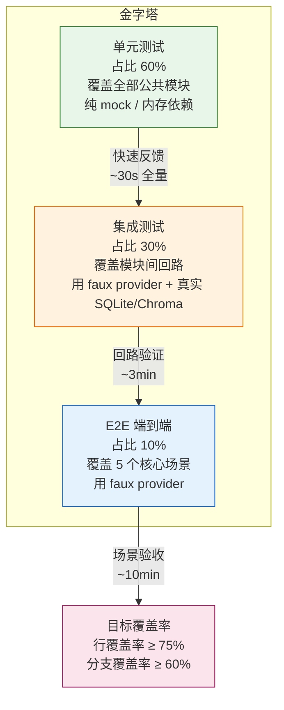
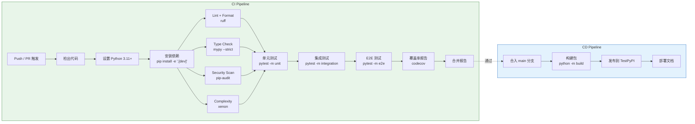

# Terminal CodingAgent —— 测试与运维手册

> **文档版本**：v1.0
> **编制日期**：2026-07-13
> **文档编号**：TCA-TEST-005
> **阶段**：测试与运维

---

## 0. 文档说明

### 0.1 本文档在整套文档中的位置

| 文档编号 | 文档名称 | 与本文档的关系 |
|---|---|---|
| `README.md` | 项目总览 | 前置入口 |
| `docs/01_产品需求文档.md` | PRD | 功能验收标准的源头 |
| `docs/02_系统架构文档.md` | 架构文档 | 被测系统的结构依据 |
| `docs/03_项目开发文档.md` | 项目开发文档 | 开发完成后的测试衔接 |
| `docs/04_核心模块设计.md` | 核心模块设计 | 集成测试的输入 |
| **`docs/05_测试与运维手册.md`** | **本文档** | 测试策略 + CI/CD + 运维 |

**阅读路径**：PRD（明确验收标准）→ 架构文档（明确被测模块）→ 本文档（落地测试与运维）。

### 0.2 前置阅读

在阅读本文档前，建议具备以下知识：

1. 原始 pi 项目 faux provider 的实现模式，理解"假 LLM"如何驱动测试。
2. 7 份参考资料中的大模型22（记忆可测试性）、大模型23（Harness 可观测性）、大模型24（Loop 验证闭环）。
3. pytest 官方文档（≥ 8.0）的 fixture、parametrize、markers 机制。

### 0.3 适用范围

| 角色 | 关注章节 | 使用方式 |
|---|---|---|
| Python 开发工程师 | 第 2、3、4 节 | 编写/运行单元与集成测试 |
| 测试 / QA 工程师 | 第 2、5、6 节 | 设计 e2e 用例、回归用例 |
| DevOps / CI 维护者 | 第 7 节 | 配置 GitHub Actions 流水线 |
| 运维工程师 | 第 8、9 节 | 部署、监控、故障排查 |

**前置知识**：Python 3.11+ 基础；pytest 官方文档（≥ 8.0）的 fixture / parametrize / markers 机制；专业术语首次出现时附解释。

---

## 1. 测试总览

### 1.1 测试金字塔

TCA 采用经典三层测试金字塔，结合 Agent 系统的"LLM 调用不可控"特点，用 **faux provider** 替代真实 LLM，实现零 token 成本的确定性测试。



### 1.2 覆盖率目标

| 层级 | 行覆盖率目标 | 分支覆盖率目标 | 说明 |
|---|---|---|---|
| 单元测试 | ≥ 80% | ≥ 65% | 工具、压缩器、Skill 加载器、记忆模块等纯逻辑 |
| 集成测试 | ≥ 60% | ≥ 50% | 多 Agent 编排、记忆回路、MCP 进程、索引查询 |
| e2e 测试 | 覆盖 5 个核心场景 | — | 不追求覆盖率，追求场景完整性 |
| **全量合并** | **≥ 75%** | **≥ 60%** | `pytest --cov` 合并报告 |

> **说明**：LLM 调用路径（`BaseChatModel.invoke`）由 faux provider 覆盖，不计入真实 LLM 的不可测分支。

### 1.3 测试目录结构

```
tests/
├── conftest.py                  # 全局 fixtures（faux LLM、内存 Chroma、temp SQLite）
├── unit/
│   ├── tools/                   # 内置工具单测
│   ├── mcp/                     # MCP 客户端单测
│   ├── skill/                   # Skill 加载器单测
│   ├── compression/             # Token 压缩器单测
│   ├── memory/                  # 记忆模块单测
│   ├── core/                    # Core 业务逻辑单测
│   └── middleware/              # 中间件钩子单测
├── integration/
│   ├── orchestrator/            # 多 Agent 编排端到端
│   ├── memory_roundtrip/        # 记忆写入-检索回路
│   ├── mcp_e2e/                 # MCP 进程启动与工具调用
│   └── indexing/                # 索引全项目 + 查询
├── e2e/
│   ├── coding_task/             # 编码任务 e2e（faux provider）
│   └── cli_entry/               # CLI 入口 e2e
├── regressions/                 # 回归测试（issue 编号映射）
│   ├── test_issue_001.py
│   └── test_issue_002.py
└── fixtures/                    # 共享测试数据
    ├── sample_projects/         # 小型示例项目（供索引测试）
    ├── skills/                  # 示例 Skill 目录
    └── faux_responses/          # faux provider 预设响应 YAML
```

---

## 2. 单元测试

### 2.1 pytest 配置

#### `pytest.ini`（或 `pyproject.toml` 的 `[tool.pytest]` 段）

```ini
[pytest]
testpaths = tests
python_files = test_*.py
python_classes = Test*
python_functions = test_*
addopts =
    -ra
    --strict-markers
    --cov=src
    --cov-report=term-missing
    --cov-report=html:htmlcov
    --cov-fail-under=75
markers =
    unit: 单元测试（快速、无外部依赖）
    integration: 集成测试（需要 SQLite/Chroma/MCP 子进程）
    e2e: 端到端测试（完整场景）
    slow: 慢速测试（>5s，CI 可选执行）
    regression: 回归测试（关联 issue 编号）
filterwarnings =
    ignore::DeprecationWarning
    ignore::PendingDeprecationWarning
```

### 2.2 `conftest.py` 关键 fixtures

```python
# tests/conftest.py
"""全局 fixtures：为所有测试层提供可复用的假依赖。"""

import os
import tempfile
from pathlib import Path
from typing import Iterator
from unittest.mock import MagicMock

import pytest
from langchain_core.messages import AIMessage, HumanMessage
from langgraph.checkpoint.sqlite import SqliteSaver

from src.llm.faux_provider import FauxLLM
from src.memory.long_term import ChromaMemory


# ─── 1. Mock LLM（faux provider）────────────────────────────────────────────

@pytest.fixture
def faux_llm() -> FauxLLM:
    """返回一个可预设响应的假 LLM。

    用法：
        faux_llm.enqueue("hello")
        result = real_llm.invoke([HumanMessage(content="hi")])
        assert result.content == "hello"
    """
    return FauxLLM(name="faux-model", responses=[])


@pytest.fixture
def faux_llm_factory():
    """工厂 fixture，用于在测试内动态创建带预设响应的 faux LLM。"""

    def _factory(*responses: str | AIMessage) -> FauxLLM:
        return FauxLLM(name="faux-model", responses=list(responses))

    return _factory


# ─── 2. In-memory ChromaDB ──────────────────────────────────────────────────

@pytest.fixture
def memory_dir() -> Iterator[Path]:
    """临时目录，测试结束自动清理。"""
    with tempfile.TemporaryDirectory() as tmp:
        yield Path(tmp)


@pytest.fixture
def chroma_memory(memory_dir: Path) -> ChromaMemory:
    """返回一个使用临时目录的 ChromaDB 记忆实例。

    使用内存模式（ephemeral），不持久化到磁盘，测试间完全隔离。
    """
    return ChromaMemory(
        persist_dir=str(memory_dir / "chroma"),
        collection_name="test_memory",
        embedding_function=None,  # 使用默认 MiniLM，测试用足够
    )


# ─── 3. Temp SQLite / Checkpointer ──────────────────────────────────────────

@pytest.fixture
def checkpointer() -> Iterator[SqliteSaver]:
    """返回一个基于临时文件的 SQLite Checkpointer。"""
    with tempfile.NamedTemporaryFile(suffix=".db", delete=False) as f:
        db_path = f.name
    # SqliteSaver.from_conn_string 返回上下文管理器
    conn_str = f"sqlite:///{db_path}"
    checkpointer = SqliteSaver.from_conn_string(conn_str)
    yield checkpointer
    checkpointer.conn.close()
    os.unlink(db_path)


# ─── 4. tree-sitter 小段代码 ────────────────────────────────────────────────

@pytest.fixture
def sample_python_code() -> str:
    """一段 30 行的 Python 代码，覆盖函数、类、导入、装饰器。"""
    return '''
"""示例模块，用于 tree-sitter 解析测试。"""

from typing import List, Optional


class Calculator:
    """简单计算器类。"""

    def __init__(self, base: int = 0) -> None:
        self.base = base

    def add(self, x: int, y: int) -> int:
        return self.base + x + y

    def divide(self, x: float, y: float) -> Optional[float]:
        if y == 0:
            return None
        return x / y


def greet(name: str) -> str:
    return f"Hello, {name}!"


if __name__ == "__main__":
    calc = Calculator(10)
    print(calc.add(1, 2))
    print(greet("World"))
'''.strip()


@pytest.fixture
def sample_ts_code() -> str:
    """一段 TypeScript 代码，用于多语言解析测试。"""
    return '''
interface User {
    id: number;
    name: string;
}

function getUser(id: number): Promise<User> {
    return fetch(`/api/users/${id}`).then(r => r.json());
}
'''.strip()


# ─── 5. 示例项目目录（供索引测试）──────────────────────────────────────────

@pytest.fixture
def sample_project_dir(memory_dir: Path) -> Path:
    """创建一个最小 Python 项目结构。"""
    proj = memory_dir / "sample_project"
    proj.mkdir()
    (proj / "main.py").write_text("def main():\n    print('hello')\n")
    (proj / "utils.py").write_text("def add(a, b):\n    return a + b\n")
    (proj / "sub").mkdir()
    (proj / "sub" / "__init__.py").write_text("")
    (proj / "sub" / "helper.py").write_text("def help():\n    return True\n")
    return proj
```

### 2.3 各模块单元测试要点

#### 2.3.1 内置工具（`tests/unit/tools/`）

| 测试目标 | 关键断言 | 依赖 fixture |
|---|---|---|
| `ReadTool` | 读取存在/不存在文件、越权路径拦截 | `memory_dir` |
| `WriteTool` | 写入后内容一致、覆盖/追加模式 | `memory_dir` |
| `EditTool` | 精确替换、多匹配报错、无匹配报错 | `memory_dir` |
| `BashTool` | 命令执行返回 stdout/stderr、超时熔断 | — |
| `FindTool` | 按名/按 glob 过滤、忽略 `.git` | `sample_project_dir` |
| `GrepTool` | 正则匹配、多文件搜索、上下文行 | `sample_project_dir` |

```python
# tests/unit/tools/test_read_tool.py
"""ReadTool 单元测试示例。"""

import pytest
from pathlib import Path

from src.tools.file_tools import ReadTool


@pytest.mark.unit
class TestReadTool:
    def test_read_existing_file(self, memory_dir: Path):
        target = memory_dir / "hello.txt"
        target.write_text("hello world")
        tool = ReadTool()
        result = tool.invoke({"file_path": str(target)})
        assert result == "hello world"

    def test_read_nonexistent_file(self, memory_dir: Path):
        tool = ReadTool()
        with pytest.raises(FileNotFoundError):
            tool.invoke({"file_path": str(memory_dir / "nope.txt")})

    def test_path_traversal_blocked(self, memory_dir: Path):
        tool = ReadTool(root_dir=str(memory_dir))
        with pytest.raises(PermissionError):
            tool.invoke({"file_path": "/etc/passwd"})
```

#### 2.3.2 MCP 客户端（`tests/unit/mcp/`）

| 测试目标 | 关键断言 |
|---|---|
| `MultiServerMCPClient` 启动 | 子进程启动后 `list_tools()` 返回工具列表 |
| 工具转换 | MCP 工具 → LangChain Tool 字段映射正确 |
| 连接失败降级 | 服务器启动失败时抛出 `MCPConnectionError`，不崩溃 |
| 超时处理 | 工具调用超时返回错误而非挂起 |

> **注意**：MCP 进程启动测试标记为 `@pytest.mark.integration`，不放在单元层。

#### 2.3.3 Skill 加载器（`tests/unit/skill/`）

| 测试目标 | 关键断言 |
|---|---|
| frontmatter 解析 | YAML frontmatter 字段（name/description/triggers）正确提取 |
| 懒加载 | 仅扫描元数据时不读取 `scripts/` 正文 |
| 触发匹配 | 用户输入匹配 triggers 时返回 Skill 正文 |
| 目录约定校验 | 缺少 `SKILL.md` 时抛出 `InvalidSkillError` |

#### 2.3.4 压缩器（`tests/unit/compression/`）

| 测试目标 | 关键断言 |
|---|---|
| L1 截断 | 超过 Token 预算时旧消息被裁剪，system prompt 保留 |
| L2 摘要 | 摘要后 Token 数 ≤ 原文 20% |
| L3 工具卸载 | 工具输出只保留头尾，完整内容落盘 |
| 压缩审计 | 每次压缩写入审计日志（原因/前后 Token 数） |

```python
# tests/unit/compression/test_l1_truncation.py
"""L1 截断压缩测试示例。"""

import pytest
from langchain_core.messages import HumanMessage, SystemMessage

from src.memory.compressor import truncate_messages


@pytest.mark.unit
class TestTruncation:
    def test_truncate_preserves_system(self):
        messages = [
            SystemMessage(content="You are a helpful assistant."),
            HumanMessage(content="msg1" * 100),
            HumanMessage(content="msg2" * 100),
        ]
        result = truncate_messages(messages, max_tokens=50)
        assert result[0].type == "system"  # system 必须保留

    def test_truncate_removes_oldest_first(self):
        messages = [
            HumanMessage(content="old"),
            HumanMessage(content="new"),
        ]
        # 设置极小预算，只够保留最后一条
        result = truncate_messages(messages, max_tokens=10, keep_recent=1)
        assert len(result) == 1
        assert "new" in result[0].content
```

#### 2.3.5 记忆模块（`tests/unit/memory/`）

| 测试目标 | 关键断言 |
|---|---|
| 写入-立即检索 | `add()` 后 `query()` 能命中 |
| 命名空间隔离 | project_A 的数据在 project_B 中查不到 |
| 类型过滤 | 按 `memory_type`（semantic/episodic/procedural）过滤 |
| eviction | 超过容量上限时按 LRU 淘汰 |
| 元数据追溯 | 每条记忆携带 `session_id` + `timestamp` |

#### 2.3.6 Core 业务逻辑（`tests/unit/core/`）

| 测试目标 | 关键断言 |
|---|---|
| Agent 状态机 | 节点执行后状态增量正确 |
| 条件路由 | 条件边按状态字段选择正确下游 |
| Human-in-the-loop | 断点暂停后 `invoke(resume=...)` 继续 |
| 中间件钩子 | `before_model` / `after_model` 按注册顺序执行 |

---

## 3. 集成测试

### 3.1 多 Agent 编排端到端

**目标**：验证"研究员 → 工程师 → 审查员"三角色流水线在 faux provider 驱动下完整跑通。

```python
# tests/integration/orchestrator/test_three_agent_pipeline.py
"""三 Agent 流水线集成测试。"""

import pytest
from langgraph.graph import StateGraph

from src.multi_agent.orchestrator import Orchestrator
from src.llm.faux_provider import FauxLLM
from src.agent_core.node import agent_node


@pytest.mark.integration
class TestThreeAgentPipeline:
    def test_researcher_engineer_reviewer_flow(self, faux_llm_factory, checkpointer):
        # 预设每个角色的响应
        researcher_llm = faux_llm_factory("调研报告：方案 A 最优")
        engineer_llm = faux_llm_factory("代码实现完成")
        reviewer_llm = faux_llm_factory("APPROVED")

        # 构建图
        builder = StateGraph(state_schema=dict)
        builder.add_node("researcher", lambda s: agent_node(s, researcher_llm, "research"))
        builder.add_node("engineer", lambda s: agent_node(s, engineer_llm, "code"))
        builder.add_node("reviewer", lambda s: agent_node(s, reviewer_llm, "review"))
        builder.add_edge("researcher", "engineer")
        builder.add_edge("engineer", "reviewer")
        builder.set_entry_point("researcher")

        graph = builder.compile(checkpointer=checkpointer)
        result = graph.invoke({"task": "实现一个计算器"}, config={"configurable": {"thread_id": "test-1"}})

        assert result["status"] == "completed"
        assert "APPROVED" in result.get("review_result", "")
```

**关键验证点**：
- 节点执行顺序正确（researcher → engineer → reviewer）
- 状态在节点间正确传递
- Checkpointer 每轮快照可恢复
- 不消耗任何真实 token

### 3.2 记忆写入-检索回路

```python
# tests/integration/memory_roundtrip/test_write_read_roundtrip.py
"""记忆写入-检索回路集成测试。"""

import pytest

from src.memory.long_term import ChromaMemory


@pytest.mark.integration
class TestMemoryRoundtrip:
    def test_write_then_query(self, chroma_memory):
        chroma_memory.add(
            text="项目使用 Node 20 + Fastify 框架",
            metadata={"project_id": "proj-A", "memory_type": "semantic"},
        )
        results = chroma_memory.query("项目技术栈是什么？", project_id="proj-A", top_k=3)
        assert len(results) >= 1
        assert "Node 20" in results[0].text

    def test_namespace_isolation(self, chroma_memory):
        chroma_memory.add(
            text="项目 A 用 PostgreSQL",
            metadata={"project_id": "proj-A", "memory_type": "semantic"},
        )
        results = chroma_memory.query("数据库", project_id="proj-B", top_k=3)
        assert len(results) == 0  # 跨项目查不到
```

### 3.3 MCP 进程启动与工具调用

```python
# tests/integration/mcp_e2e/test_mcp_process.py
"""MCP 进程启动与工具调用集成测试。"""

import pytest

from src.mcp.client import MCPClient


@pytest.mark.integration
@pytest.mark.slow
class TestMCPProcess:
    def test_start_stdio_server_and_list_tools(self):
        """启动一个 stdio 模式的 MCP 服务器并列出工具。"""
        client = MCPClient(
            command="python",
            args=["-m", "src.mcp.test_server"],  # 内置测试用 MCP 服务器
            transport="stdio",
        )
        with client:
            tools = client.list_tools()
            assert len(tools) > 0
            assert any(t.name == "echo" for t in tools)

    def test_call_tool(self):
        client = MCPClient(command="python", args=["-m", "src.mcp.test_server"])
        with client:
            result = client.call_tool("echo", {"text": "hello"})
            assert result == "echo: hello"
```

### 3.4 索引全项目 + 查询

```python
# tests/integration/indexing/test_full_project_index.py
"""索引全项目 + 查询集成测试。"""

import pytest

from src.code_index.ast_indexer import ASTIndexer


@pytest.mark.integration
class TestFullProjectIndex:
    def test_index_and_query_symbols(self, sample_project_dir):
        indexer = ASTIndexer()
        indexer.index_directory(sample_project_dir)

        # 查询 main.py 中的 main 函数
        symbols = indexer.query_symbol("main")
        assert any(s.file.endswith("main.py") for s in symbols)

        # 查询 sub/helper.py 中的 help 函数
        symbols = indexer.query_symbol("help")
        assert any(s.file.endswith("helper.py") for s in symbols)

    def test_incremental_update(self, sample_project_dir):
        indexer = ASTIndexer()
        indexer.index_directory(sample_project_dir)
        # 修改文件后增量更新
        (sample_project_dir / "main.py").write_text("def new_func():\n    pass\n")
        indexer.index_file(sample_project_dir / "main.py")
        symbols = indexer.query_symbol("new_func")
        assert len(symbols) == 1
```

---

## 4. E2E 测试

### 4.1 编码任务 E2E 用例（faux provider）

**场景**：用户要求 Agent "在 sample_project 中新增一个 `multiply` 函数"。

```python
# tests/e2e/coding_task/test_coding_e2e.py
"""编码任务 E2E 测试——使用 faux provider，零 token 成本。"""

import pytest
from pathlib import Path

from src.multi_agent.orchestrator import Orchestrator
from src.llm.faux_provider import FauxLLM
from src.config.settings import get_settings as load_config


@pytest.mark.e2e
@pytest.mark.slow
class TestCodingTaskE2E:
    def test_add_multiply_function(self, memory_dir: Path, faux_llm_factory):
        """端到端验证：Agent 读取文件 → 编写代码 → 写入文件。"""
        # 准备项目
        proj = memory_dir / "project"
        proj.mkdir()
        utils_py = proj / "utils.py"
        utils_py.write_text("def add(a, b):\n    return a + b\n")

        # 预设 faux LLM 响应序列
        llm = faux_llm_factory(
            # 第一轮：Agent 决定读取文件
            '{"action": "read", "file": "utils.py"}',
            # 第二轮：Agent 决定写入
            '{"action": "write", "file": "utils.py", "content": "def add(a, b):\\n    return a + b\\n\\ndef multiply(a, b):\\n    return a * b\\n"}',
            # 第三轮：Agent 报告完成
            "任务完成，已添加 multiply 函数。",
        )

        config = load_config()
        config.llm = llm
        config.project_dir = str(proj)

        orchestrator = Orchestrator(config)
        result = orchestrator.run("请在 utils.py 中添加 multiply 函数")

        # 验证文件确实被修改
        final_content = utils_py.read_text()
        assert "def multiply" in final_content
        assert "return a * b" in final_content
        assert result.status == "completed"
```

### 4.2 CLI 入口 E2E

```python
# tests/e2e/cli_entry/test_cli_e2e.py
"""CLI 入口 E2E 测试。"""

import subprocess
import sys


@pytest.mark.e2e
class TestCLIEntry:
    def test_cli_help(self):
        result = subprocess.run(
            [sys.executable, "-m", "src.cli.main", "--help"],
            capture_output=True, text=True,
        )
        assert result.returncode == 0
        assert "Terminal CodingAgent" in result.stdout

    def test_cli_run_with_faux(self, memory_dir):
        result = subprocess.run(
            [
                sys.executable, "-m", "src.cli.main",
                "--model", "faux",
                "--project", str(memory_dir),
                "hello",
            ],
            capture_output=True, text=True, timeout=30,
        )
        assert result.returncode == 0
```

---

## 5. Faux Provider 实现

仿照原始 pi 的 faux provider 模式，用 Python 实现一个符合 LangChain `BaseChatModel` 接口的假 LLM，用于 CI 中替代真实 LLM。

### 5.1 设计目标

1. **零 token 成本**：不调用任何外部 API。
2. **可预设响应**：按顺序返回队列中的响应，耗尽时报错。
3. **支持同步/异步**：实现 `_generate` 和 `_agenerate`。
4. **支持 tool calling**：可预设 `AIMessage(tool_calls=[...])` 响应。
5. **模型元数据**：暴露 `model_name`、`_llm_type` 等 LangChain 标准属性。

### 5.2 完整实现

```python
# src/llm/faux_provider.py
"""FauxLLM：用于测试的假 LLM，仿照原始 pi 的 faux provider。

用法：
    llm = FauxLLM(responses=["hello", AIMessage(content="world")])
    llm.invoke([HumanMessage(content="hi")])   # → AIMessage("hello")
    llm.invoke([HumanMessage(content="hi")])   # → AIMessage("world")
    llm.invoke([HumanMessage(content="hi")])   # → RuntimeError
"""

from __future__ import annotations

import asyncio
from typing import Any, List, Optional, Sequence

from langchain_core.callbacks import CallbackManagerForLLMRun
from langchain_core.language_models.chat_models import BaseChatModel
from langchain_core.messages import AIMessage, BaseMessage
from langchain_core.outputs import ChatGeneration, ChatResult


class FauxLLM(BaseChatModel):
    """假 LLM，按预设响应队列返回消息。

    Attributes:
        name: 模型名称（仅用于日志/标识）。
        responses: 预设响应队列，元素可以是 str 或 AIMessage。
        _call_count: 已调用次数（用于断言测试）。
    """

    name: str = "faux-model"
    _call_count: int = 0

    def __init__(
        self,
        name: str = "faux-model",
        responses: Optional[Sequence[str | AIMessage]] = None,
    ) -> None:
        super().__init__(name=name)
        # 深拷贝队列，避免测试间共享可变状态
        self._responses: list[AIMessage] = [
            AIMessage(content=r) if isinstance(r, str) else r
            for r in (responses or [])
        ]

    # ── LangChain 必需属性 ────────────────────────────────────────────────

    @property
    def _llm_type(self) -> str:
        return "faux"

    @property
    def _identifying_params(self) -> dict[str, Any]:
        return {"name": self.name, "queued": len(self._responses)}

    # ── 核心生成方法 ──────────────────────────────────────────────────────

    def _generate(
        self,
        messages: List[BaseMessage],
        stop: Optional[List[str]] = None,
        run_manager: Optional[CallbackManagerForLLMRun] = None,
        **kwargs: Any,
    ) -> ChatResult:
        """同步生成：从队列头部弹出一个响应。"""
        self._call_count += 1
        if not self._responses:
            raise RuntimeError(
                f"No more faux responses queued (call #{self._call_count}). "
                f"Enqueue more responses or check your test setup."
            )
        message = self._responses.pop(0)
        # 触发回调（LangChain 标准流程）
        if run_manager:
            run_manager.on_llm_new_token(message.content or "")
        generation = ChatGeneration(message=message)
        return ChatResult(generations=[generation])

    async def _agenerate(
        self,
        messages: List[BaseMessage],
        stop: Optional[List[str]] = None,
        run_manager: Optional[CallbackManagerForLLMRun] = None,
        **kwargs: Any,
    ) -> ChatResult:
        """异步生成：本体与同步版一致（faux 无 IO 等待）。"""
        await asyncio.sleep(0)  # 让出控制权，模拟异步语义
        return self._generate(messages, stop, run_manager, **kwargs)

    # ── 编程式控制接口 ────────────────────────────────────────────────────

    def enqueue(self, *responses: str | AIMessage) -> None:
        """在队列尾部追加响应（用于测试中途补充）。"""
        for r in responses:
            self._responses.append(
                AIMessage(content=r) if isinstance(r, str) else r
            )

    @property
    def pending_count(self) -> int:
        """返回队列中剩余响应数。"""
        return len(self._responses)

    @property
    def call_count(self) -> int:
        """返回已调用次数。"""
        return self._call_count

    def reset(self) -> None:
        """重置调用计数器和队列。"""
        self._call_count = 0
        self._responses.clear()
```

### 5.3 使用示例

```python
# 测试中创建 faux LLM
from langchain_core.messages import HumanMessage, AIMessage
from src.llm.faux_provider import FauxLLM

def test_agent_reads_file_then_writes():
    llm = FauxLLM(responses=[
        "让我先读取文件。",           # 第一轮响应
        "现在写入新内容。",           # 第二轮响应
        "任务完成。",                 # 第三轮响应
    ])

    # 断言：第一次调用返回 "让我先读取文件。"
    result = llm.invoke([HumanMessage(content="请修改 utils.py")])
    assert result.content == "让我先读取文件。"
    assert llm.call_count == 1
    assert llm.pending_count == 2

    # 耗尽后报错
    llm.invoke([HumanMessage(content="继续")])
    llm.invoke([HumanMessage(content="继续")])
    with pytest.raises(RuntimeError, match="No more faux responses queued"):
        llm.invoke([HumanMessage(content="继续")])
```

### 5.4 进阶：支持 Tool Calling

```python
# 预设带 tool_calls 的 AIMessage
from langchain_core.messages import AIMessage

tool_response = AIMessage(
    content="",
    tool_calls=[
        {
            "id": "call-1",
            "name": "read_file",
            "args": {"path": "utils.py"},
        }
    ],
)

llm = FauxLLM(responses=[tool_response, "已完成读取。"])
# Agent 第一轮会调用 read_file 工具，第二轮返回最终文本。
```

---

## 6. 回归测试

### 6.1 命名与放置规范

| 项 | 规范 |
|---|---|
| 目录 | `tests/regressions/` |
| 文件命名 | `test_issue_{编号}.py` 或 `test_regression_{描述}.py` |
| 必须标注 | `@pytest.mark.regression` |
| issue 映射 | 每个文件头部注释注明关联的 GitHub Issue 编号与简要描述 |

```python
# tests/regressions/test_issue_042.py
"""回归测试：Issue #042 —— ChromaDB 写入后立即查询偶发空结果。

根本原因：add() 后未 commit，query() 时数据未刷盘。
修复方案：add() 后自动调用 collection._client._persist()。
"""

import pytest
from src.memory.long_term import ChromaMemory


@pytest.mark.regression
class TestIssue042:
    def test_write_then_immediate_query(self, chroma_memory):
        chroma_memory.add("test fact", metadata={"project_id": "p1"})
        results = chroma_memory.query("fact", project_id="p1")
        assert len(results) >= 1, "写入后立即查询应能命中"
```

### 6.2 Issue 编号映射表

| Issue 编号 | 描述 | 回归测试文件 | 状态 |
|---|---|---|---|
| #001 | Skill 加载器解析空 frontmatter 崩溃 | `test_issue_001.py` | 已修复 |
| #002 | L1 截断误删 system message | `test_issue_002.py` | 已修复 |
| #003 | MCP stdio 子进程僵死未超时 | `test_issue_003.py` | 修复中 |
| ... | ... | ... | ... |

> **维护规则**：每修复一个 bug，必须在 `tests/regressions/` 添加对应回归测试，否则不允许合入。

---

## 7. 评估/质量门禁

### 7.1 门禁工具链

在 CI 流水线中，以下检查全部通过才允许合入：

| 类别 | 工具 | 配置 | 失败阈值 |
|---|---|---|---|
| **Lint** | `ruff` | `ruff check src/ tests/` | 任一错误 |
| **Format** | `ruff format` | `ruff format --check src/ tests/` | 任一格式不符 |
| **Type** | `mypy` | `mypy src/ --strict` | 任一类型错误 |
| **Security** | `pip-audit` | `pip-audit --strict` | 任一已知 CVE |
| **Complexity** | `xenon` | `xenon --max-absolute B --max-modules A --max-average A src/` | 超复杂度阈值 |

### 7.2 各工具配置

#### `ruff`（`pyproject.toml`）

```toml
[tool.ruff]
target-version = "py311"
line-length = 100

[tool.ruff.lint]
select = ["E", "F", "I", "N", "W", "UP", "B", "A", "C4", "TID"]
ignore = ["E501"]

[tool.ruff.lint.per-file-ignores]
"tests/*" = ["S101"]  # 测试允许 assert
```

#### `mypy`（`pyproject.toml`）

```toml
[tool.mypy]
python_version = "3.11"
strict = true
warn_return_any = true
warn_unused_configs = true
disallow_untyped_defs = true

[[tool.mypy.overrides]]
module = ["chromadb.*", "tree_sitter.*", "pygls.*"]
ignore_missing_imports = true
```

#### `xenon`（复杂度门禁）

```bash
# 在 CI 中执行
xenon --max-absolute B --max-modules A --max-average A src/
# --max-absolute B：单个函数复杂度 ≤ 10
# --max-modules A：模块平均复杂度 ≤ 5
# --max-average A：全项目平均复杂度 ≤ 5
```

### 7.3 Pre-commit 钩子

```yaml
# .pre-commit-config.yaml
repos:
  - repo: https://github.com/astral-sh/ruff-pre-commit
    rev: v0.5.0
    hooks:
      - id: ruff
        args: [--fix]
      - id: ruff-format

  - repo: https://github.com/pre-commit/mirrors-mypy
    rev: v1.10.0
    hooks:
      - id: mypy
        additional_dependencies: [types-pyyaml, types-requests]

  - repo: https://github.com/pycqa/bandit
    rev: 1.7.9
    hooks:
      - id: bandit
        args: ["-c", "pyproject.toml"]
        additional_dependencies: ["bandit[toml]"]

  - repo: local
    hooks:
      - id: pip-audit
        name: pip-audit
        entry: pip-audit --strict
        language: system
        pass_filenames: false
        always_run: true
```

---

## 8. CI/CD 流水线

### 8.1 GitHub Actions 工作流图



### 8.2 GitHub Actions 工作流文件

```yaml
# .github/workflows/ci.yml
name: CI

on:
  push:
    branches: [main, develop]
  pull_request:
    branches: [main]

concurrency:
  group: ${{ github.workflow }}-${{ github.ref }}
  cancel-in-progress: true

jobs:
  # ── 1. 代码质量门禁 ─────────────────────────────────────────────────────
  quality:
    runs-on: ubuntu-latest
    steps:
      - uses: actions/checkout@v4

      - uses: actions/setup-python@v5
        with:
          python-version: "3.11"
          cache: "pip"

      - name: Install dependencies
        run: pip install -e ".[dev]"

      - name: Ruff Lint
        run: ruff check src/ tests/

      - name: Ruff Format Check
        run: ruff format --check src/ tests/

      - name: Mypy Type Check
        run: mypy src/ --strict

      - name: Security Audit
        run: pip-audit --strict

      - name: Complexity Check
        run: xenon --max-absolute B --max-modules A --max-average A src/

  # ── 2. 单元测试 ─────────────────────────────────────────────────────────
  unit-test:
    needs: quality
    runs-on: ubuntu-latest
    strategy:
      matrix:
        python-version: ["3.11", "3.12"]
    steps:
      - uses: actions/checkout@v4
      - uses: actions/setup-python@v5
        with:
          python-version: ${{ matrix.python-version }}
          cache: "pip"
      - run: pip install -e ".[dev]"
      - name: Unit Tests
        run: pytest -m unit -v --cov=src --cov-report=xml
      - uses: codecov/codecov-action@v4
        with:
          file: coverage.xml

  # ── 3. 集成测试 ─────────────────────────────────────────────────────────
  integration-test:
    needs: unit-test
    runs-on: ubuntu-latest
    steps:
      - uses: actions/checkout@v4
      - uses: actions/setup-python@v5
        with:
          python-version: "3.11"
          cache: "pip"
      - run: pip install -e ".[dev]"
      - name: Integration Tests
        run: pytest -m integration -v --timeout=120

  # ── 4. E2E 测试 ──────────────────────────────────────────────────────────
  e2e-test:
    needs: integration-test
    runs-on: ubuntu-latest
    steps:
      - uses: actions/checkout@v4
      - uses: actions/setup-python@v5
        with:
          python-version: "3.11"
          cache: "pip"
      - run: pip install -e ".[dev]"
      - name: E2E Tests
        run: pytest -m e2e -v --timeout=300
```

### 8.3 流水线关键决策

| 决策 | 说明 |
|---|---|
| **质量门禁前置** | Lint/Type/Security 在测试前运行，失败快速反馈，节省 CI 时间 |
| **三层测试串行** | unit 通过后才跑 integration，integration 通过才跑 e2e，避免浪费 CI 资源 |
| **矩阵测试** | 单元测试覆盖 Python 3.11 / 3.12 两个版本 |
| **faux provider 驱动** | 所有测试不依赖真实 LLM API，CI 无密钥、零成本、确定性 |
| **超时熔断** | integration 单测 120s，e2e 单测 300s，防止子进程僵死拖累 CI |

---

## 9. 运维手册

### 9.1 运行环境要求

| 项 | 要求 |
|---|---|
| Python | 3.11+ |
| OS | Windows 10+/Ubuntu 20.04+/macOS 12+ |
| 内存 | ≥ 4GB（LSP 子进程 + ChromaDB 常驻） |
| 磁盘 | ≥ 2GB（索引 + 检查点 + 长期记忆） |
| API Key | `ANTHROPIC_API_KEY` 或 `OPENAI_API_KEY`（或配置 Ollama 本地模型） |

### 9.2 三种运行形态的启动命令

| 形态 | 命令 | 监听地址 |
|---|---|---|
| **CLI** | `pi-enhanced run "任务描述"` | — |
| **Streamlit 仪表盘** | `streamlit run src/ui/streamlit_app.py` | `http://localhost:8501` |
| **FastAPI 服务** | `uvicorn src.api.app:app --host 0.0.0.0 --port 8000` | `http://0.0.0.0:8000` |

### 9.3 配置管理

```bash
# 环境变量（优先级最高）
export ANTHROPIC_API_KEY="sk-..."
export PI_MODEL="claude-sonnet-4-20250514"
export PI_MEMORY_DIR="./data/memory"
export PI_CHECKPOINT_DB="./data/checkpoints.db"

# 或 .env 文件（自动加载）
# .env
ANTHROPIC_API_KEY=sk-...
PI_MODEL=claude-sonnet-4-20250514
```

### 9.4 常用运维操作

#### 查看服务状态

```bash
# FastAPI 健康检查
curl http://localhost:8000/health

# 预期返回
{"status": "ok", "version": "0.1.0", "components": {"llm": "ok", "memory": "ok", "index": "ok"}}
```

#### 清理长期记忆

```bash
# 按项目清理
pi-enhanced memory clear --project proj-A

# 按类型清理
pi-enhanced memory clear --type episodic --older-than 30d
```

#### 重建代码索引

```bash
# 全量重建
pi-enhanced index rebuild --project ./my-project

# 增量更新（监 file watcher 自动触发）
pi-enhanced index watch --project ./my-project
```

#### 检查点管理

```bash
# 列出所有会话
pi-enhanced sessions list

# 导出会话
pi-enhanced sessions export --thread-id abc123 --output backup.jsonl

# 删除过期检查点
pi-enhanced sessions prune --older-than 7d
```

### 9.5 故障排查指南

| 故障现象 | 可能原因 | 排查命令/解决 |
|---|---|---|
| `ANTHROPIC_API_KEY not set` | 环境变量未配置 | `echo $ANTHROPIC_API_KEY` 或检查 `.env` |
| `MCPConnectionError: server not started` | MCP 子进程启动失败 | `pi-enhanced mcp test --server github` 验证 |
| `SQLiteLockError` | 多进程并发写检查点 | 确保同一 `thread_id` 不被并发调用 |
| `ChromaDB timeout` | 向量库过大或磁盘 IO 瓶颈 | `pi-enhanced memory stats` 查看统计 |
| LSP 无响应 | pyright 子进程崩溃 | `pi-enhanced index restart-lsp` |
| Streamlit 白屏 | 端口被占用 | `lsof -i :8501` 杀旧进程或换端口 |
| Token 超限无压缩 | 压缩器未启用 | 检查配置 `compression.enabled: true` |

### 9.6 日志配置

```yaml
# config/logging.yaml
version: 1
formatters:
  json:
    class: pythonjsonlogger.jsonlogger.JsonFormatter
    format: "%(asctime)s %(name)s %(levelname)s %(message)s"

handlers:
  console:
    class: logging.StreamHandler
    formatter: json
    level: INFO
  file:
    class: logging.handlers.RotatingFileHandler
    formatter: json
    filename: logs/pi-enhanced.log
    maxBytes: 10485760  # 10MB
    backupCount: 5

loggers:
  src:
    level: DEBUG
    handlers: [console, file]
```

### 9.7 监控与告警

| 指标 | 采集方式 | 告警阈值 |
|---|---|---|
| LLM 调用延迟 | 中间件钩子记录 | P95 > 30s |
| 工具调用失败率 | 中间件钩子统计 | > 5% |
| Token 消耗速率 | 中间件累计 | > 100k tokens/min |
| ChromaDB 查询延迟 | 记忆模块埋点 | P95 > 300ms |
| Checkpoint 写入失败 | Checkpointer 异常 | 任一失败 |
| LSP 子进程存活 | 心跳检测 | 连续 3 次无响应 |

> **说明**：生产级监控（Prometheus / Grafana）为可选扩展。建议在 Streamlit 面板中内置简易指标页，满足调试需求。

### 9.8 备份与恢复

| 数据 | 位置 | 备份策略 |
|---|---|---|
| 检查点数据库 | `data/checkpoints.db` | 每日 `sqlite3 .dump` 备份 |
| ChromaDB 向量库 | `data/memory/chroma/` | 文件级增量 rsync |
| 会话日志 | `data/sessions/*.jsonl` | 与检查点同步备份 |
| 配置文件 | `config/*.yaml` + `.env` | 纳入 Git 版本控制（`.env` 除外） |

```bash
# 一键备份脚本 scripts/backup.sh
#!/bin/bash
BACKUP_DIR="./backups/$(date +%Y%m%d_%H%M%S)"
mkdir -p "$BACKUP_DIR"
sqlite3 data/checkpoints.db ".dump" > "$BACKUP_DIR/checkpoints.sql"
rsync -a data/memory/chroma/ "$BACKUP_DIR/chroma/"
rsync -a data/sessions/ "$BACKUP_DIR/sessions/"
rsync -a config/ "$BACKUP_DIR/config/"
echo "Backup saved to $BACKUP_DIR"
```

### 9.9 容器化（可选）

以下给出最小可用模板，用于单机快速起全栈验证；生产部署请按需加固（多阶段构建、非 root 用户、secret 挂载）。

**Dockerfile**：

```dockerfile
FROM python:3.11-slim
WORKDIR /app
COPY requirements.txt .
RUN pip install --no-cache-dir -r requirements.txt
COPY src/ ./src/
COPY config/ ./config/
ENV PI_DATA_DIR=/app/data
VOLUME ["/app/data"]
EXPOSE 8000 8501
CMD ["uvicorn", "src.api.app:app", "--host", "0.0.0.0", "--port", "8000"]
```

**docker-compose.yml**：

```yaml
version: "3.9"
services:
  api:
    build: .
    ports: ["8000:8000"]
    env_file: [.env]
    volumes: ["./data:/app/data"]
    restart: unless-stopped
  dashboard:
    build: .
    command: ["streamlit", "run", "src/ui/streamlit_app.py", "--server.port=8501", "--server.address=0.0.0.0"]
    ports: ["8501:8501"]
    env_file: [.env]
    volumes: ["./data:/app/data"]
    restart: unless-stopped
```

启动：`docker compose up --build`，访问 `http://localhost:8000/health` 与 `http://localhost:8501`。

---

## 10. 附录

### 10.1 测试命令速查

```bash
# 运行全部测试
pytest

# 仅单元测试
pytest -m unit

# 仅集成测试
pytest -m integration

# 仅 E2E
pytest -m e2e

# 仅回归测试
pytest -m regression

# 强制包含慢速测试
pytest -m "slow or unit"

# 带覆盖率
pytest --cov=src --cov-report=term-missing

# 并行执行（需 pytest-xdist）
pytest -n auto

# 失败即停
pytest -x

# 仅运行上次失败的测试
pytest --lf
```

### 10.2 项目结构总览（测试视角）

```
pi-enhanced/
├── src/
│   ├── llm/
│   │   └── faux.py              # ★ FauxLLM（本文档第 5 节）
│   ├── tools/                   # 内置工具（单测覆盖）
│   ├── mcp/                     # MCP 客户端（集成测试覆盖）
│   ├── skill/                   # Skill 加载器（单测覆盖）
│   ├── compression/             # Token 压缩（单测覆盖）
│   ├── memory/                  # 记忆模块（单测 + 集成测试）
│   ├── indexing/                # LSP+AST 索引（集成测试覆盖）
│   ├── orchestrator/            # 多 Agent 编排（集成 + e2e 覆盖）
│   ├── core/                    # Core 业务逻辑（单测覆盖）
│   ├── middleware/              # 中间件钩子（单测覆盖）
│   ├── cli.py                   # CLI 入口（e2e 覆盖）
│   ├── api.py                   # FastAPI 服务（e2e 覆盖）
│   └── ui/app.py                # Streamlit 仪表盘（手测为主）
├── tests/
│   ├── conftest.py              # ★ 全局 fixtures
│   ├── unit/                    # 单元测试
│   ├── integration/             # 集成测试
│   ├── e2e/                     # E2E 测试
│   ├── regressions/             # 回归测试
│   └── fixtures/                # 共享测试数据
├── .github/workflows/ci.yml     # ★ CI 流水线
├── .pre-commit-config.yaml      # Pre-commit 钩子
├── pyproject.toml               # pytest / ruff / mypy 配置
└── scripts/backup.sh            # 备份脚本
```

### 10.3 参考文档

| 文档 | 路径 | 关联章节 |
|---|---|---|
| 产品需求文档 | `docs/01_产品需求文档.md` | 第 1 节验收标准来源 |
| 系统架构文档 | `docs/02_系统架构文档.md` | 第 1.1 测试对象来源 |
| 核心模块设计 | `docs/04_核心模块设计.md` | 集成测试接口契约 |
| pytest 官方文档 | https://docs.pytest.org | 第 2 节配置参考 |
| LangChain 自定义 LLM | https://python.langchain.com/docs/how_to/custom_llm/ | 第 5 节接口参考 |

**外部参考资料**（完整映射见 `README.md` 参考资料映射表）：

| 引用名 | 主题 | 本文档关联章节 |
|---|---|---|
| 大模型 22 | Agent 记忆可测试性 | 记忆模块测试（§3.2 / §6） |
| 大模型 23 | Harness 可观测性 | 中间件测试（§3.6） |
| 大模型 24 | Loop 验证闭环 | Loop 五段闭环（§4.4 / §4.5） |